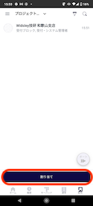

もばくらの配布コールモードの使いかた

ながれから架電をおこおないステータス保存までのキャプチャをお願いします。

1. 「ComDesk Lead」をタップ\
   
2. ログイン画面が表示された場合は入力して「ログイン」タップ\
   
3. 「配布」タップ\
   
4. 「割り当て」タップ\
   
5. 通話タップ\
   
6. 通話中\
   
7.  通話終了後、アクティビティ結果登録画面が表示される

    ステータス登録

    応対者登録

    メモ登録

    

    

    

    再コール登録方法

    1. 「再コールを設定」をタップ\
       
    2. カレンダーで再コール日をタップ\
       「時刻」をタップすると時計が表示\
       
    3.  「時」の選択は外側が午前、内側が午後\
        選択はドラッグでもタップでもOK

        時：午前指定は外側の数字を選択

        時：午後指定は内側の数字を選択

        

        
    4. 「分」は、１分単位で指定可能。「閉じる」タップ\
       選択はドラッグでもタップでもOK\
       
8. 「保存」ボタンタップ\
   
9. 「通話結果を保存しました」表示されるので「閉じる」タップ\
   
10. 次のリストへ架電するには「割り当て」ボタンタップ\
    
11. 通話ボタンタップ\
    
