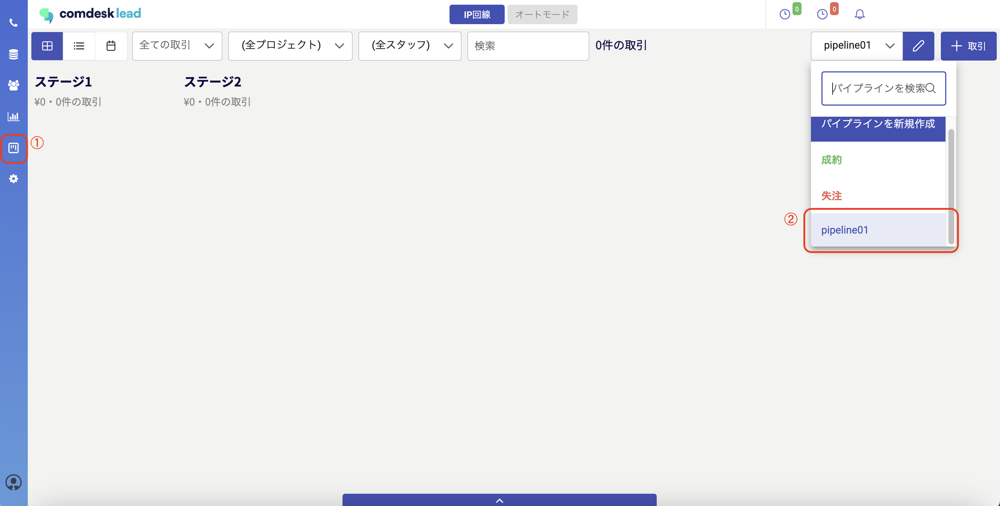
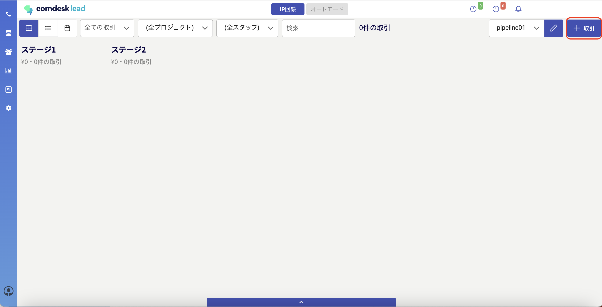
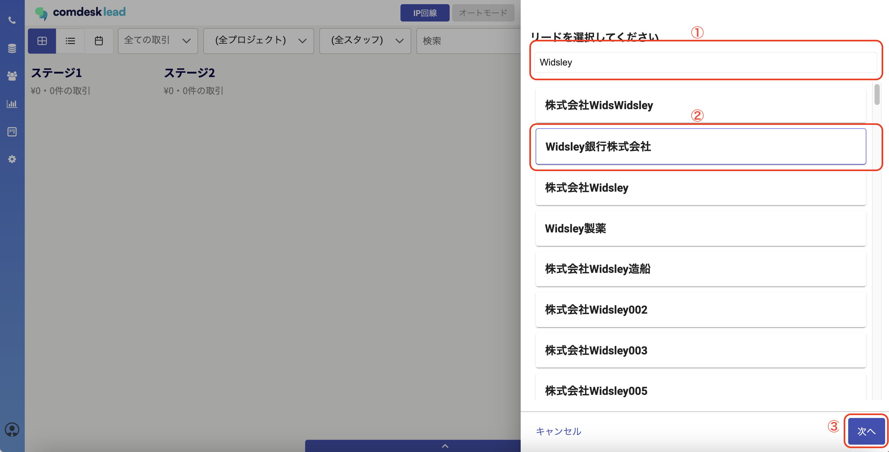
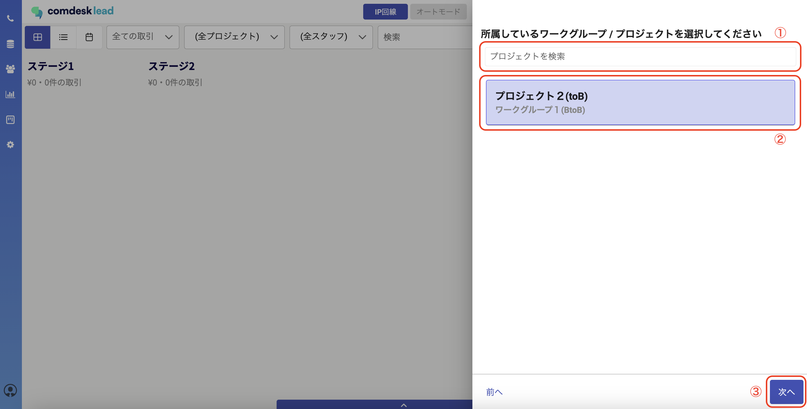
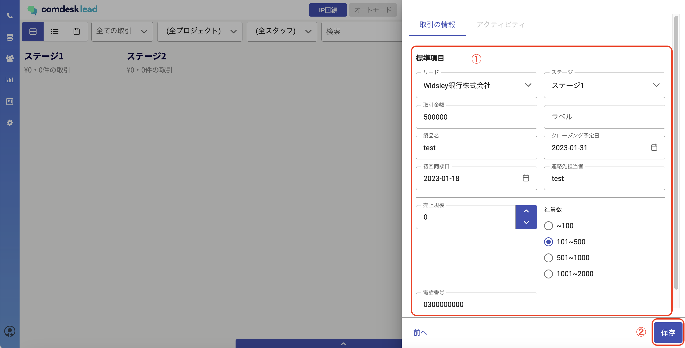
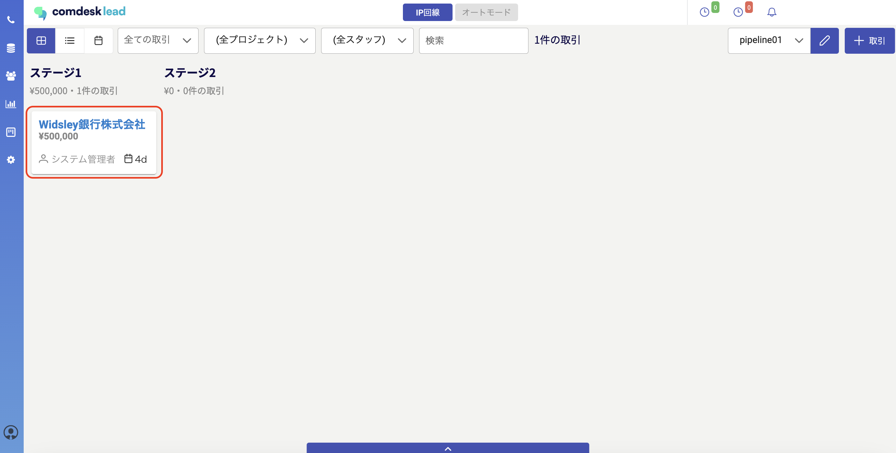

# パイプライン機能：取引を作成する

## **パイプラインの取引作成**

パイプラインで管理する取引を作成します。

1\. パイプラインメニューを開き（①）、対象となるパイプラインをクリックします（②）。

2\. 画面右上の「＋取引」をクリックします。\

3\. このパイプラインで管理したいリード（リスト）を検索し（①）、選択して（②）、次へをクリックします（③）。\

4\. 3で選択したリード（リスト）が所属しているプロジェクトを検索し（①）、選択し（②）、次へをクリックします（③）。\

5\. 取引の情報を入力し（①）、保存をクリックします（②）。\
取引情報画面に表示する項目の設定方法については[こちら](13940816117785_パイプライン機能：取引情報の項目を設定する.md)をご確認ください。

6\. 取引がパイプラインに作成できました。\

その他ご不明点などございましたら、[**サポートチームまでお問い合わせ**](https://comdesklead.zendesk.com/hc/ja/requests/new)をお願いいたします。

お問い合わせ方法は\*\*[こちら](../../トラブルシューティング/サポートチームへのお問い合わせ方法/12828937533081_サポートチームへのお問い合わせ方法.md)\*\*
