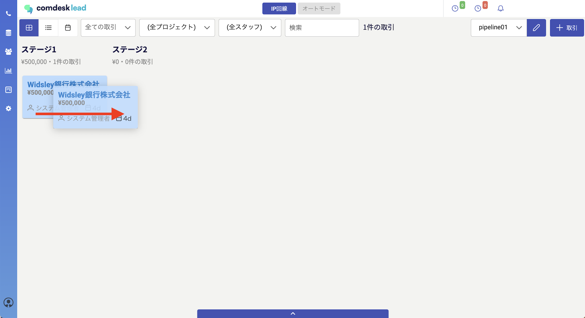
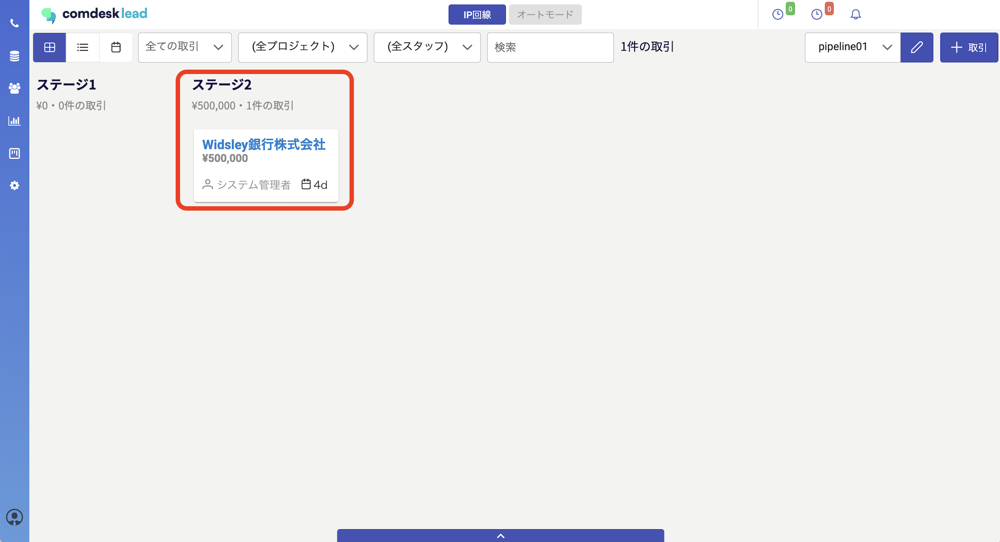
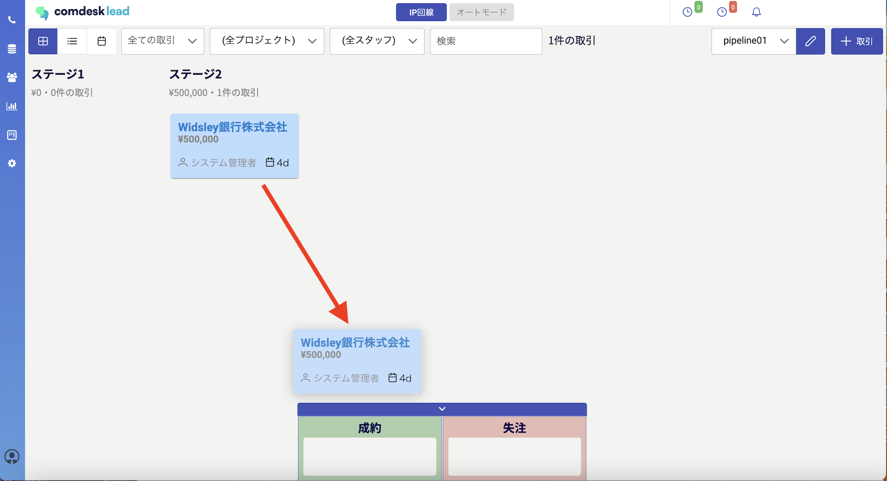
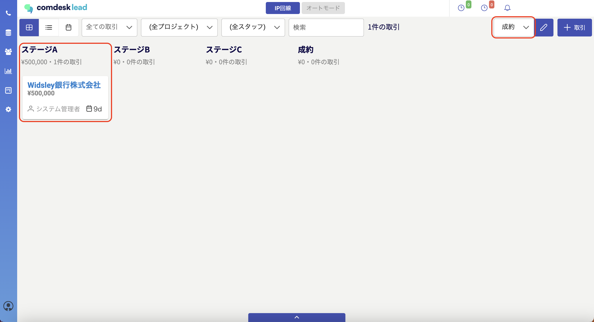

## **1. ステージを移動させる**

移動させたい取引をドラッグ＆ドロップでステージ移動させることができます。\
\
ステージ1からステージ2に移動できました。\

## **2. パイプラインを移動させる**

デフォルトで設定されていて画面下部に出ている「成約」「失注」のパイプラインにもドラッグ＆ドロップで移動させることができます。

※「成約」「失注」以外のパイプラインに移動させたい場合は、[こちら](13538915677209_パイプライン機能：パイプラインを編集する.md)　のパイプライン間移動設定をご確認ください。

pipeline1のステージ2から成約のパイプラインに移動できました。\

その他ご不明点などございましたら、[**サポートチームまでお問い合わせ**](https://comdesklead.zendesk.com/hc/ja/requests/new)をお願いいたします。

お問い合わせ方法は\*\*[こちら](../../トラブルシューティング/サポートチームへのお問い合わせ方法/12828937533081_サポートチームへのお問い合わせ方法.md)\*\*
