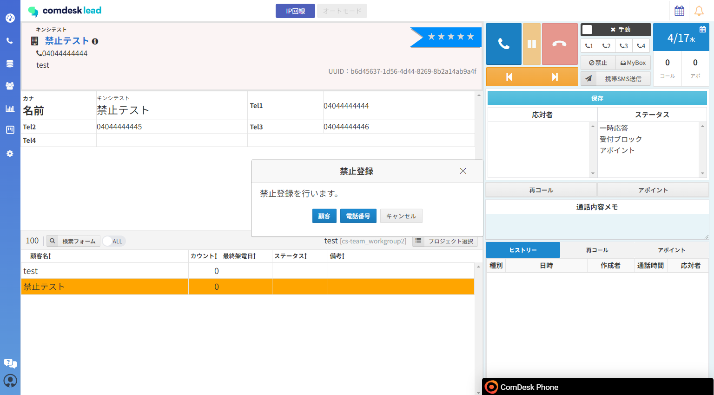
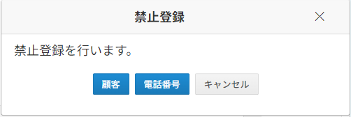
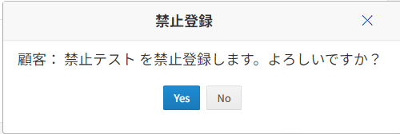
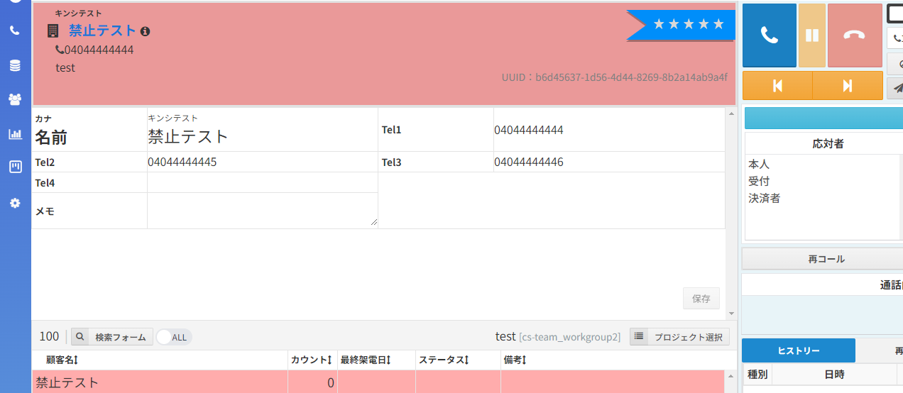
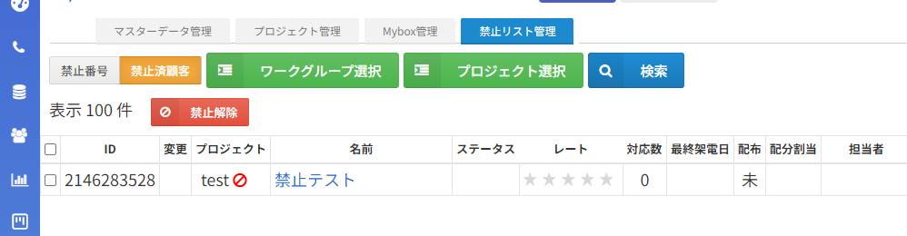
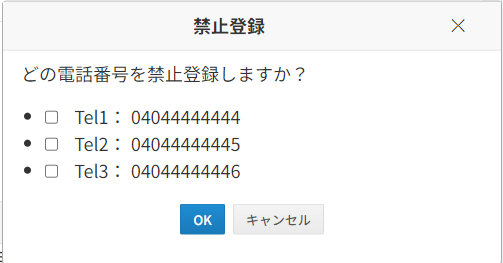
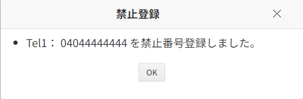
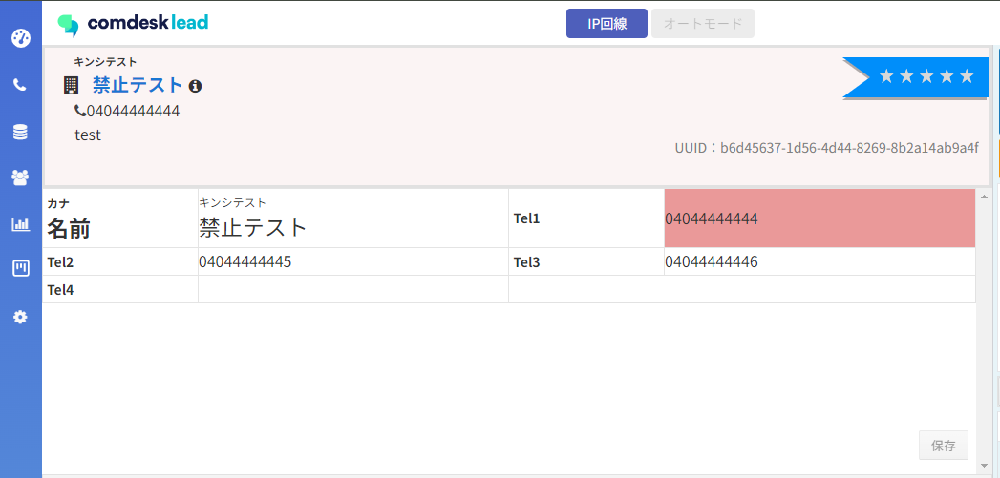
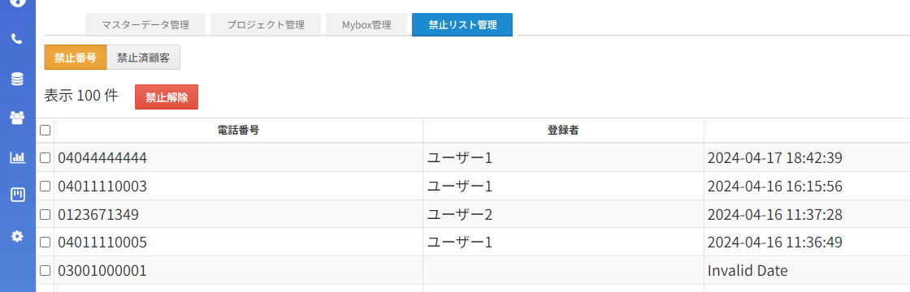

**・コール画面から番号を禁止登録**

コールモードで該当の番号（TEL1、TEL2、TEL3、TEL4）を選択した状態で「🚫禁止」ボタンを押下

「禁止登録」のポップアップが表示

\*\*「顧客」\*\*を選択した場合・・・・顧客リストのTEL1、TEL2、TEL3、TEL4全てが禁止登録される

顧客が禁止登録されると下記のように上の顧客情報がピンク色になり、一度他のページに遷移すると該当顧客は表示されなくなります。

　禁止登録をした顧客は、「Customer」→「禁止リスト管理」→「禁止番号」に表示されます。

　禁止解除もこちらから解除ができます。

　**※「マスターデータ管理」から禁止解除ができなくなりました**

\*\*「電話番号」\*\*を選択した場合・・選択した番号のみ禁止登録されます。

　禁止登録する電話番号にチェックを入れ、OKを押下

禁止登録された番号はピンクの背景になります。

禁止登録をした番号は、「Customer」→「禁止リスト管理」→「禁止番号」に表示されます。

・CSVインポートを利用し顧客を禁止登録

　変更なし
