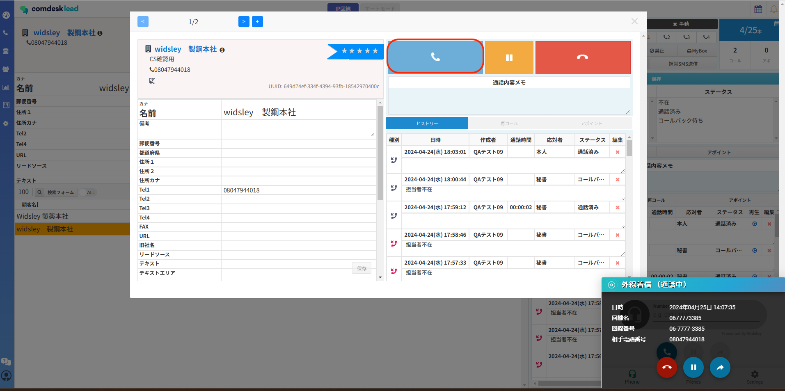
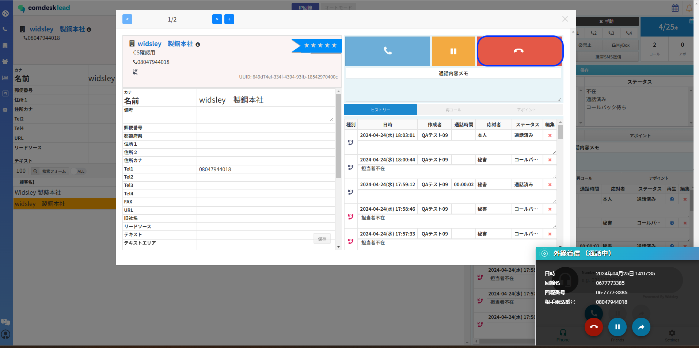
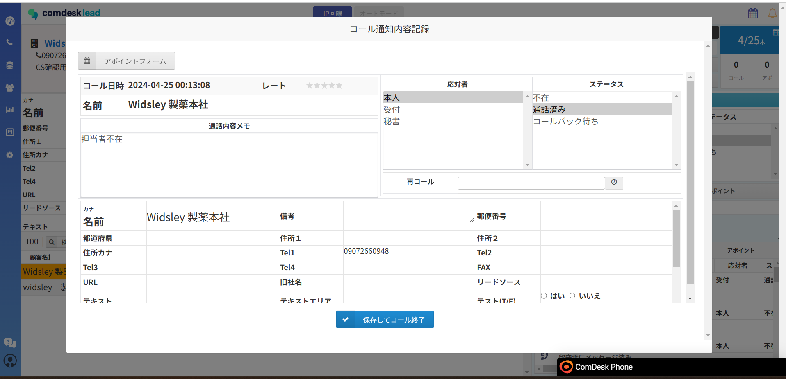
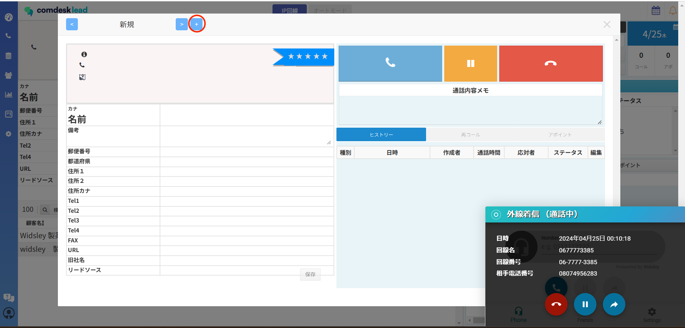

2024/04/30の夜間のアップデートにて、IP回線利用時の受電方法が変更となります。

## **登録されているリストからの着信**

1. 着信があると従来通り「カスタマー情報ダイアログ」が表示され、「OK」をクリックします。\
   
2. 受電専用のダイアログが表示され、いずれかの顧客詳細の受話器（赤枠）アイコンをクリックします。\
   通顧客詳細内の「＜」「＞」ボタンから、どのリストから着信があったか通話中に確認ができます。\
   
3. 通話中に該当のリストが見つかったら、該当のリストを開いた状態で「通話内容記録メモ」を入力します。\
   通話が終了したら、該当の顧客詳細を開いた状態で切電ボタン（青枠）をクリックします。\
   &#xNAN;**※切電ボタンをクリックしたリストにヒストリーが紐付きます。**\
   **異なるリストで切電ボタンをクリックしないようご注意ください。**
4. 切電ボタン終了後、「通話内容記録メモ」を残し、保存し通話終了となります。\
   

## **登録されていないリストからの着信**

登録されているリストからの着信「2」の時点で、どのリストからの着信でもなかった場合

どのリストにも紐付かない活動履歴を生成します。

1. 通顧客詳細内の「＜」「＞」ボタン横にある「+」ボタン（赤枠）をクリックすると新規のページが作成されます。\
   
2. 画面左側の顧客情報の部分は入力不可な仕様のため、「通話内容メモ」に必要な情報を記入します。\
   
3.  通話が終了したら「通話内容記録メモ」を入力します。\
    &#xNAN;**※この際、ワークグループ設定で一番上にある初期のワークグループの「応対者」「ステータス」が適用されています。**\
    \*\*初期のワークグループの「応対者」「ステータス」がすべてOFFの場合のみ、「ステータス」の選択がなくても保存が可能です。

    \*\*
4. 活動履歴には、どのリストにも紐付かない活動履歴が生成されます。\
   必要に応じて適切なプロジェクトへのリスト登録が必要となります。

その他ご不明点などございましたら、[**サポートチームまでお問い合わせ**](https://comdesklead.zendesk.com/hc/ja/requests/new)をお願い致します。

お問い合わせ方法は\*\*[こちら](../../トラブルシューティング/サポートチームへのお問い合わせ方法/12828937533081_サポートチームへのお問い合わせ方法.md)\*\*
