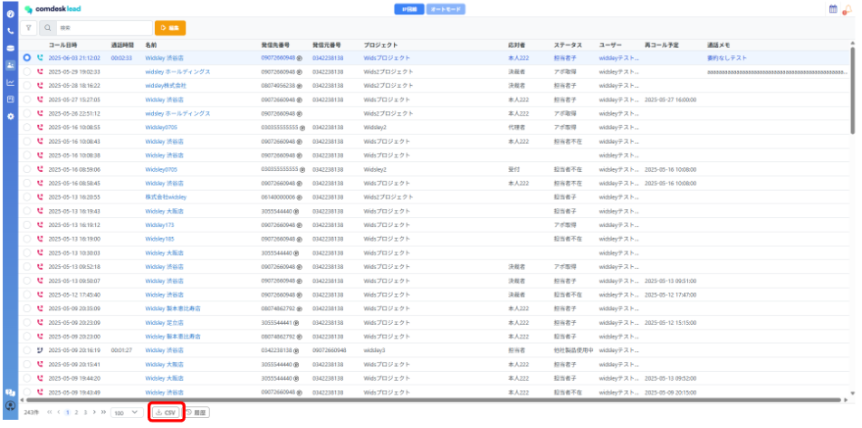
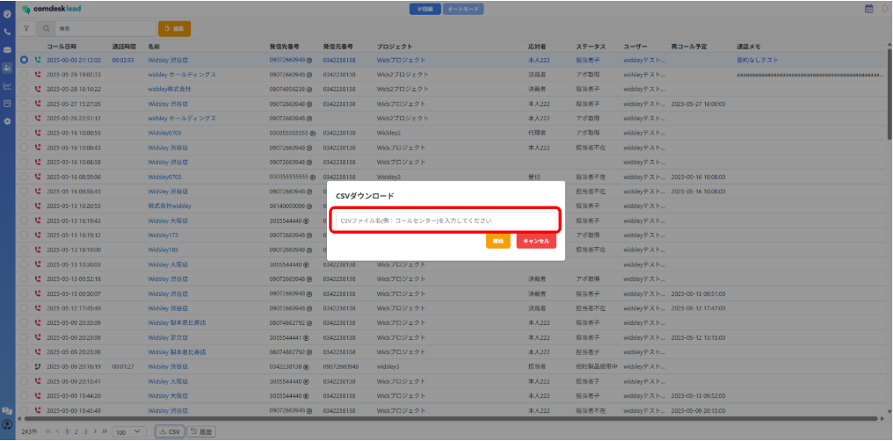
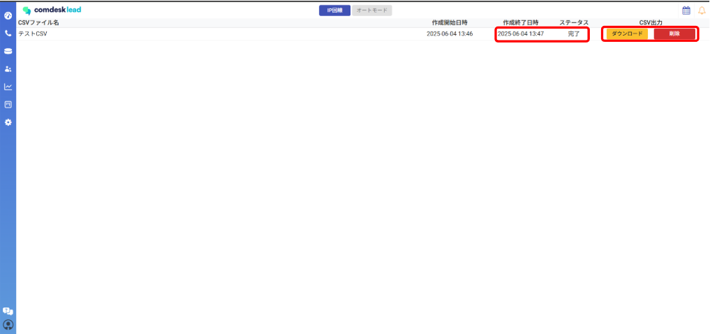
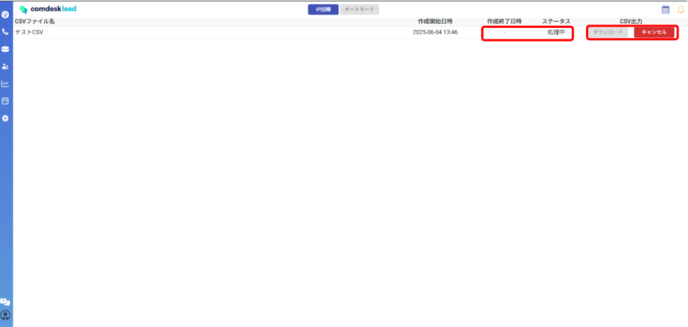
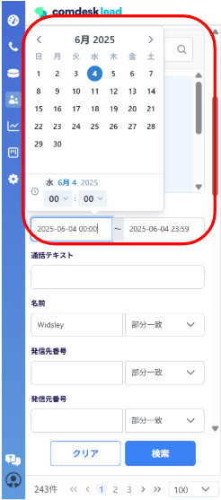

・CSVダウンロード方式の変更

即時ダウンロードから完了後に通知が来るようになりました。通知が来るまでの間、他の作業が可能になります。

CSVの項目に活動履歴URL、通話テキスト、テキスト要約を追加しました。\
┗上記項目もCSVとしてダウンロード可能な形になります。

以下、活動履歴CSVのダウンロード手順になります。

1. 活動履歴画面内左下にございます、「CSV」ボタンをクリック。\
   
2. クリックすると、画面中央にポップアップが表示され、活動履歴CSVに任意の名前を付与します。\
   名前入力後オレンジ色「開始」ボタンをクリック。（CSVのダウンロードがシステム側で開始されます。）\
   
3. システム側でダウンロードが完了すると、画面右上ベルマークに完了通知が表示されます。
4. 完了通知をクリックしていただくか、活動履歴画面左下の「履歴」ボタンをクリックするとCSVダウンロード可能な画面に遷移します。\
   （ダウンロード可能な状態）\
   　「ダウンロード」ボタンがオレンジ色の場合、クリックするとCSVがダウンロード可能でございます。\
   \
   （ダウンロード不可の状態）\
   「ダウンロード」のボタンがグレーアウトしていると、システム側で処理中になりますので、完了通知が来るまでお待ちください。\
   

ダウンロード件数を100万件までの制約を追加しました。\
CSVダウンロード実行時に任意の名称を指定し保存可能になります。\
CSVダウンロードが履歴として残ります。（最大30日保存）

\---（別の記事があるのでそちらでもよいかも）

・検索条件の変更\
コール日時\
現在：日付指定➡変更後：日時指定

