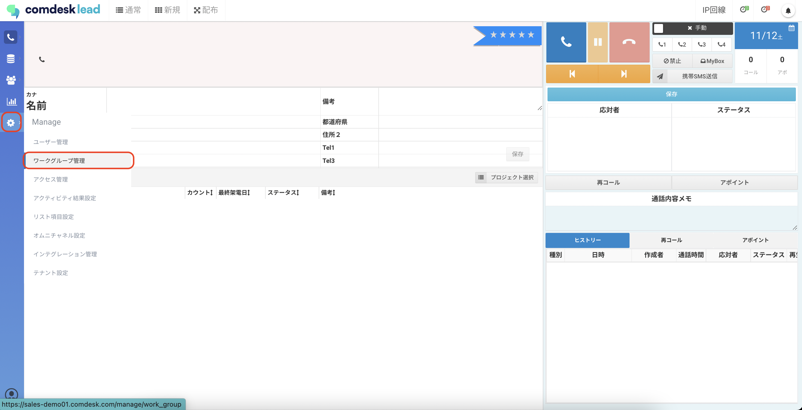
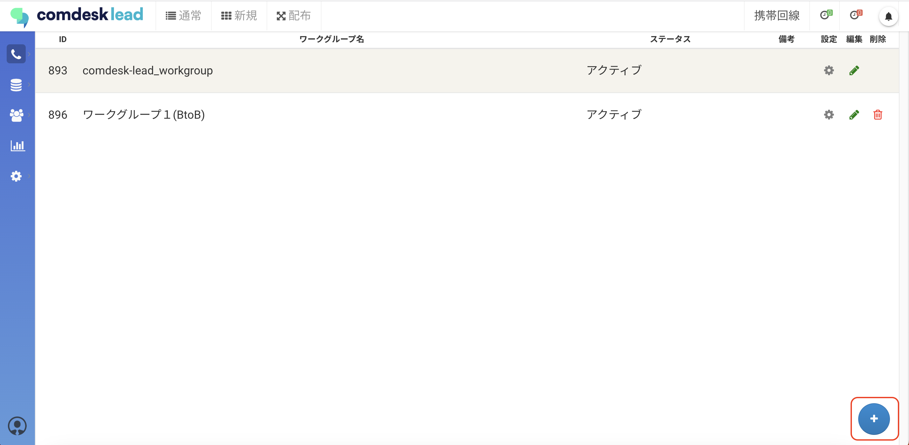
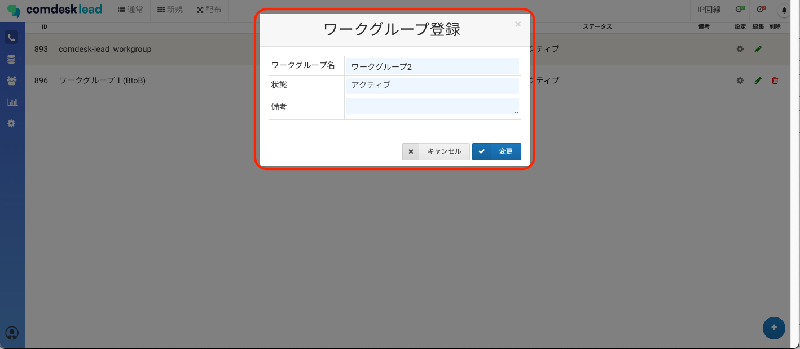
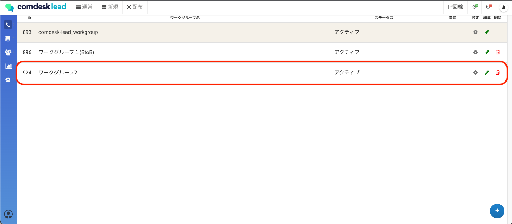

# ワークグループ作成

各ワークグループ毎に表示させたいリスト項目や応対者、ステータスを変えることができます。

活用事例：以下のように、ワークグループを分けてお使いいただけます。\
・販売商材（例：toB、toC）ごと\
・部署ごと

## **「ワークグループ管理」からワークグループを作成する**

1.  画面左側の「Manage」アイコンを選択し、「ワークグループ管理」をクリックします。

    
2.  ワークグループ管理画面が表示されますので、画面右下の「＋」ボタンをクリックします。

    
3.  ワークグループ登録画面が表示されますので、ワークグループ名を入力し、「変更」ボタンをクリックします。

    
4. ワークグループの作成が完了しました。\
   

その他ご不明点などございましたら、[**サポートチームまでお問い合わせ**](https://comdesklead.zendesk.com/hc/ja/requests/new)をお願い致します。

お問い合わせ方法は\*\*[こちら](../../トラブルシューティング/サポートチームへのお問い合わせ方法/12828937533081_サポートチームへのお問い合わせ方法.md)\*\*
