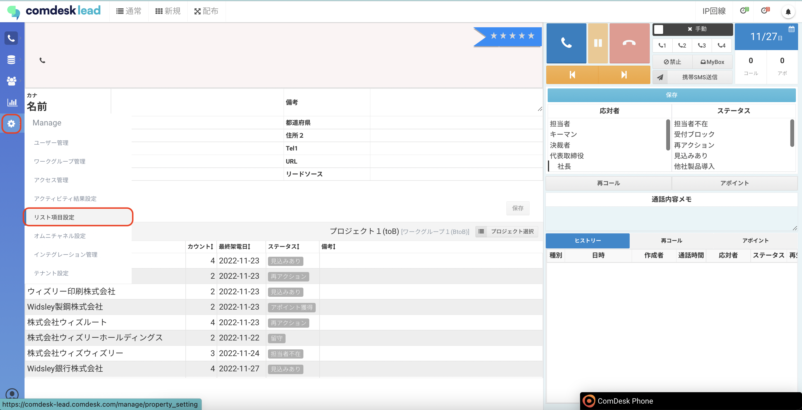
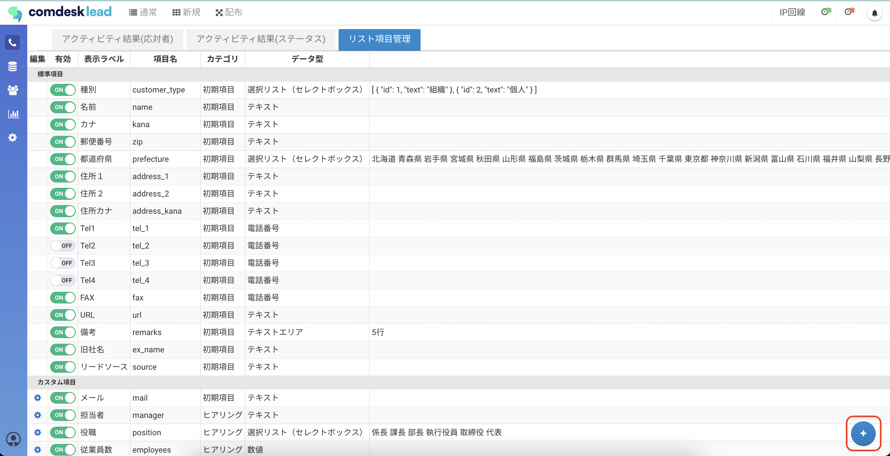
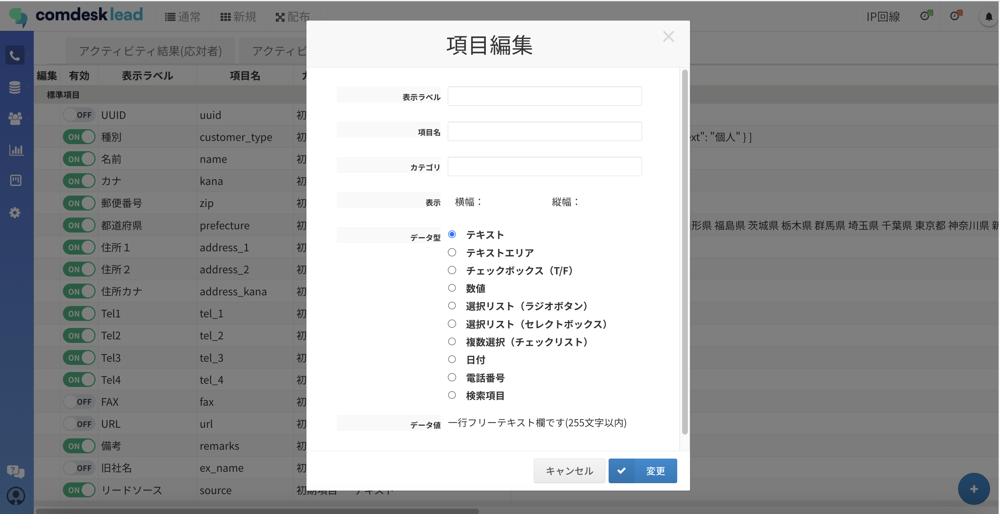
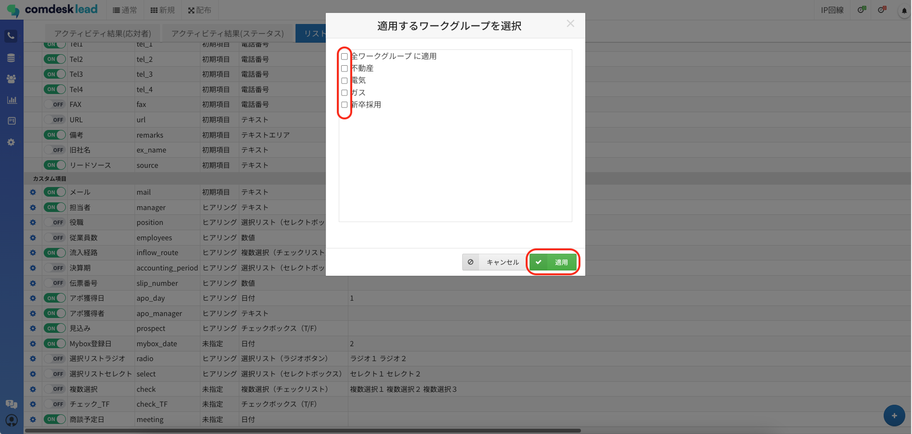

## **リスト項目の種類**

リスト項目には2種類あります。

* 標準項目：初めから用意されている項目です。
* カスタム項目：自由に追加作成いただける項目です。

## **表示ラベルと項目名**

* 表示ラベル：コールモード画面に表示される名称です。
* 項目名：内部処理で使用する名称です。

## **設定方法**

運用していく上で標準項目では足りない項目を、カスタム項目で追加することができます。

1.  画面左側の「Manage」アイコンをクリックし、「リスト項目設定」をクリックします。

    
2.  リスト項目管理画面が表示されますので、右下の追加ボタンを選択してカスタム項目を作成します。

    
3.  項目編集画面が表示されますので、各項目を設定して「変更」ボタンをクリックします。

    

    データ型を選択すると、データ値に説明が表示されます。

    ※データ型は、後から変更ができません。
4. 「追加するワークグループを選択」というポップアップが表示されますので、追加したリスト項目を適用させるワークグループのチェックボックスに✔を入れ「適用」を押下して設定完了です。\
   

その他ご不明点などございましたら、[**サポートチームまでお問い合わせ**](https://comdesklead.zendesk.com/hc/ja/requests/new)をお願い致します。

お問い合わせ方法は\*\*[こちら](../../トラブルシューティング/サポートチームへのお問い合わせ方法/12828937533081_サポートチームへのお問い合わせ方法.md)\*\*
