# アクティビティ結果の項目を設定する

リストに架電した際のアクティビティ結果を、ご運用に合わせて自由に作成・追加していただくことが可能です。

## **アクティビティ結果（応対者）の作成**

1.  画面左側の「Manage」アイコンを選択し、「アクティビティ結果設定」をクリックします。

    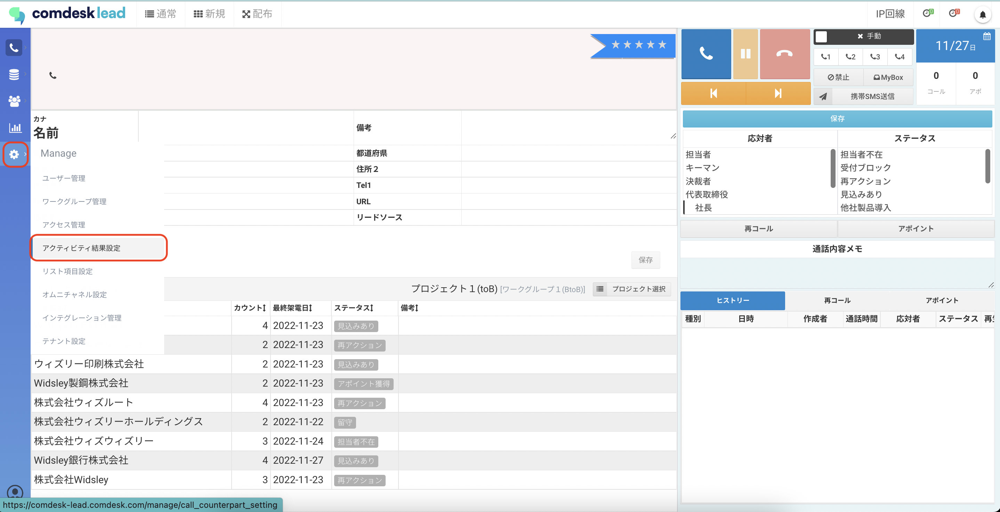
2.  アクティビティ結果（応対者）タブを開き、画面右下の追加ボタンをクリックします。

    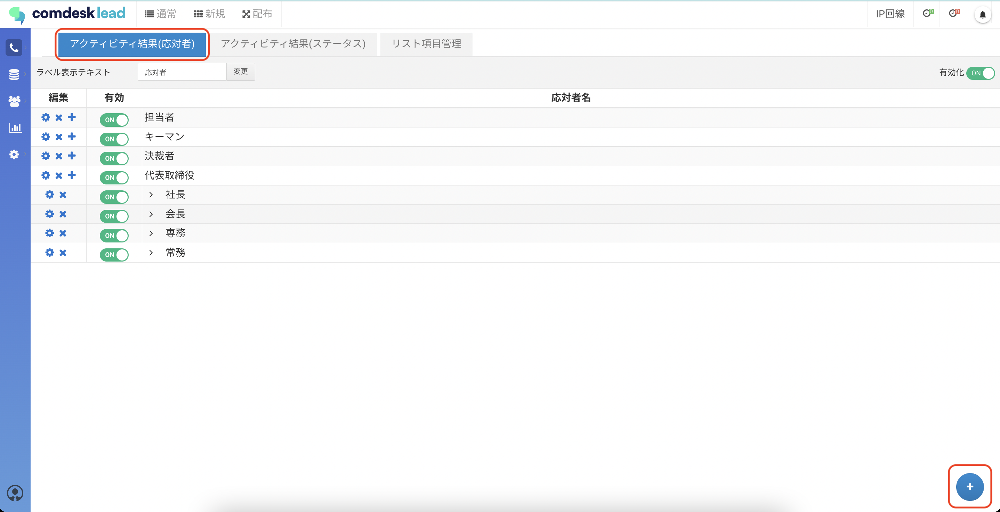
3.  項目編集画面が表示されますので、項目を入力して「変更」ボタンをクリックします。

    **・応対者名**：必須入力項目

    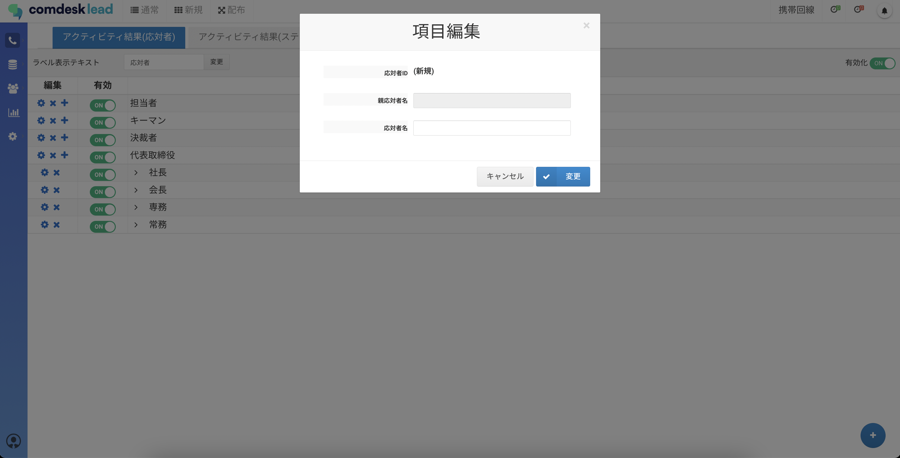
4.  応対者は親子関係を作成できます。

    応対者の子項目を作成する場合は、親となる応対者の＋アイコンをクリックします。

    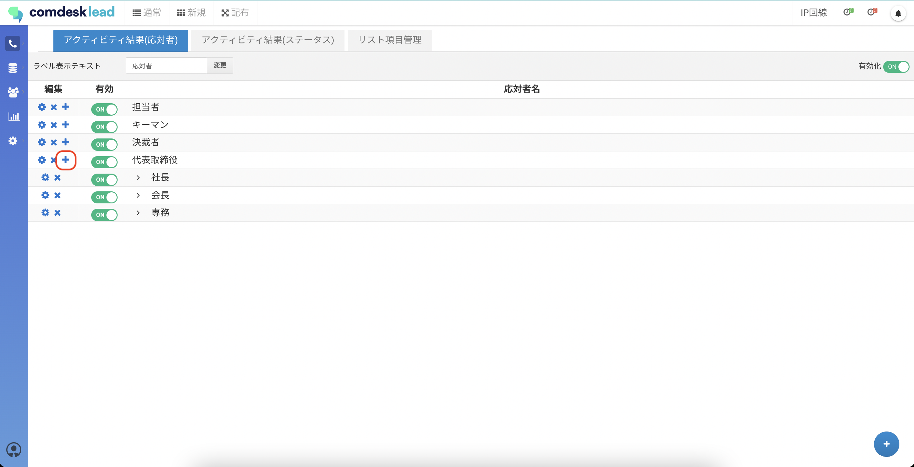
5.  項目編集画面が表示されますので、各項目を入力して「変更」ボタンをクリックします。

    **・親応対者名**：自動で反映のため変更不可

    **・応対者名**：必須入力項目

    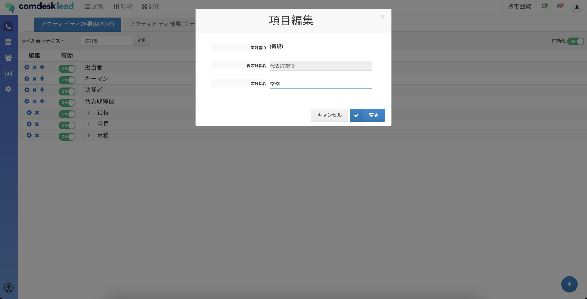

    💡 親子関係の応対者を登録した場合、以下のように画面に表示されます\
    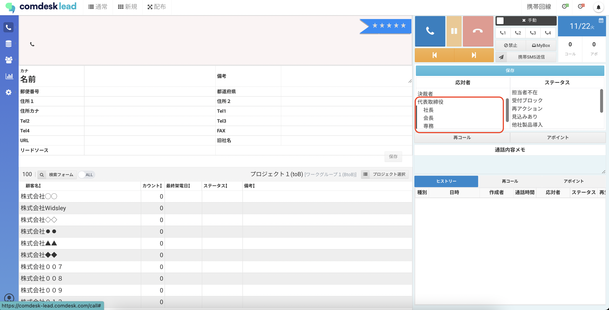
6. 「追加するワークグループを選択」というポップアップが表示されますので、追加したアクティビティ結果（応対者）の項目を適用させるワークグループのチェックボックスに✔を入れ「適用」を押下して設定完了です。\
   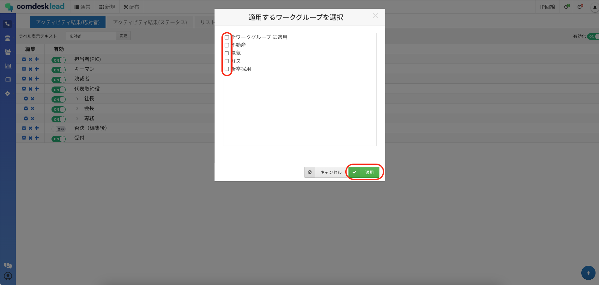

## **アクティビティ結果（ステータス）の作成**

1.  画面左側の「Manage」アイコンを選択し、「アクティビティ結果設定」をクリックします。

    
2.  アクティビティ結果（ステータス）タブを開き、画面右下の追加ボタンをクリックします。

    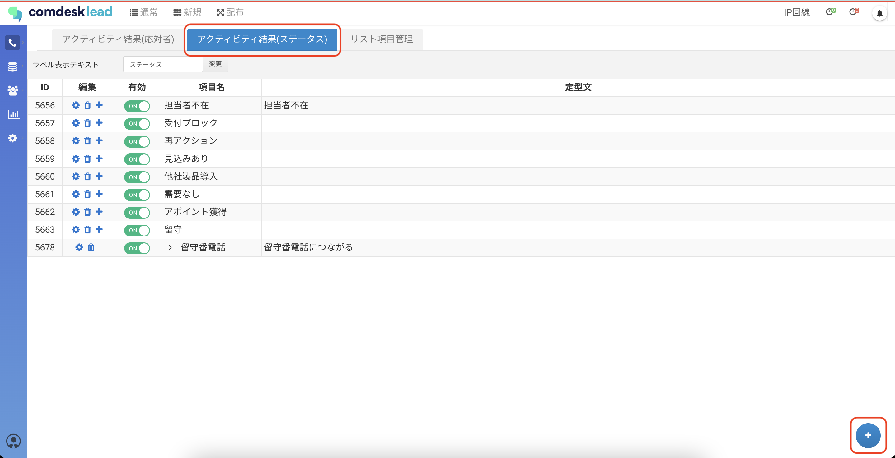
3.  項目編集画面が表示されますので、各項目を入力して「変更」ボタンをクリックします。

    **・項目名**：必須入力項目

    **・定型文**：任意入力項目

    　コール画面でステータスを選択した際、「通話内容メモ」に、この定型文を挿入できます。

    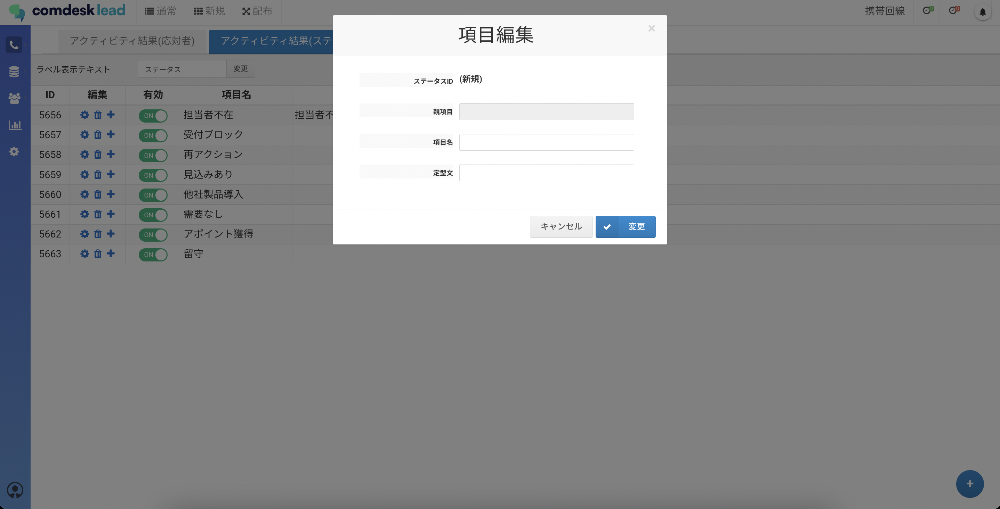
4.  ステータスは親子関係を作成できます。

    ステータスの子項目を作成する場合は、親となるステータスの＋アイコンをクリックします。

    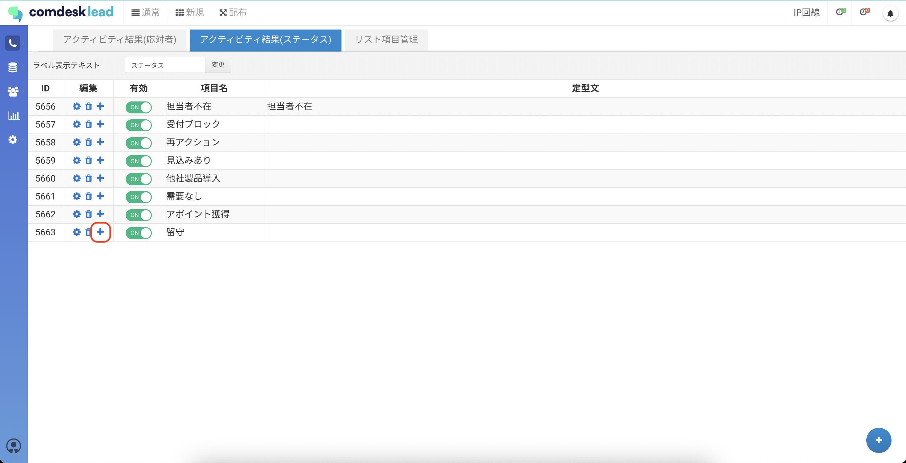
5.  項目編集画面が表示されますので、各項目を入力して「変更」ボタンをクリックします。

    **・親項目**：自動で反映のため変更不可

    **・項目名**：必須入力項目

    \*\*・\*\***定型文**：任意入力項目

    　コール画面でステータスを選択した際、「通話内容メモ」に、この定型文を挿入できます。

    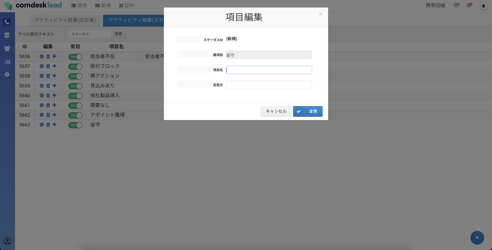

    💡 親子関係のステータスを登録した場合、以下のように画面に表示されます。\
    定型文を登録すると、ステータスの選択と同時に、通話内容メモへ定型文が挿入されます。\
    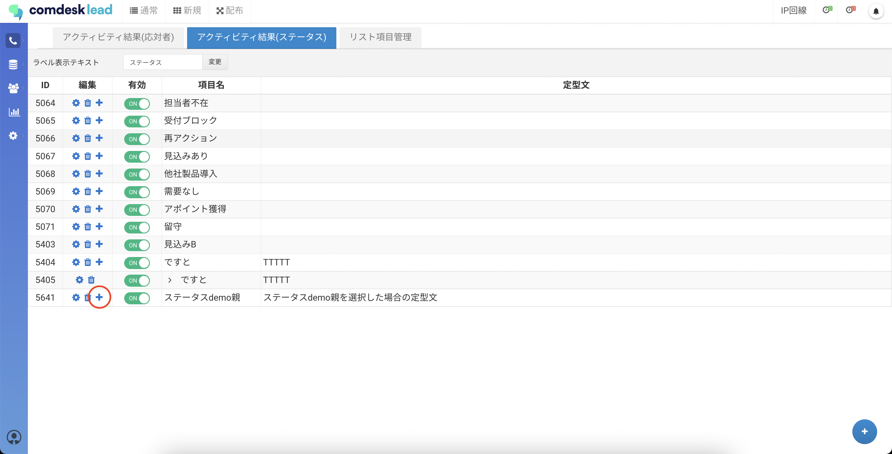
6. 「追加するワークグループを選択」というポップアップが表示されますので、追加したアクティビティ結果（ステータス）の項目を適用させるワークグループのチェックボックスに✔を入れ「適用」を押下して設定完了です。\
   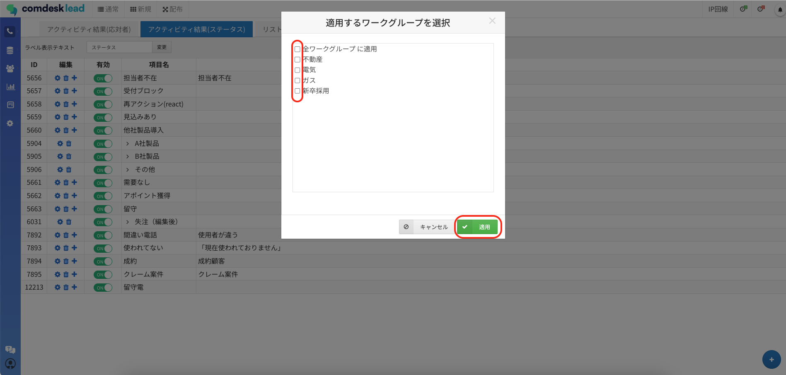

その他ご不明点などございましたら、[**サポートチームまでお問い合わせ**](https://comdesklead.zendesk.com/hc/ja/requests/new)をお願い致します。

お問い合わせ方法は\*\*[こちら](../../トラブルシューティング/サポートチームへのお問い合わせ方法/12828937533081_サポートチームへのお問い合わせ方法.md)\*\*
