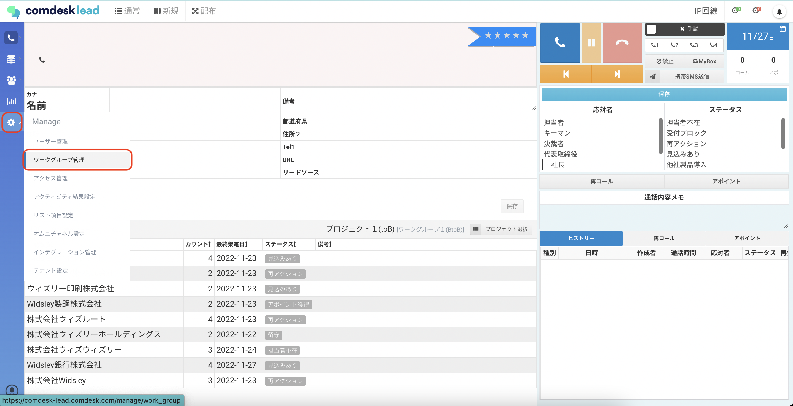
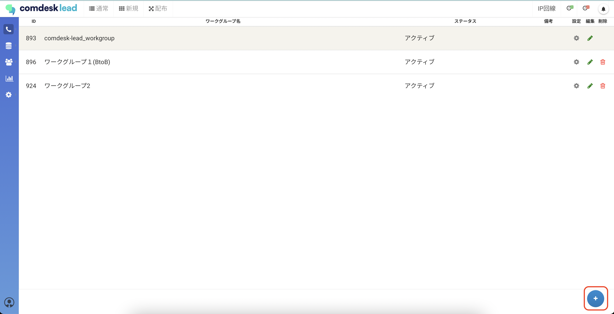
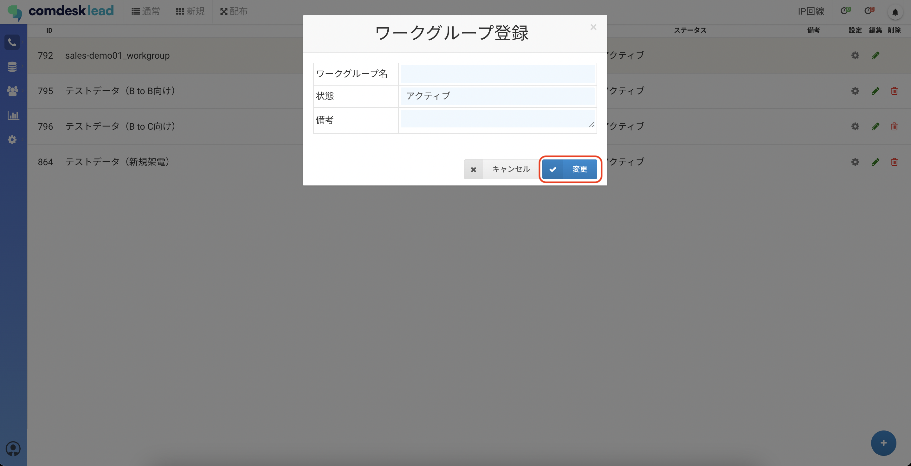
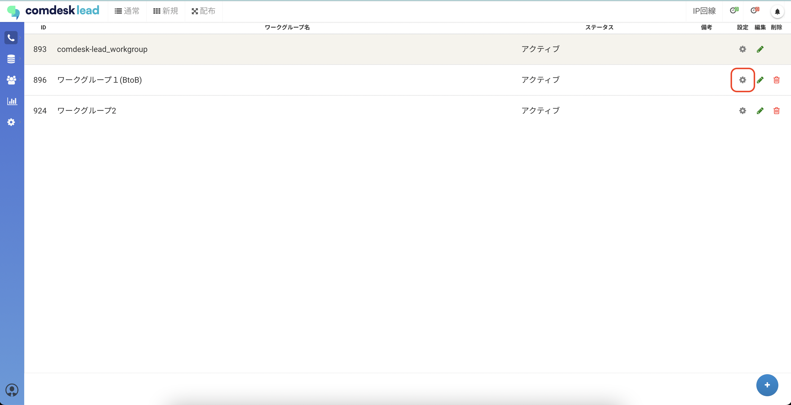
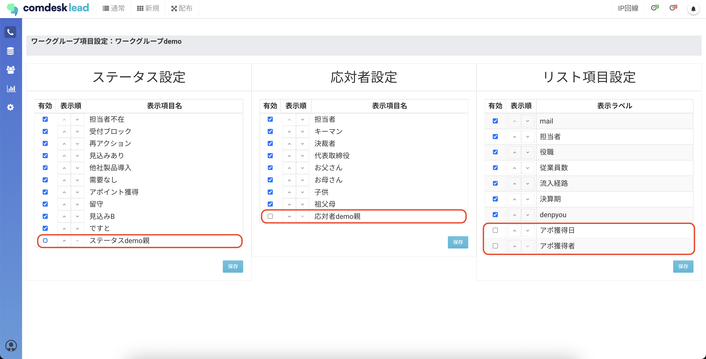
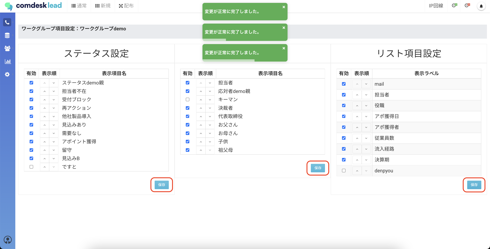

# ワークグループ設定をする

目次\
ワークグループの作成方法\
ワークグループごとの表示項目の設定方法

## **ワークグループの作成方法**

1.  画面左側の「Manage」アイコンから「ワークグループ管理」をクリックします。

    
2.  ワークグループ管理画面が表示されますので、画面右下の「＋」ボタンをクリックします。

    
3.  ワークグループ登録画面が表示されますので、ワークグループ名を入力し、「変更」ボタンをクリックします。

    

## **ワークグループごとの表示項目の設定方法**

標準項目に加え、必要なリスト情報をカスタム項目として設定追加できます。 　

※標準項目：種別・名前・カナ・郵便番号・都道府県・住所１・住所２・住所カナ・Tel1・Tel2・Tel3・Tel4・FAX ・URL・備考・旧社名・リードソース

1.  画面左側の「Manage」アイコンから「ワークグループ管理」をクリックします。

    
2.  ワークグループの一覧が表示されますので、編集対象のワークグループの設定アイコンをクリックします。

    
3. ワークグループ項目設定画面が表示されますので、ステータスの設定、応対者設定、リスト項目設定をします。ワークグループごとに有効項目の設定、表示順の変更ができます。\
   
4.  各項目の設定ができましたら、設定欄の「保存」ボタンをクリックします。

    

その他ご不明点などございましたら、[**サポートチームまでお問い合わせ**](https://comdesklead.zendesk.com/hc/ja/requests/new)をお願い致します。

お問い合わせ方法は\*\*[こちら](../../トラブルシューティング/サポートチームへのお問い合わせ方法/12828937533081_サポートチームへのお問い合わせ方法.md)\*\*
