# リストをプロジェクトにインポート

Comdesk Leadでは、下記の構成となっています。

* ワークグループ＞プロジェクト＞リスト\
  ワークグループ：商材や案件毎の箱であり、プロジェクトの上位となる位置付け\
  プロジェクト：リストのかたまりであり、ワークグループの下位、リストの上位となる位置付け\
  リスト：顧客データ１件ごとを指し、プロジェクトの下位となる位置付け

インポートには大きく２種類あります。

* [新規プロジェクトを作成しリストをインポート](12743928066585_リストをプロジェクトにインポート.md#01H8DFK2D54W6SBQZ28KV9HVHG)
* [既存プロジェクトに追加でリストをインポート](12743928066585_リストをプロジェクトにインポート.md#01H8DFK2D533SSMY2GFR4GEF9J)

## **新規プロジェクトを作成しリストをインポート**

1.  画面左側の「Customer」を選択し、「プロジェクト管理」をクリックします。

    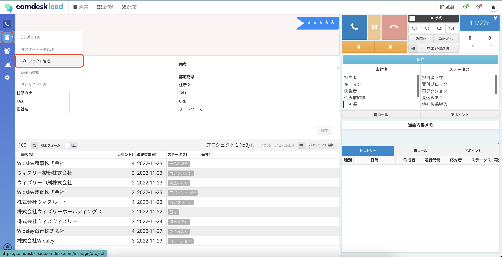
2.  プロジェクト管理画面が表示されますので、「プロジェクト登録」ボタンをクリックします。

    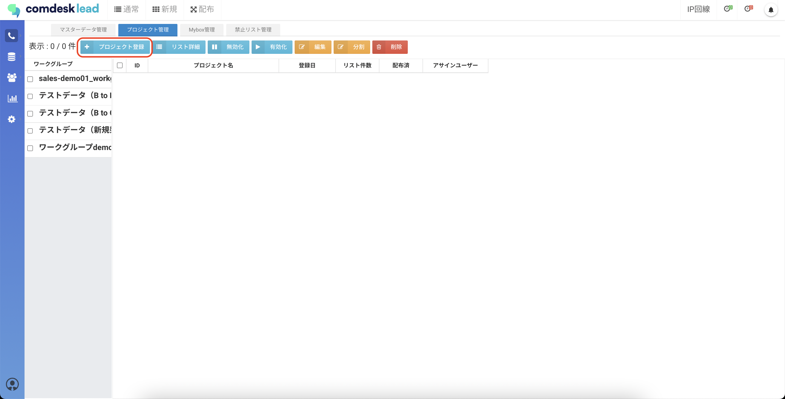
3.  プロジェクト登録画面が表示されますので、「CSVフォーマット」ボタンを選択します。

    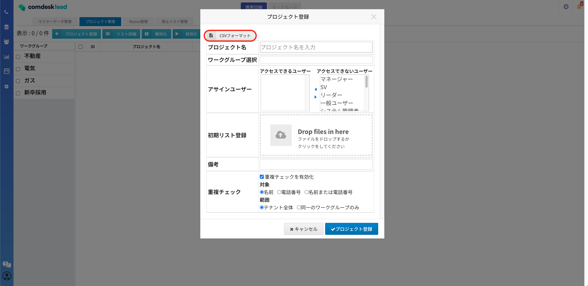
4.  ダウンロードしたCSVフォーマットを開いて、登録する情報を入力します。\
    [CSV形式のファイルをExcelで開く](16562691982617_CSV形式のファイルをExcelで開く.md)

    必須入力項目

    ・名前

    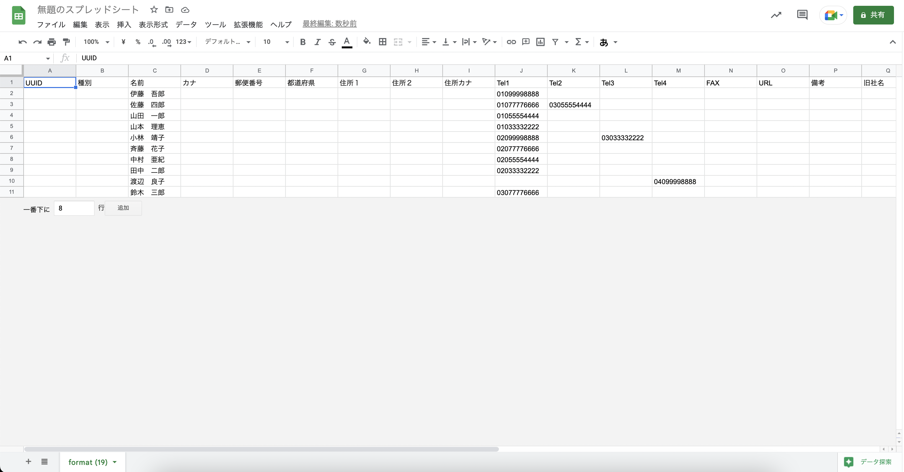

    💡 Tel1〜Tel4に「0」のみ入力すると、全件が重複チェックでHitして処理が重くなるので、\
    正しい情報を入力してください。\
    セル内での改行は禁止です。\
    以下は入力禁止文字の一例です 。\
    ,（カンマ）　\
    ”（半角ダブルコーテーション）　\
    ’（半角シングルコーテーション）\
    \`（バッククォート）\
    ’（全角/半角アポストロフィ）

    ※旧字体はインポートができても、Comdesk Lead上で正しく表示できない場合があります。
5. CSVファイル形式で保存します。
6.  プロジェクト登録画面の各項目を入力して、「プロジェクト登録」ボタンをクリックします。

    **・プロジェクト名**：必須入力項目

    **・ワークグループ選択**：選択項目

    **・アサインユーザー**：登録するリストを利用できるユーザーを選択し、左の「アクセスできるユーザー」に反映させます。

    **・初期リスト登録**：保存したcsvリストをドロップするか、フォルダからファイルを選択し格納します。

    **・備考**：任意入力項目

    **・重複チェックを有効化**：既に登録されている情報とインポートするリストの情報の重複チェックをしたい場合は、チェックボックスに✔を入れます。\
    重複チェックの対象は下の3項目より選択が可能です。

    * 名前
    * 電話番号
    * 名前または電話番号

    ※「名前」を選択した場合、完全一致で重複対象となります。

    ※あくまでも重複チェック時における対象項目の選択となり、禁止番号は現状同様テナント設定に準ずる。（2024/03/06のアップデートにて、重複チェックの対象項目が追加されました。）

    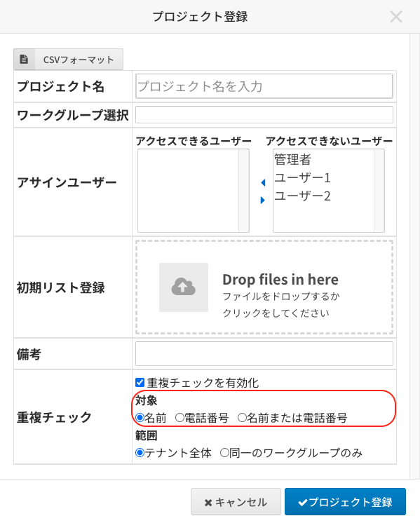
7.  画面上部に「プロジェクトを作成しました」というメッセージが表示されます。

    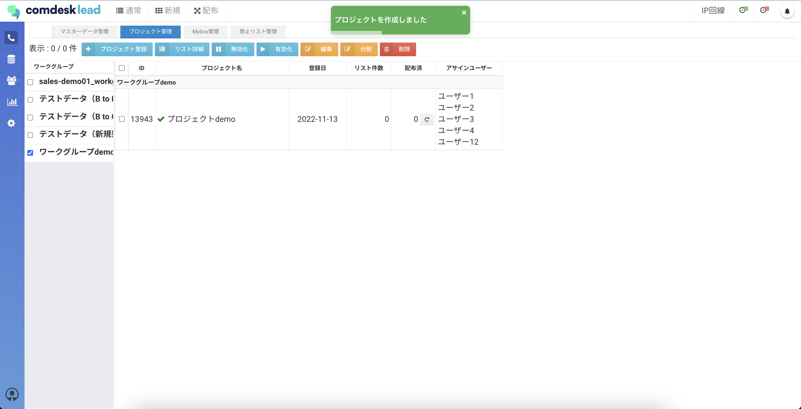

    💡 この時点で作成されるのはプロジェクトのみで、リストは未登録です。
8.  重複チェックを有効化した場合は、重複チェックが終了すると画面右上に通知されるので選択します

    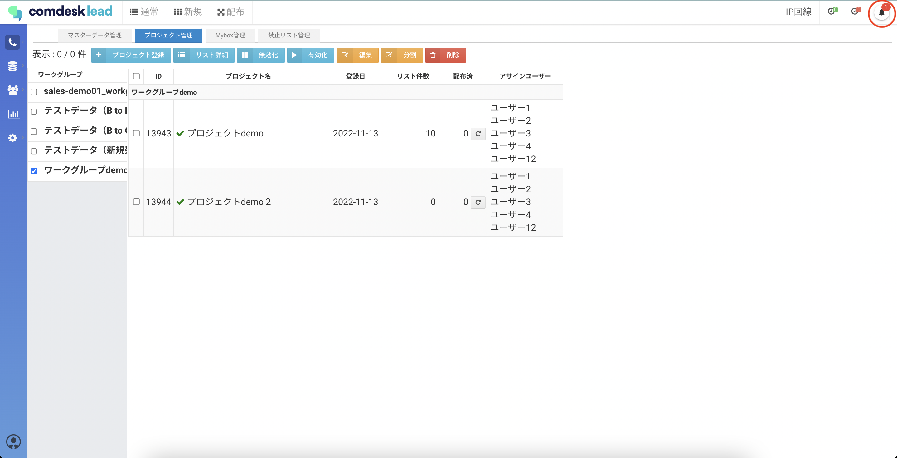
9. 通知メッセージが表示されますので、「顧客インポート・・・ここをクリックして重複確認を行って下さい。・・・」というメッセージをクリックします。\
   
10. 重複チェック画面が表示されますので、「重複」タブをクリックします。\
    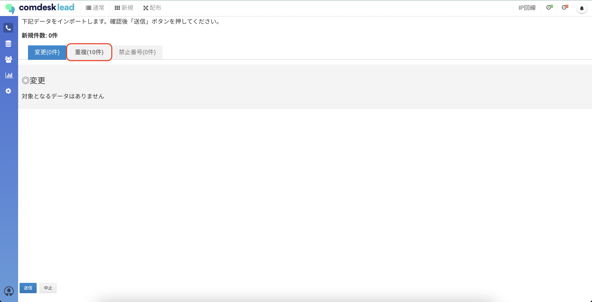

    ◇各項目を選択した場合の画面表示

    \*\*重複チェック対象：名前\
    \*\*※完全一致のみ対象

    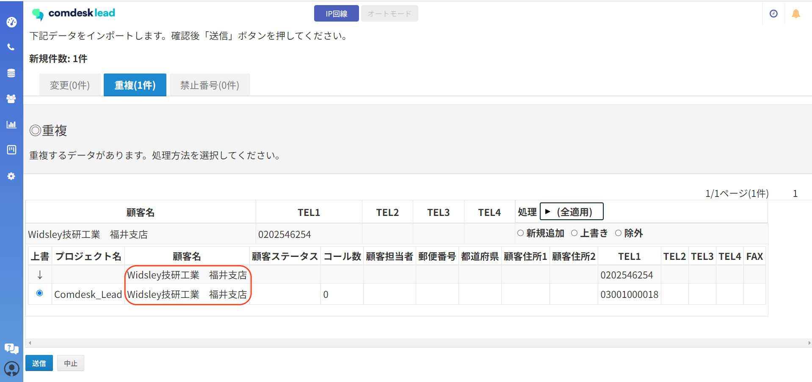

    \*\*重複チェック対象：電話番号

    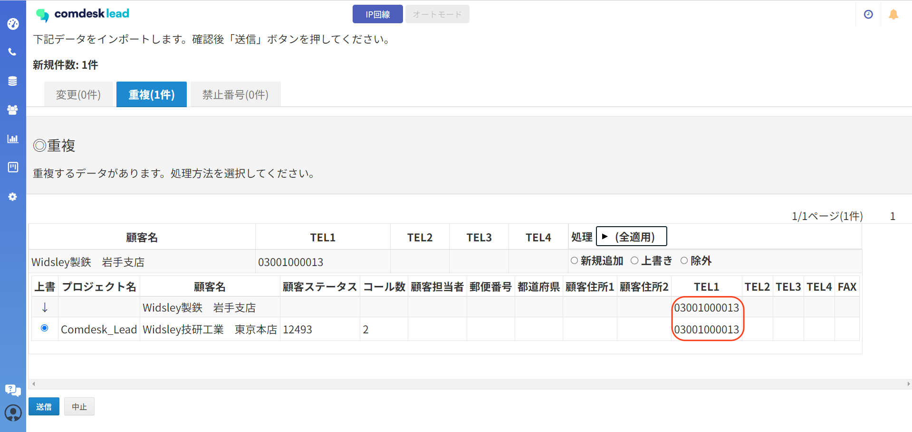\
    \*\*\
    \*\*重複チェック対象：名前または電話番号

    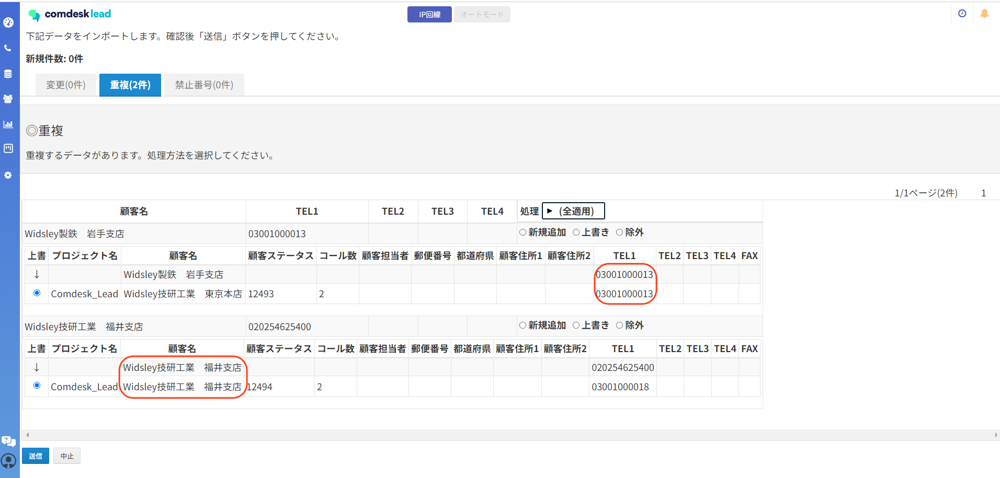\*\*
11. 重複した情報に対して一括で処理を行う場合は、（全適用）を選択するとリストが表示されますので、いずれかを選択します。

    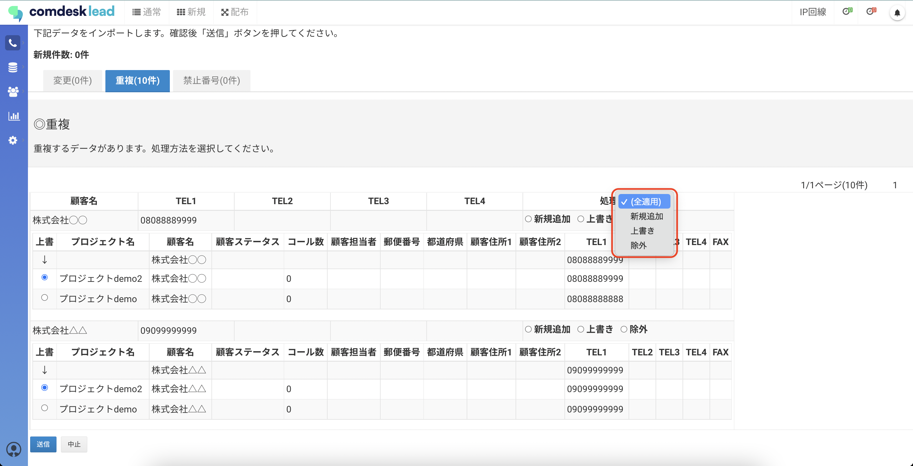

    個別に設定する場合は、プロジェクトごとに設定をします。

    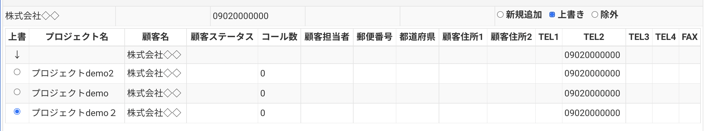
12. 処理方法をそれぞれ選択し終わったら、「送信」ボタンをクリックします。

    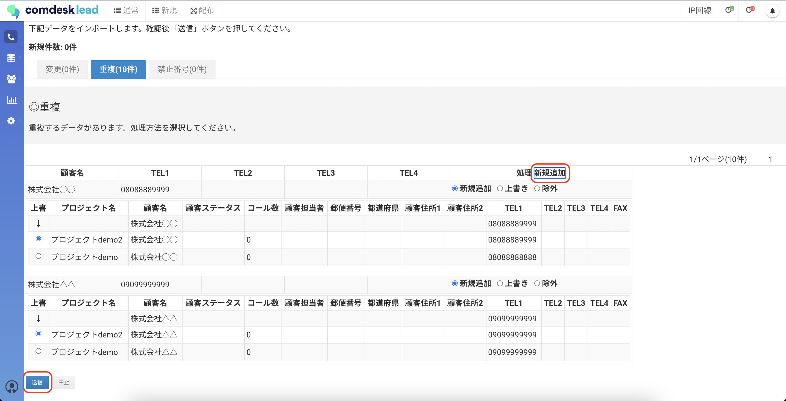
13. 「本当によろしいですか？」というモーダルが表示されますので問題なければ「OK」をクリックします。

    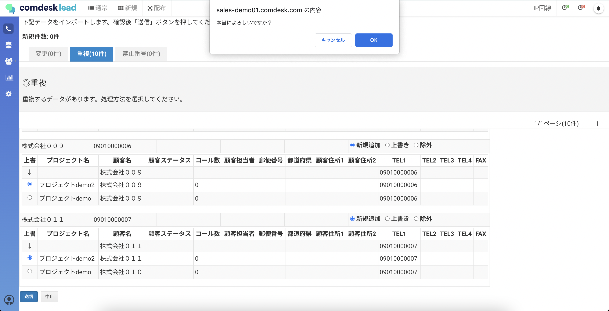
14. 下記メッセージモーダルが表示されますので、「OK」ボタンをクリックします。

    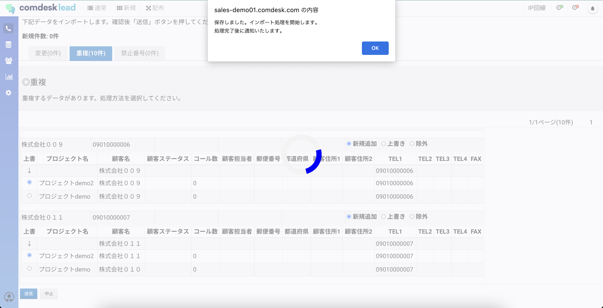
15. インポート処理が完了すると、画面右上に通知されます。

    
16. インポート完了後に画面右上のベルマークに「インポート処理を完了しました」と通知が来たら上書きインポート処理の完了です。

    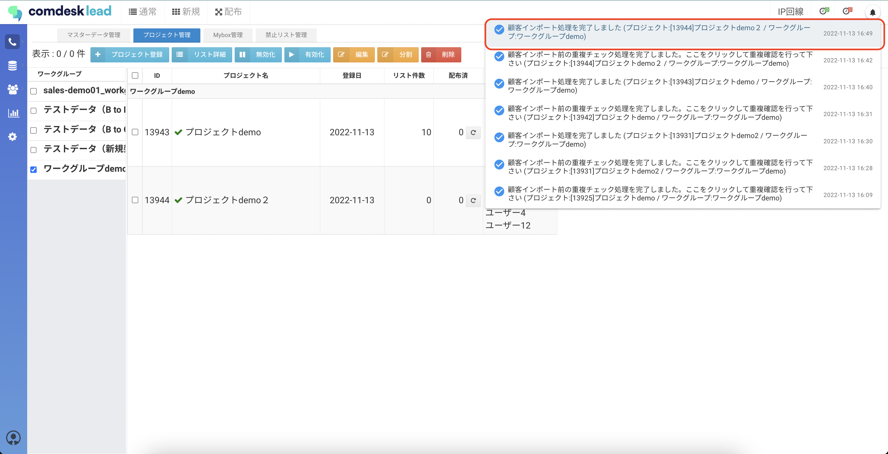

    💡 重複チェックを完了する前に、次のインポートを新たに行った場合、\
    重複チェック処理が溜まって処理が重くなります。\
    必ず1つのCSVファイルをインポート→重複チェック完了を行なってください。

## **既存プロジェクトに追加でリストをインポート**

1. 画面左側の「Customer」を選択し、「プロジェクト管理」を選択します\
   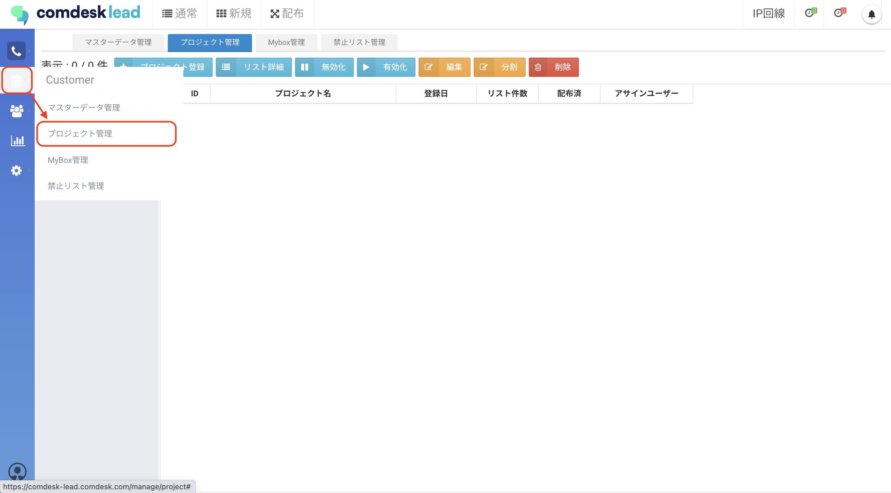
2. 追加したい既存プロジェクトが存在する「ワークグループ」を選択した後、該当の「ワークグループ」を選択し「編集」をクリックします\
   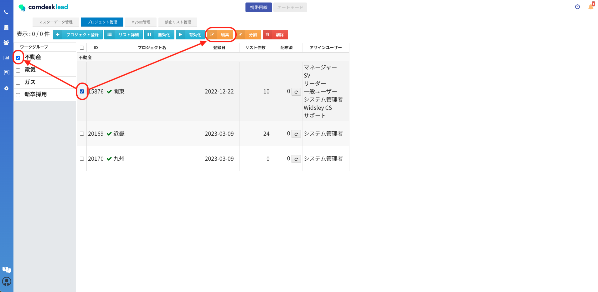
3. インポートしたいデータを、CSVフォーマットの形式に合わせてアップロードし「プロジェクト編集」をクリックします。\
   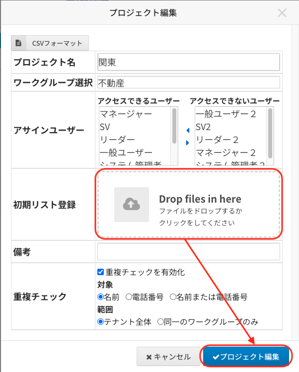
4. このあとは「新規プロジェクトを作成しリストをインポート」の8以降と同様です。

その他ご不明点などございましたら、[**サポートチームまでお問い合わせ**](https://comdesklead.zendesk.com/hc/ja/requests/new)をお願い致します。

お問い合わせ方法は\*\*[こちら](../../トラブルシューティング/サポートチームへのお問い合わせ方法/12828937533081_サポートチームへのお問い合わせ方法.md)\*\*
