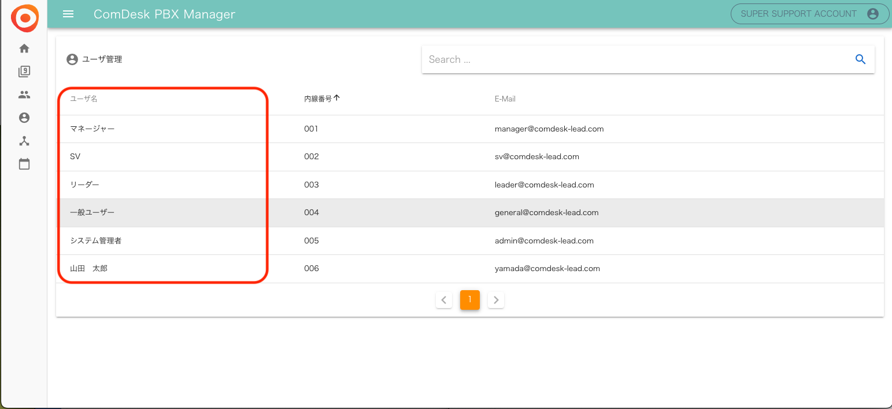
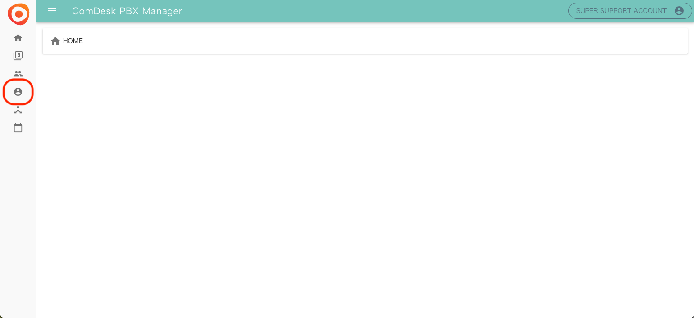
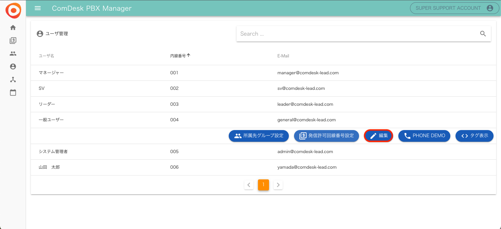
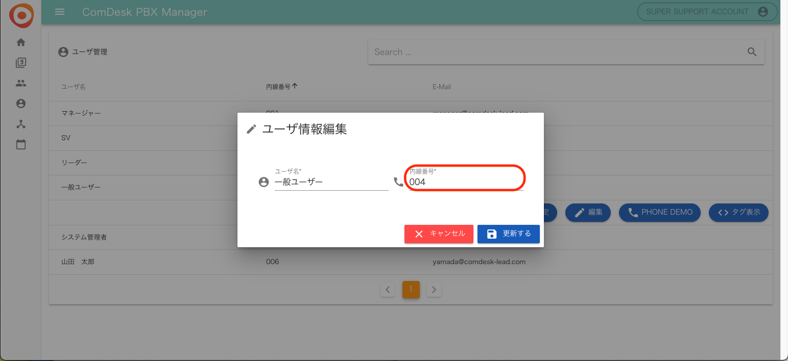

# IP回線 ユーザー名・内線番号の編集方法

## **ユーザー名の編集をする**

1. PBX Managerを開き「ユーザー管理」画面を開きます。\
   
2. 赤枠内\*\*「ユーザー名」は編集不可の為、ご依頼いただき弊社で編集させていただきます。\
   \*\*

ご依頼の場合、\*\*[サポートチームまでRequest](https://comdesklead.zendesk.com/hc/ja/requests/new)\*\*をお願い致します。

## **内線番号を変更する**

1. PBX Managerを開き「ユーザー管理」画面を開きます。\
   
2. ユーザー管理画面で編集したいユーザーを選択し、「編集」をクリックします。\
   
3. 内線番号部分を編集し、「更新」をすると変更完了です。\
   （既に登録されてる内線番号には変更できませんのでご注意ください。）\
   

その他ご不明点などございましたら、[**サポートチームまでお問い合わせ**](https://comdesklead.zendesk.com/hc/ja/requests/new)をお願い致します。

お問い合わせ方法は\*\*[こちら](../../トラブルシューティング/サポートチームへのお問い合わせ方法/12828937533081_サポートチームへのお問い合わせ方法.md)\*\*
