## **着信設定とは**

下記３ステップで着信に関する各種設定が簡単にできます。

　Step1 着信パーツの作成\
　　　　┗パーツの種類：着信グループ、音声管理、自動転送、留守番電話、キューイング\
　Step2 着信コールフローの作成\
　Step3 着信スケジュールの作成

## **Step1．着信パーツの作成**

### **着信グループ**

回線ごとに、着信を受けるユーザーをグループに設定します。

1. PBX Managerの「グループ管理」を開きます。\
   ※PBX Managerとは、IP回線の設置をする画面です。URLは管理者の方に弊社よりご案内致します。\
   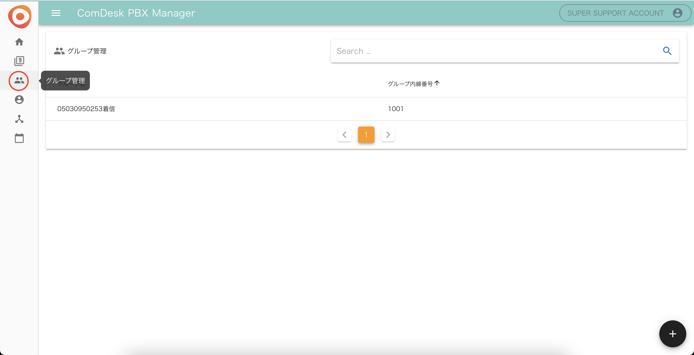
2. グループ管理画面右下の「＋」ボタンをクリックします。\
   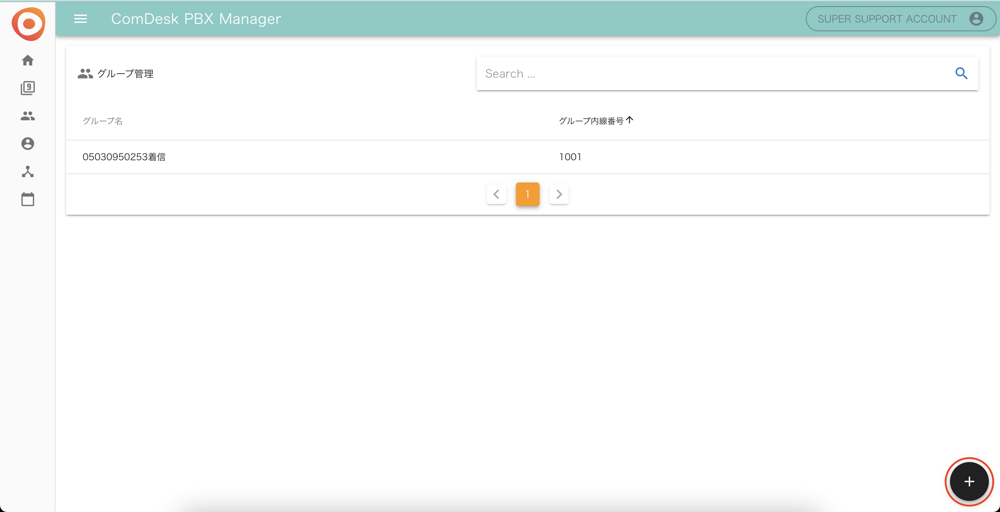
3.  「グループ情報登録」のモーダルが表示されるので、\
    &#xNAN;**・グループ名**：必須項目\
    &#xNAN;**・グループ内線番号**：指定がない場合はデフォルト値の9999とし「登録する」をクリックします。

    
4. 上記3で設定したグループ名をクリックし「所属ユーザ設定」をクリックします。
5. 着信グループに入れたいユーザを選択して下さい。最上部のチェックボックスにチェックを入れると全選択となります。選択が完了しましたら、「登録する」をクリックします。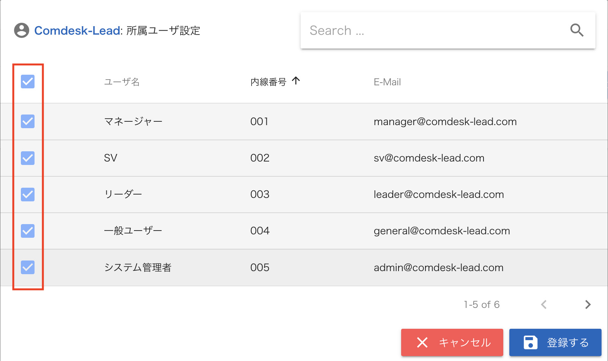

### **音声管理**

営業時間外アナウンスや休日アナウンスの音声をアップロードします。

1.  「着信コールフロー管理」画面を開きます。

    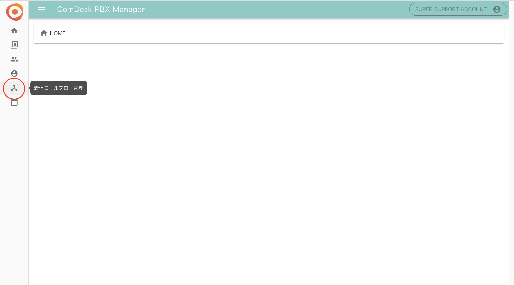
2.  右下の黒い円にマウスカーソルを合わせて表示されるオレンジ色のメニューから、音声追加アイコン（赤枠）をクリックします。

    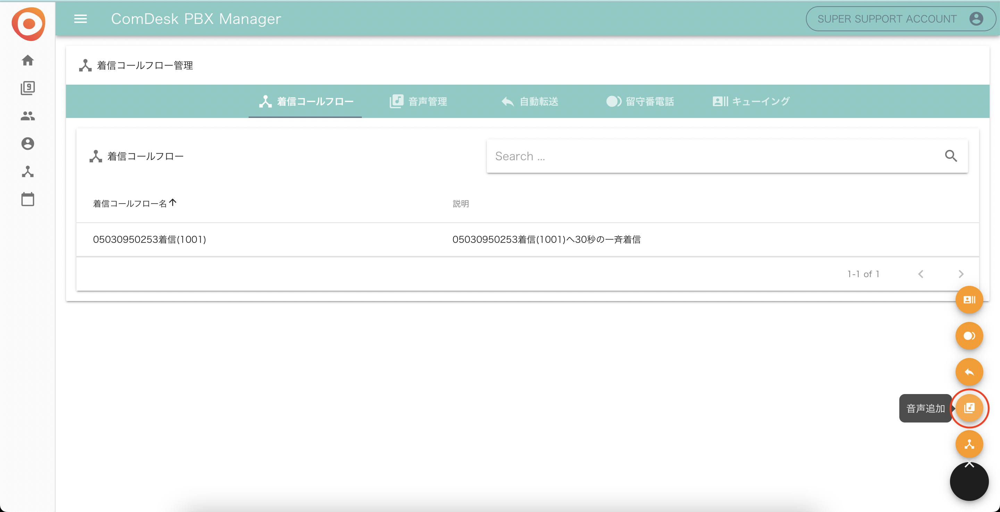
3. 音声追加画面で音声ファイル（wavファイルのみ対応可能）をドラッグアンドドロップすると、自動的にアップロードが終了します。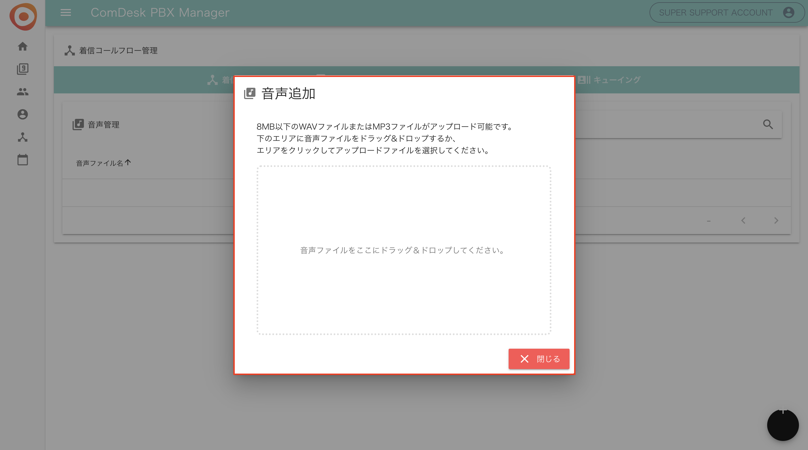

### **自動転送**

転送先の電話番号を設定します。

1. 「着信コールフロー管理」を開きます。\
   
2.  右下の黒い円にマウスカーソルを合わせて表示されるオレンジ色のメニューから、自動転送追加アイコン（赤枠）をクリックします。

    
3.  自動転送追加画面が表示されます。

    **・転送設定名**：必須入力項目

    **・転送先番号１〜４**：いずれか１つ入力し「登録する」をクリックします。

    ※転送時には、4つの番号に対して同時に転送をし、1人の方が出ると他の方の鳴動は止まります。

    

### **留守番電話**

留守番電話の設定をします。

1. 「着信コールフロー管理」を開きます。\
   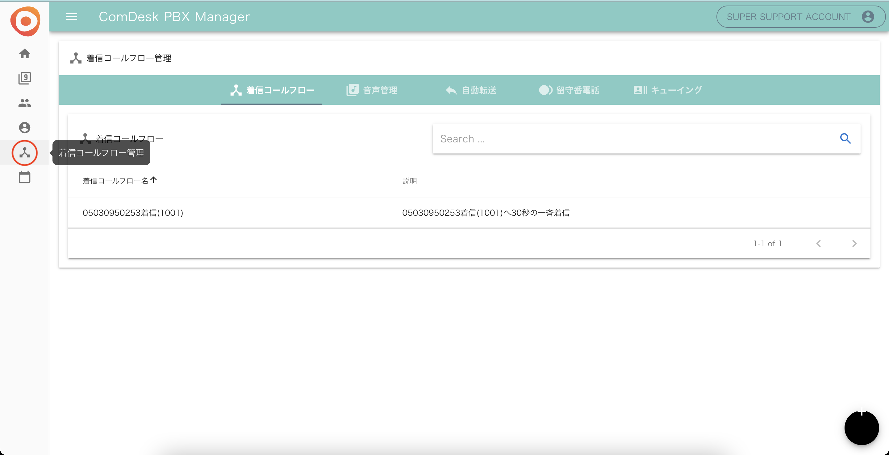
2.  右下の黒い円にマウスカーソルを合わせて表示されるオレンジ色のメニューから、留守番電話追加アイコン（赤枠）をクリックします。

    
3. 留守番電話追加画面が表示されます。\
   &#xNAN;**・留守番電話設定名**：必須入力項目\
   &#xNAN;**・録音秒数**：10秒以上120秒以内で入力し「登録する」をクリックします。\
   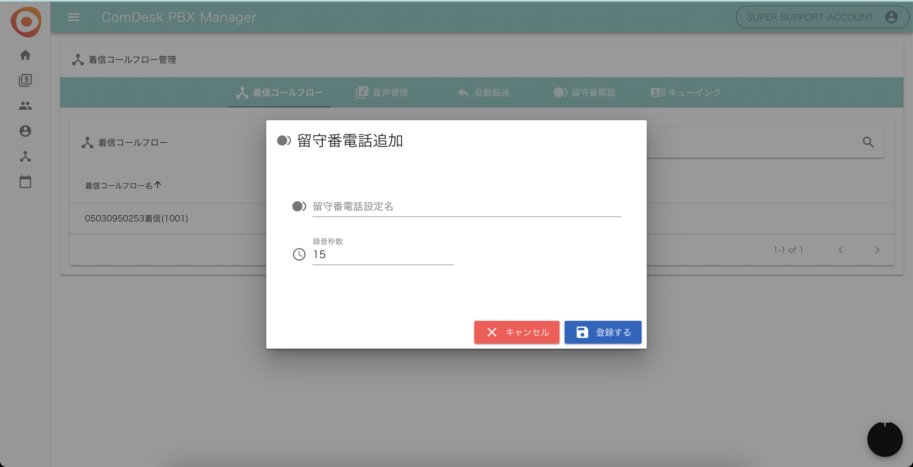

### **キューイング**

オペレータの人数以上に着信が来てしまった場合でもキューイング機能をお使いいただくことで、オペレーターが空くまでお待ちいただくことが可能です。

1.  「着信コールフロー管理」を開きます。

    
2.  右下の黒い円にマウスカーソルを合わせて表示されるオレンジ色のメニューから、キューイング追加アイコン（赤枠）をクリックします。

    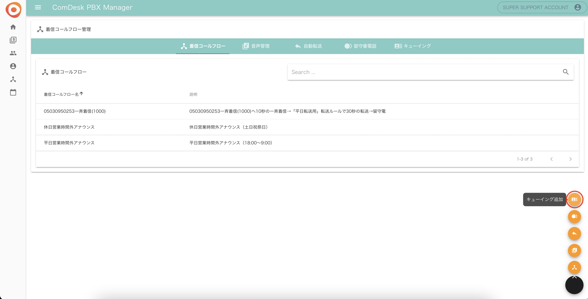
3.  キューイング追加画面が表示されますので各必要項目を埋め、「登録する」をクリックします。

    **・キューイング名**：必須入力項目\
    &#xNAN;**・着信させるグループ**：登録している着信グループから１つ選択\
    &#xNAN;**・待ち時間中の保留音**：アップロードしている音声ファイルから１つ選択\
    &#xNAN;**・キューイング方式**：選択項目\
    &#xNAN;**・最大待ち人数**：選択項目\
    &#xNAN;**・ユーザ着信秒数**：選択項目\
    &#xNAN;**・最大待ち秒数**：選択項目\
    &#xNAN;**・次の着信までのインターバル秒数**：選択項目\
    

## \*\*Step2．\*\***着信コールフローの作成**

Step1で作成した着信パーツを使用して、着信コールフローを作成します。

ここでは、着信が来た際にどのような流れで着信を受けるかというフローを作成します。

1. 「着信コールフロー管理」を開きます。
2. 右下の黒い円にマウスカーソルを合わせて表示されるオレンジ色のメニューから、着信コールフロー追加アイコン（赤枠）をクリックします。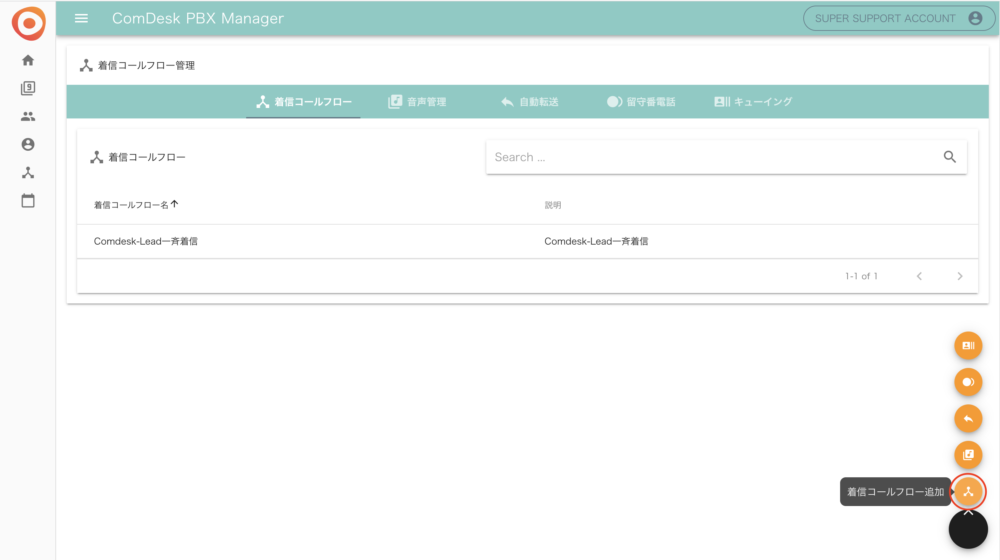
3.  着信コールフロー登録画面が表示されますので、着信コールフローを作成します。\
    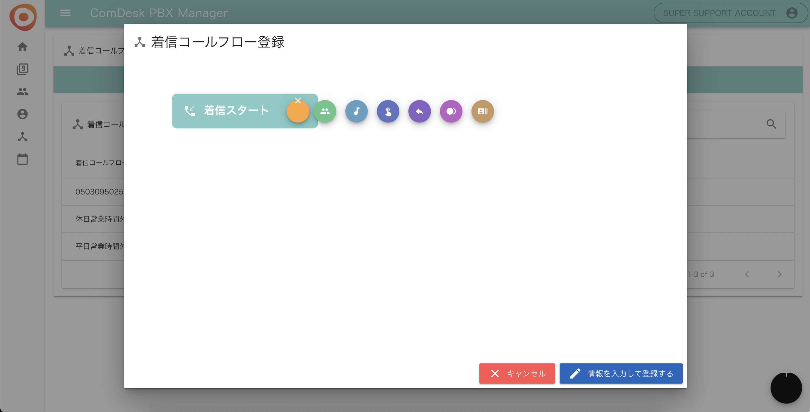\
    各アイコンの説明は以下のとおりです。\
    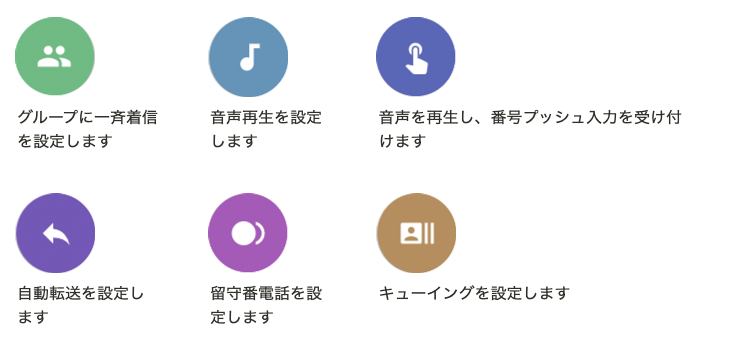

    例1）

    ①グループに30秒間一斉着信

    ↓

    ②一斉着信で誰も出なかった場合、携帯電話へ30秒間転送

    ↓

    ③転送先の携帯電話で誰も出なかった場合、留守番電話アナウンスを流す

    

    上記の例1）を設定するには、以下のように操作します。\
    ①グループに30秒間一斉着信の設定\
    

    ②携帯電話へ30秒間転送の設定\
    

    ③留守番電話アナウンスの設定\
    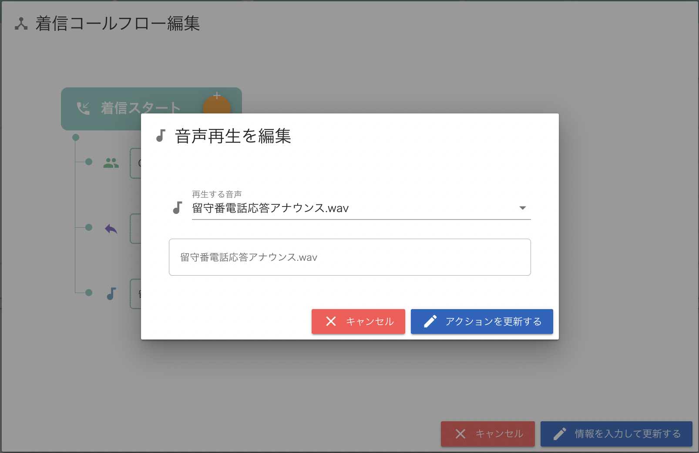
4. 「情報を入力して更新する」をクリックし完成です。

## **Step3．着信スケジュールの作成**

Step2で設定した着信フローをいつ適用するかを設定します。

1.  「着信スケジュール管理」を開き、右下の「＋」をクリックします。\*\*

    \*\*
2. 各項目を入力します。\
   &#xNAN;**・電話番号**：適用させる電話番号を選択\
   &#xNAN;**・着信コールフロー**：適用させる着信コールフローを選択\
   &#xNAN;**・年月日**：適用させる年月日を選択\
   &#xNAN;**・曜日**：適用させる曜日を選択\
   &#xNAN;**・祝日に適用する**：祝日に適用する場合はONにする\
   &#xNAN;**・開始時間**：着信コールフロー を適用開始する時間を選択\
   &#xNAN;**・終了時間**：着信コールフロー を適用終了させる時間を選択&#x20;

* &#x20; 

例1）「平日営業時間内（営業時間は10時〜19時）」の設定するには以下のように入力します。

　　　┗曜日を入れると、毎週その曜日に繰り返し適用されます。

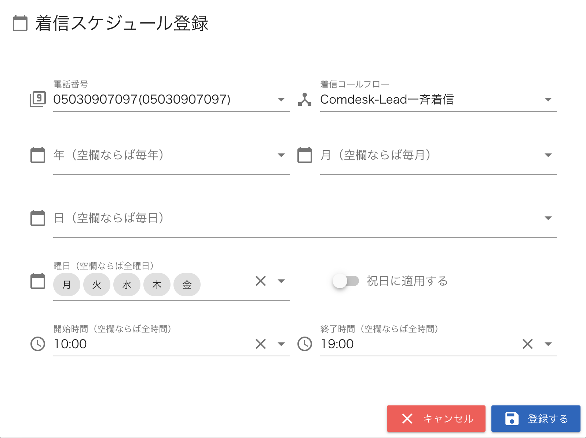

例2）「平日営業時間外（営業時間は10時〜19時）」の設定するには以下のように入力します。

例3）「土日祝日の終日」の設定するには以下のように入力します。

　　　┗開始時間・終了時間を入力しないと終日適用となります。

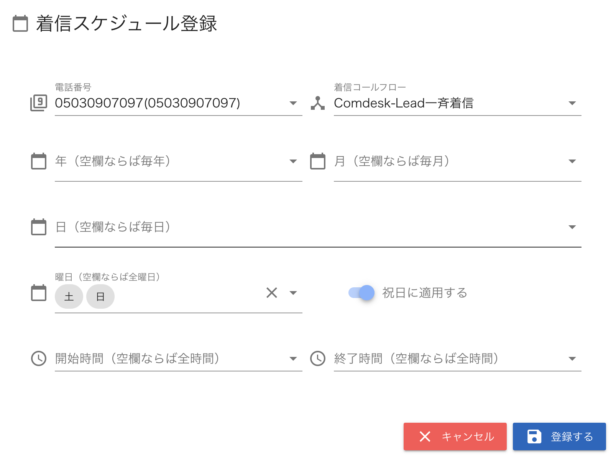

その他ご不明点などございましたら、[**サポートチームまでお問い合わせ**](https://comdesklead.zendesk.com/hc/ja/requests/new)をお願い致します。

お問い合わせ方法は\*\*[こちら](../../トラブルシューティング/サポートチームへのお問い合わせ方法/12828937533081_サポートチームへのお問い合わせ方法.md)\*\*
