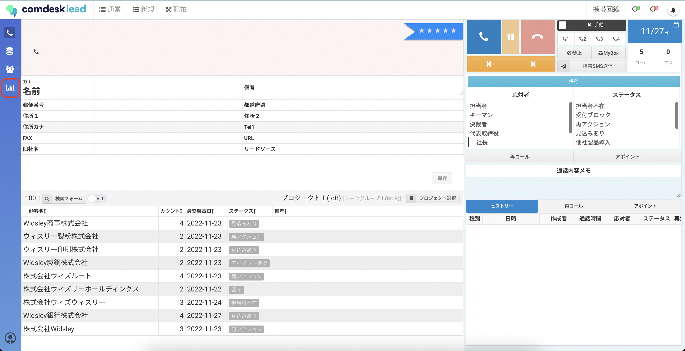
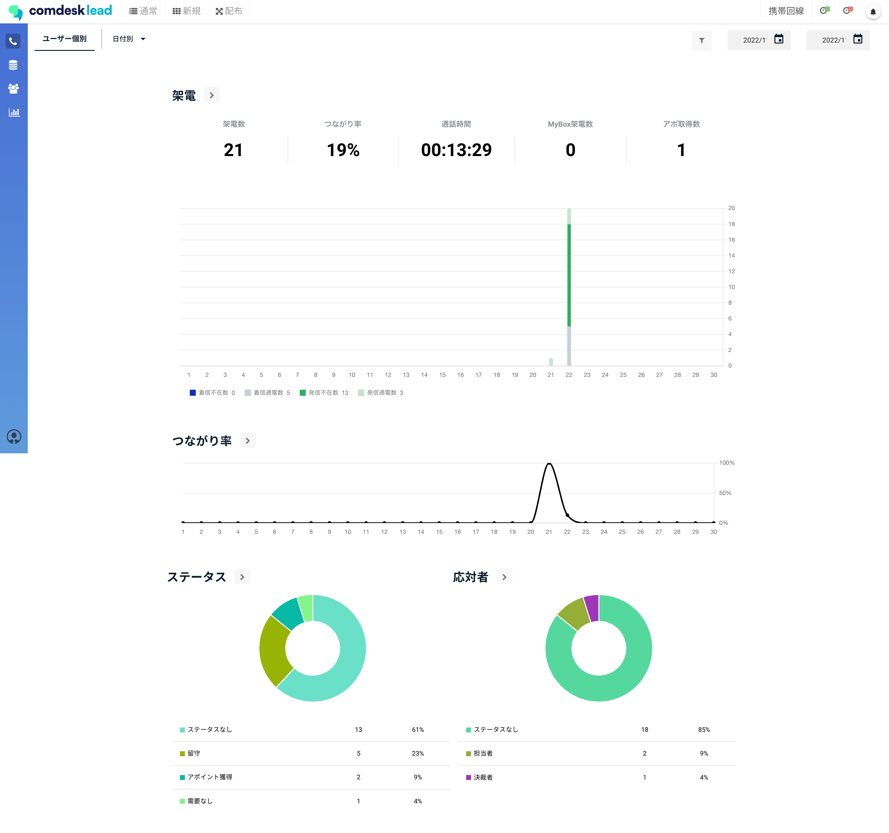
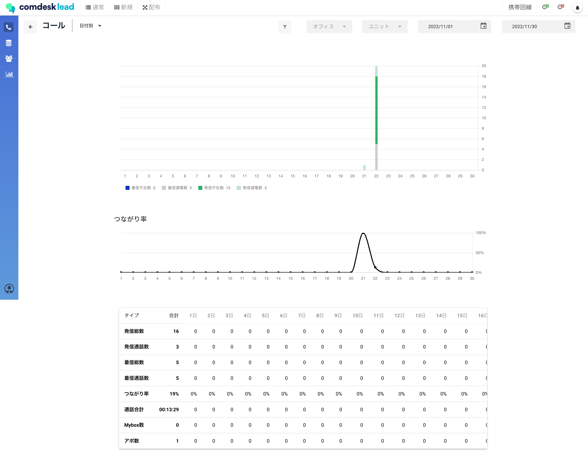
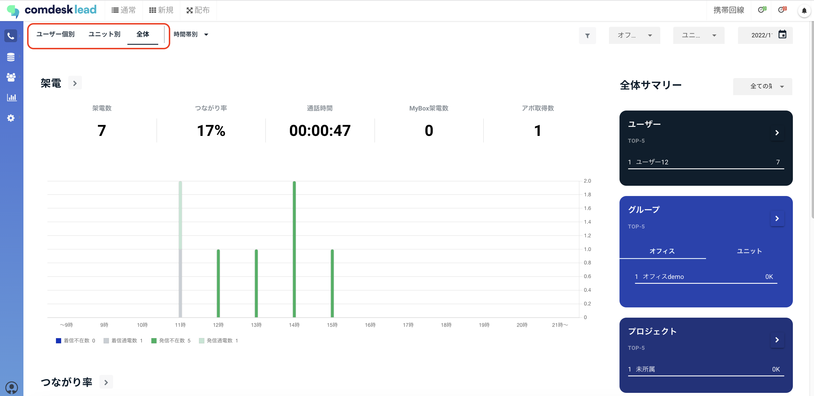
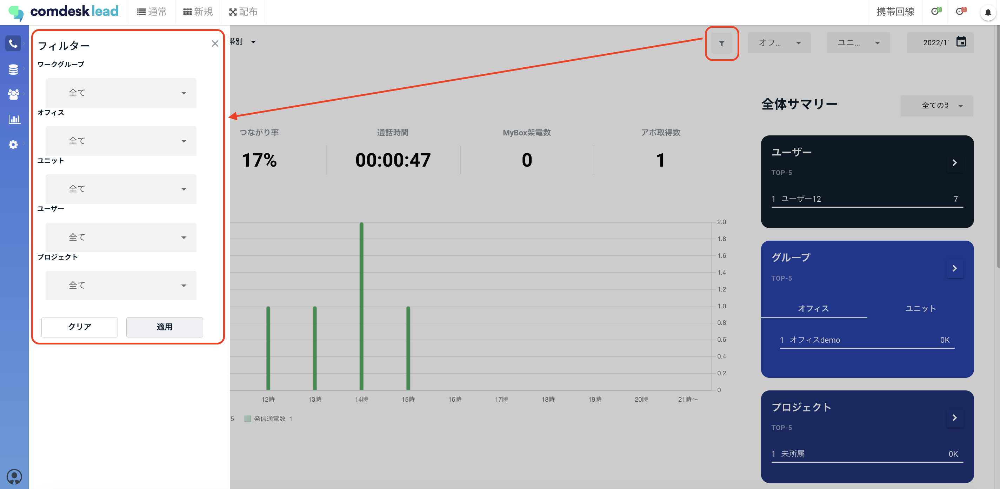
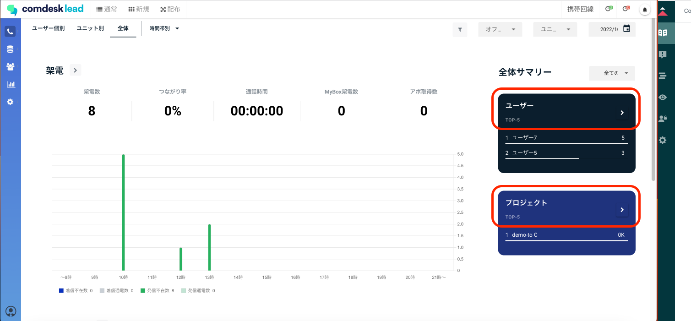
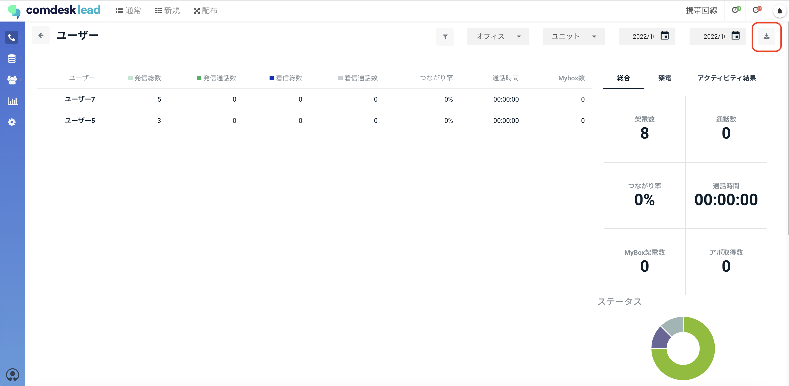

# レポートを閲覧する

## **レポート機能概要**

レポート機能でユーザーの架電結果の確認、分析ができます。

時間別、プロジェクト別、アクティビティ結果等：各カテゴリーごとの架電実績を確認できます。

（例：繋がりやすい時間帯、アポイントを獲得しやすいプロジェクトなどを見える化できます。）

## **レポートの閲覧**

1. 画面左側のレポートアイコンを選択します。
2. 時間別、プロジェクト別、アクティビティ結果別などで、各カテゴリーで営業活動実績を確認できます。
3. 管理者の場合は「ユーザー個別」以外「ユニット別」「全体」の架電結果も確認できます。\
   
4. レポート結果はフィルターをかけることが可能です。\
   

## **レポート結果のCSVダウンロード**

1. 全体サマリーからユーザーやプロジェクトの詳細を開いてください。\
   
2. それぞれの詳細の確認およびCSVでダウンロードすることができます。\
   

その他ご不明点などございましたら、[**サポートチームまでお問い合わせ**](https://comdesklead.zendesk.com/hc/ja/requests/new)をお願い致します。

お問い合わせ方法は\*\*[こちら](../../トラブルシューティング/サポートチームへのお問い合わせ方法/12828937533081_サポートチームへのお問い合わせ方法.md)\*\*
