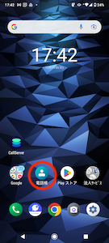

# 携帯電話内にある電話帳とComdesk Leadは連動していますか

弊社より貸与しているAndroid携帯端末に入っている電話帳アプリとComdesk Leadは、連動しておりません。

データを移動させたい場合には、それぞれインポート・エクスポート機能をご利用ください。

Comdesk Leadにリストをインポートする方法は[こちら](12743928066585_リストをプロジェクトにインポート.md)

Comdesk Lead上のリストをエクスポートする方法は[こちら](../../機能一覧/活用ガイド/12778734555545_リストをエクスポートする.md)

DIGNO® BX2 に電話帳をインポートする場合は、 [**こちら**](https://www.softbank.jp/mobile/support/manual/smartphone/digno-bx2/detail/56462/) （外部サイトへ遷移します）をご参照ください。

* [**DIGNO® BX2 オンラインマニュアル（取扱説明書）**](https://www.softbank.jp/mobile/support/manual/smartphone/digno-bx2/pdf/)
* [**DIGNO® BX オンラインマニュアル（取扱説明書）**](https://www.softbank.jp/mobile/support/manual/smartphone/digno-bx/)
* [**DIGNO® J オンラインマニュアル（取扱説明書）**](https://www.softbank.jp/mobile/support/manual/smartphone/digno-j/)

その他ご不明点などございましたら、[**サポートチームまでお問い合わせ**](https://comdesklead.zendesk.com/hc/ja/requests/new)をお願い致します。

お問い合わせ方法は\*\*[こちら](../../トラブルシューティング/サポートチームへのお問い合わせ方法/12828937533081_サポートチームへのお問い合わせ方法.md)\*\*
