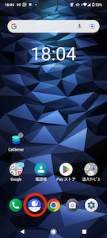
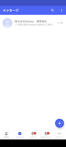
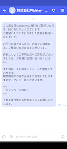

# 受信したSMSメッセージを活動履歴で確認できるか

Comdesk LeadのSMS送受信機能のうち、SMS送信はパソコンでもスマートフォンでもご利用可能ですが、SNS受信はスマートフォンでのみ可能です。\
パソコンでSMS受信はできません。

[SMS送信](13357753043097_受信したSMSメッセージを活動履歴で確認できるか.md#h_01GMHX0GAFTDZ66FVWPZDTYDPC)\
[SMS受信](13357753043097_受信したSMSメッセージを活動履歴で確認できるか.md#h_01GMHX1V9MYQXMGGYJX6VXER4K)

## **SMS送信**

Comdesk LeadからSMS送信する場合は、 [**こちら**](../../機能一覧/活用ガイド/12789493399193_SMS送信方法.md) をご覧ください。

## **SMS受信**

1.  SMS受信を確認する際は、スマートフォンにインストールされているプラスメッセージアプリをご利用ください。\
    

    初回起動時には設定が必要となります。 [**こちら**](https://www.softbank.jp/support/faq/view/20586) （外部サイトに遷移します）をご確認ください。
2.  画面下部の「メッセージ」をタップし、確認したい連絡先をタップします。

    
3.  メッセージの確認ができます。

    

    受信したSMSは活動履歴で現状確認ができない仕様となっております。\
    改修予定が立ち次第お知らせいたします。

その他ご不明点などございましたら、[**サポートチームまでお問い合わせ**](https://comdesklead.zendesk.com/hc/ja/requests/new)をお願い致します。

お問い合わせ方法は\*\*[こちら](../../トラブルシューティング/サポートチームへのお問い合わせ方法/12828937533081_サポートチームへのお問い合わせ方法.md)\*\*
