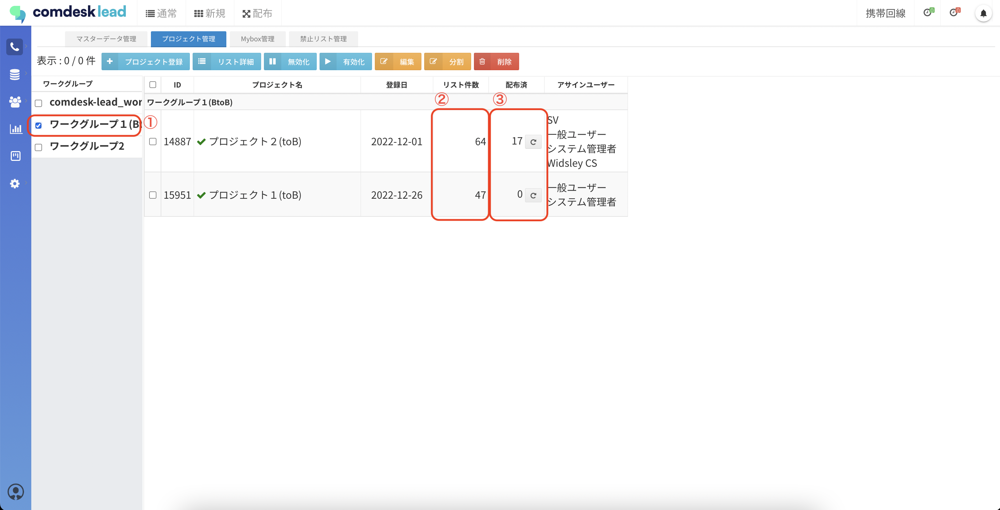
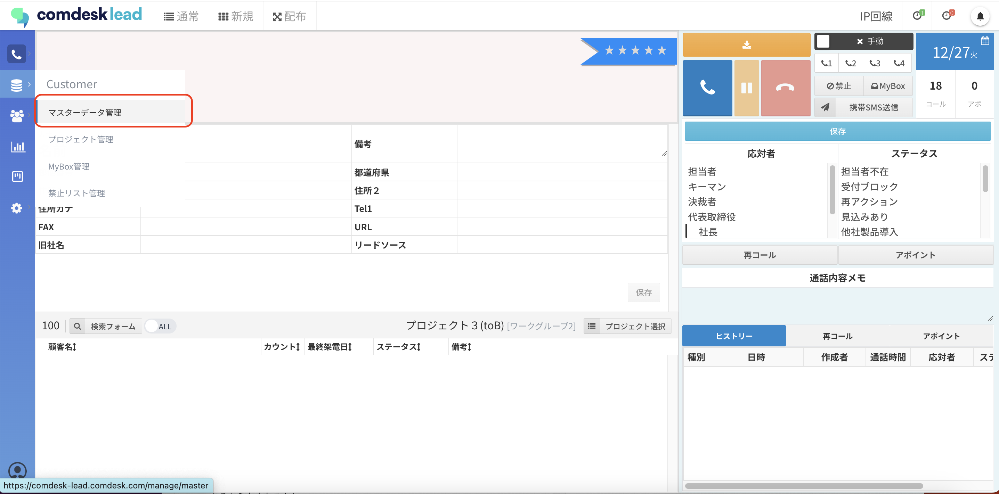
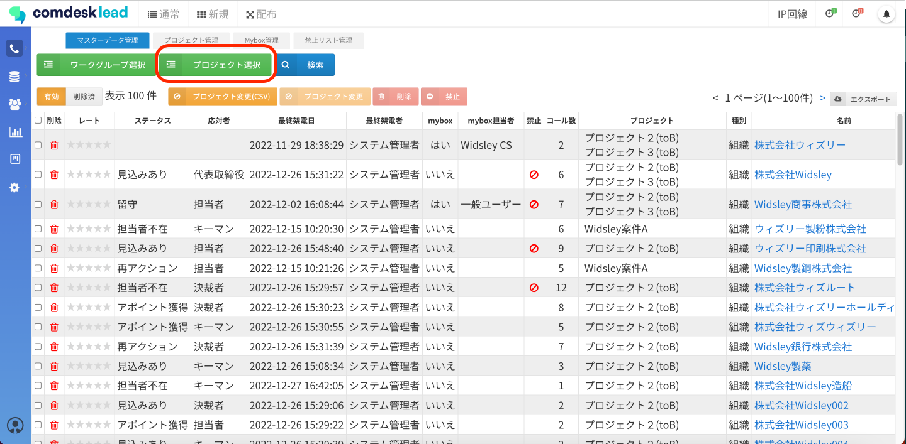
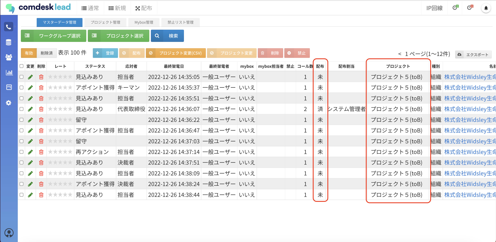

ー関連記事ー

プロジェクトの配布リセットの方法は[こちら](../../機能一覧/基本ガイド/13703755500697_プロジェクトの配布リセット.md)

配布し終わったリストを再配布する方法は[こちら](../../トラブルシューティング/エラー/12753378290841_配布し終わったリストを再配布したい.md)

## **プロジェクトごとの配布状況を確認する**

1. 画面左側のCustomerメニューより「プロジェクト管理」をクリックします。\
   
2. 該当のプロジェクトが所属するワークグループを選択（①）し、プロジェクト一覧を表示します。\
   以下の通り確認が可能です。\
   ・プロジェクトに所属するリストの全件数（②）\
   ・②の内、配布コールモードで架電済みの件数（③）\
   

## **リストの配布状況を確認する**

1\. 画面左側のCustomerメニューより「マスターデータ管理」をクリックします。

2\. 「プロジェクト選択」をクリックし対象となるプロジェクトを選択します。

3\. 選択したプロジェクトに含まれているリストの配布状況が確認できます。

その他ご不明点などございましたら、[**サポートチームまでお問い合わせ**](https://comdesklead.zendesk.com/hc/ja/requests/new)をお願い致します。

お問い合わせ方法は\*\*[こちら](../../トラブルシューティング/サポートチームへのお問い合わせ方法/12828937533081_サポートチームへのお問い合わせ方法.md)\*\*
