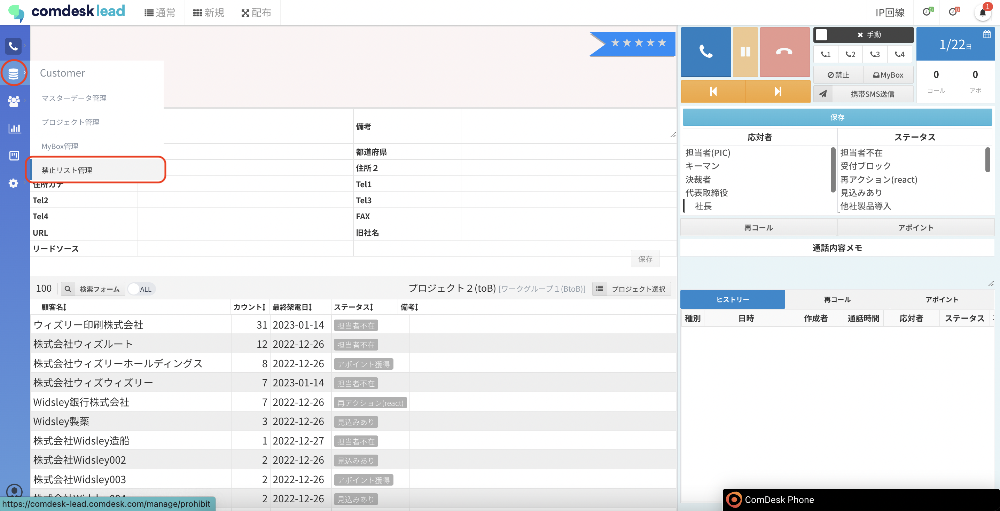
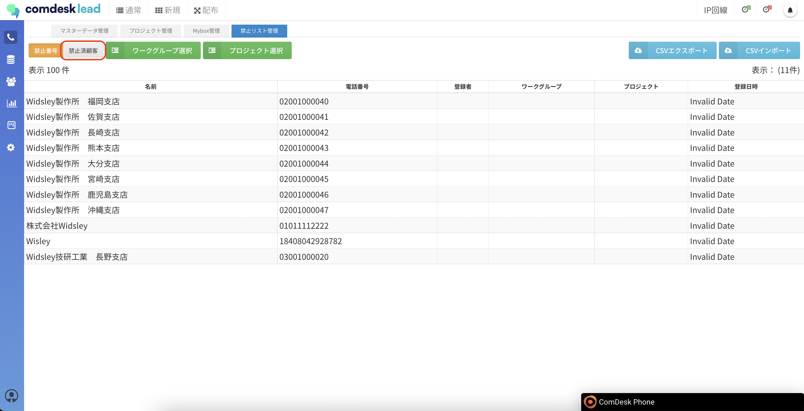
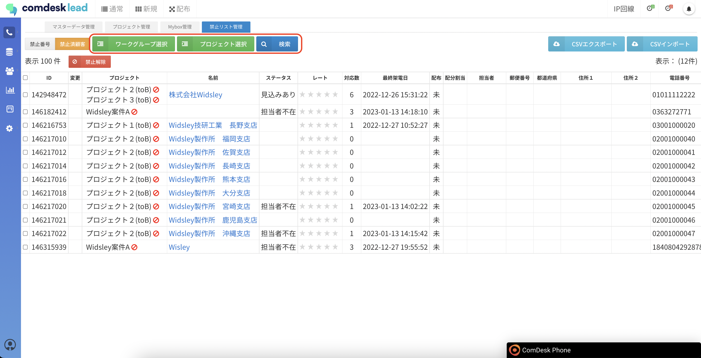
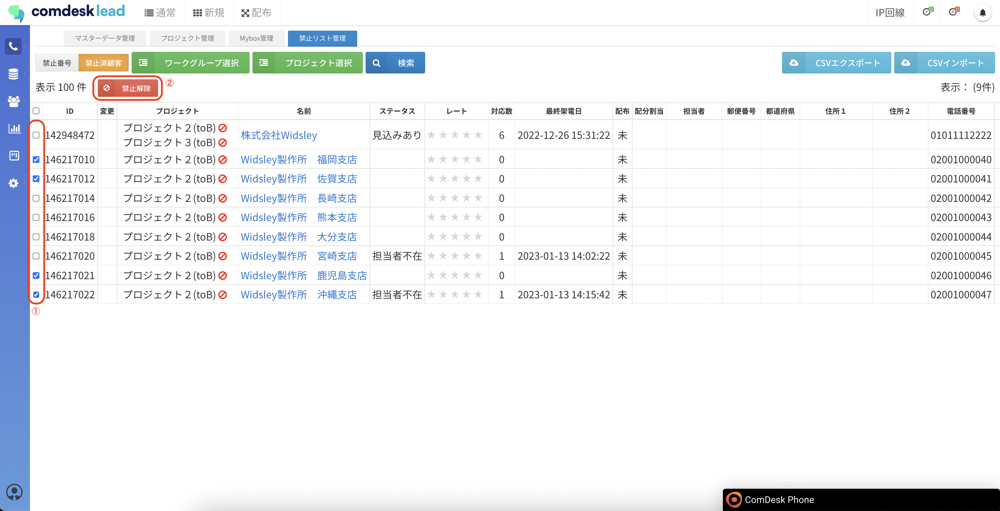
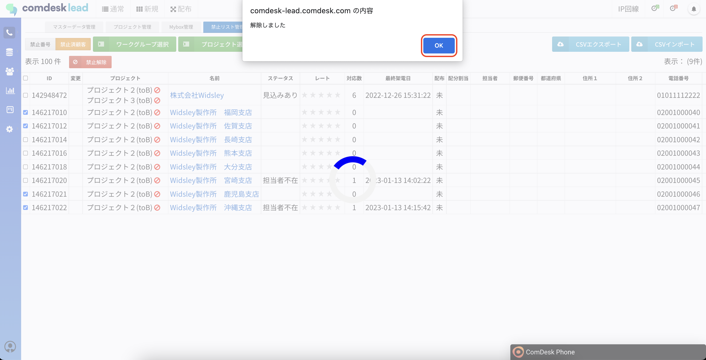
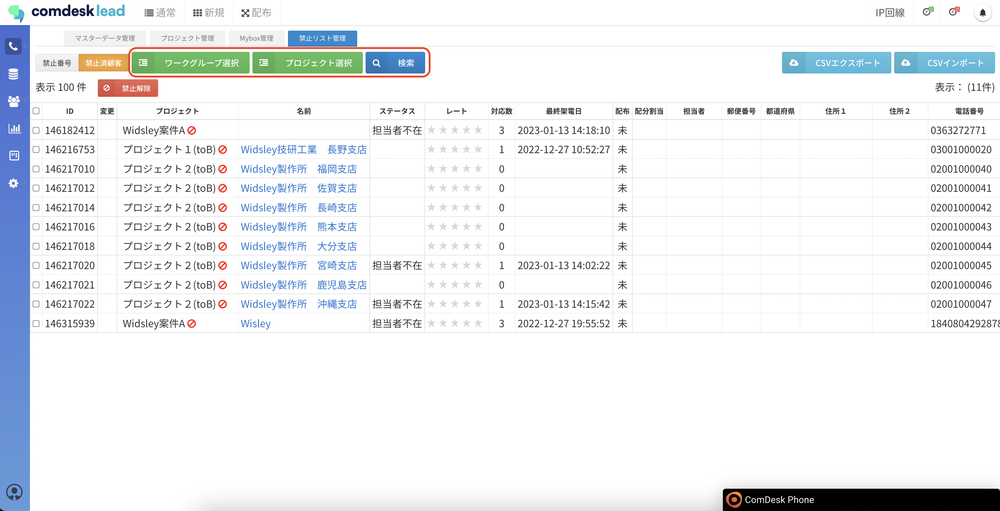
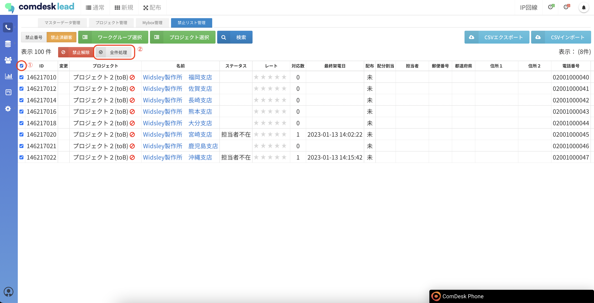
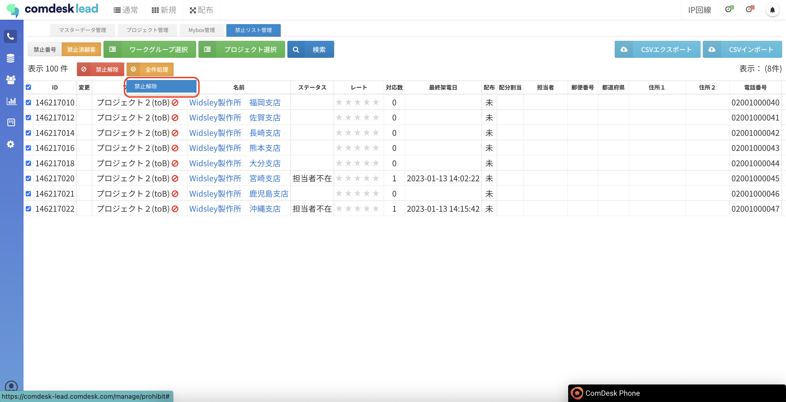
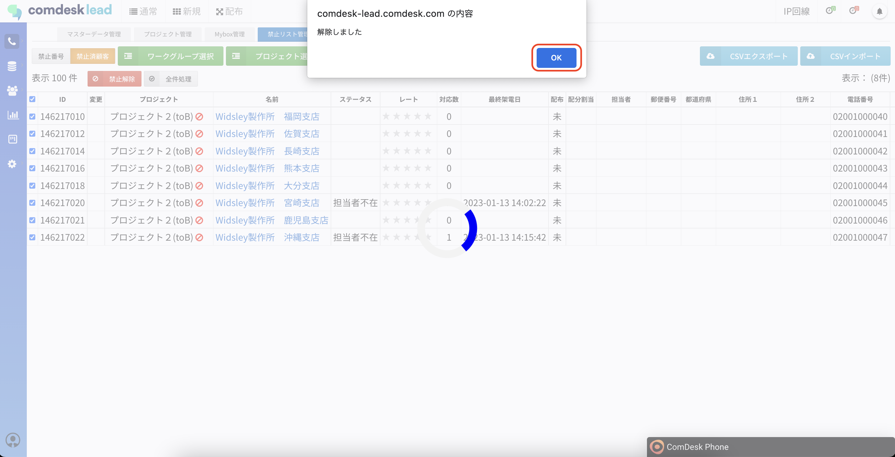

# （完了させる）1/3　禁止リストを解除する

架電禁止リストの登録解除方法を説明します。

架電禁止リストの登録方法は、こちらの記事（[架電禁止顧客を禁止リストに登録する](../ユーザーガイド/12815344287769_架電禁止顧客を禁止顧客リストに登録・解除する.md)）をご参照ください。

目次\
[1. 禁止リストを表示する](14772528016537_（完了させる）1_3_禁止リストを解除する.md#h_01GQBPTQQWN3KM3AZQWCY4ZQD9)\
[2-1. 禁止リストを選択して解除する](14772528016537_（完了させる）1_3_禁止リストを解除する.md#h_01GQBPV0GXGEPM0HAH4Z0SY723)\
[2-2. 禁止リストを一括で解除する](14772528016537_（完了させる）1_3_禁止リストを解除する.md#h_01GQBPV8NJKF7EA2SVP3YKB5M2)

## **1. 禁止リストを表示する**

1. 画面左側の「Customer」をクリックし、「禁止リスト管理」をクリックします。\
   
2. 「禁止済顧客」ボタンをクリックします。\
   

## **2-1. 禁止リストを選択して解除する**

1. 必要であれば、検索機能を使用して禁止リストを表示します。\
   検索は、ワークグループ選択とプロジェクト選択をしてから検索条件を入れて検索してください。\
   
2. 架電禁止を解除するリストの左側のチェックボックスをON（①）にして、「禁止解除」ボタン（②）をクリックします。\
   
3. 「解除しました。」モーダルが表示されるので、「OK」ボタンをクリックすると完了です。\
   

## **2-2. 禁止リストを一括で解除する**

1. 必要であれば、検索機能を使用して禁止リストを表示します。\
   検索は、ワークグループ選択とプロジェクト選択をしてから検索条件を入れて検索してください。\
   
2. 全件選択チェックボックスをON（①）にすると「全件処理」ボタン（②）が表示されますのでクリックします。\
   
3. 「全件解除」をクリックします。\
   
4. 「解除しました。」モーダルが表示されるので、「OK」ボタンをクリックすると完了です。\
   

禁止リストが複数ページにまたがっていた場合

ページ跨りで個別にチェックを入れて「禁止解除」ボタンをクリック→跨ったデータも全件解除される（表示されているページのみの解除ではない）

ページ跨りで１ページのみ全件チェック（カラム名のところ）入れて「全件処理」クリック→そのページが全件解除される

ページ跨りで全件チェックは入れられない。（これは仕様でしたらすみません。）

１ページ目で全件チェック

２ページ目で全件チェック

１ページ目に戻るとチェック外れている

その他ご不明点などございましたら、[**サポートチームまでお問い合わせ**](https://comdesklead.zendesk.com/hc/ja/requests/new)をお願いいたします。

お問い合わせ方法は\*\*[こちら](../../トラブルシューティング/サポートチームへのお問い合わせ方法/12828937533081_サポートチームへのお問い合わせ方法.md)\*\*
