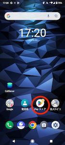
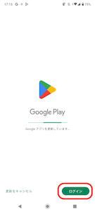
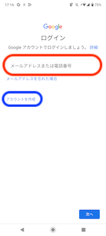
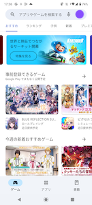

Comdesk Lead MobileClientアプリのインストールは、Play ストアからのインストールが可能です。\
[**こちら**](../../機能一覧/基本ガイド/14501355033241_MobileClient_インストール.md)　をご参照ください。

また、弊社より貸し出している携帯端末に、LINEなどの任意のアプリをインストールすることは可能です。

任意のアプリのインストールによって携帯端末に不都合が生じた場合

当社では一切の責任を負いません。あらかじめご了承ください。

1. 「Play ストア」アイコンをタップします\
   
2. Google アカウントにログインしていない場合は下図の画面が表示されますので、「ログイン」ボタンをタップします。\
   
3. Google アカウントを既にお持ちの場合は、「メールアドレスまたは電話番号」を入力して次へ進んでください。\
   新しく作成する場合は「アカウントを作成」をタップして作成してください。\
   
4. ログインができましたら、アプリのインストールが可能となります。\
   

その他ご不明点などございましたら、[**サポートチームまでお問い合わせ**](https://comdesklead.zendesk.com/hc/ja/requests/new)をお願い致します。

お問い合わせ方法は\*\*[こちら](../../トラブルシューティング/サポートチームへのお問い合わせ方法/12828937533081_サポートチームへのお問い合わせ方法.md)\*\*
