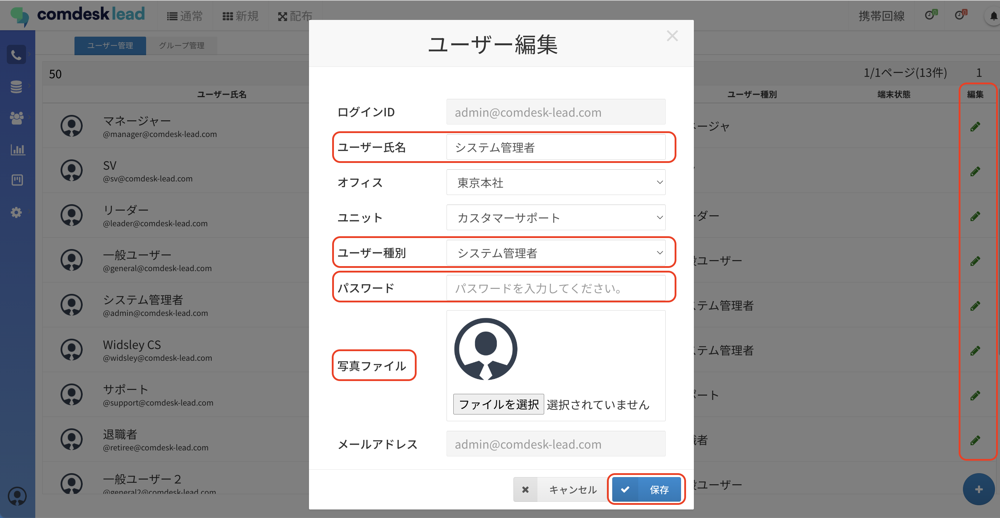
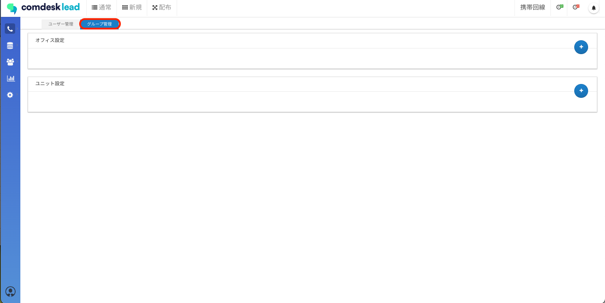
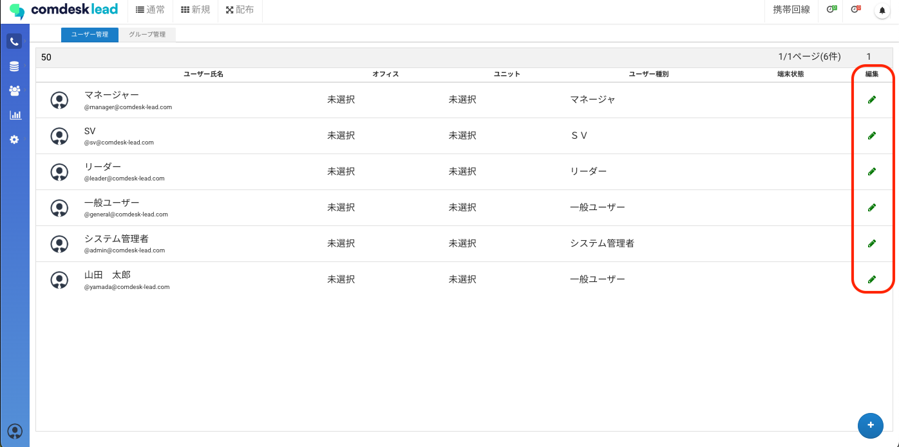
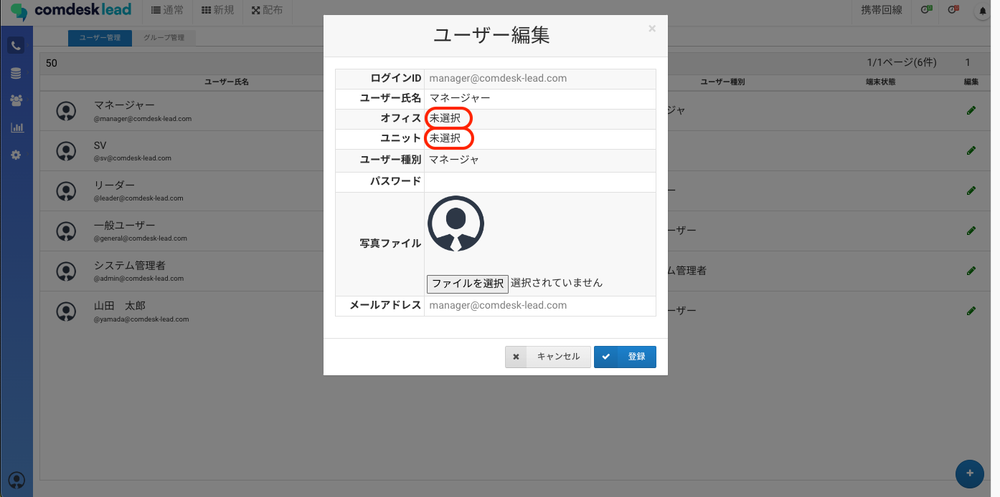

## **1. アクセス権限者**

ユーザー種別：「システム管理者」「マネージャー」

カスタムユーザー種別：「ユーザー管理：画面を開ける」の権限が付与されているユーザーのみManageメニューからアクセスできます。

## **2. 編集可能項目**

「ユーザー氏名」「ユーザー種別」「パスワード」「写真ファイル」「オフィス」「ユニット」の編集が可能です。

※「ログインID」の変更はできません。

※ユーザー（ライセンス）自体の追加登録は、弊社で対応いたしますので、ユーザー管理画面右下の「＋」ボタンよりご依頼ください。

## \*\*3. ユーザー氏名・ユーザー種別・パスワード・写真ファイルの編集

\*\*

編集したいユーザーの編集ボタンをクリックしユーザー編集画面を開いてください。編集が終わったら「保存」ボタンをクリックして完了です。

* **ユーザー氏名**：変更可能（空欄での登録はできません。）
* **ユーザー種別**：カスタムユーザー種別含め変更可能（「サポート」「退職者」を含む変更はできません。）\
  →「サポート」「退職者」を含む変更は弊社にて対応いたしますのでお問い合わせください。
* **パスワード**：変更可能（8文字以上で指定して下さい。）
* **写真ファイル**：アップロードおよび削除ができます。

## **4. オフィス・ユニットの登録と割り当て**

オフィスやユニットを登録し、ユーザーに割り当てることができます。

1. ユーザー管理画面上部、「グループ管理」を選択し、オフィス/ユニット設定の右の「＋」ボタンからそれぞれ作成できます。\
   
2. 作成後、ユーザー管理画面に戻り「オフィス/ユニット」を設定したいユーザーの右側にある「鉛筆マーク」を選択します。\
   
3. 編集画面で設定を行う「オフィス・ユニット」部分（赤枠）から作成した「オフィス/ユニット」を選択し、「登録」で割り当てができます。\
   

その他ご不明点などございましたら、[**サポートチームまでお問い合わせ**](https://comdesklead.zendesk.com/hc/ja/requests/new)をお願い致します。

お問い合わせ方法は\*\*[こちら](../../トラブルシューティング/サポートチームへのお問い合わせ方法/12828937533081_サポートチームへのお問い合わせ方法.md)\*\*
