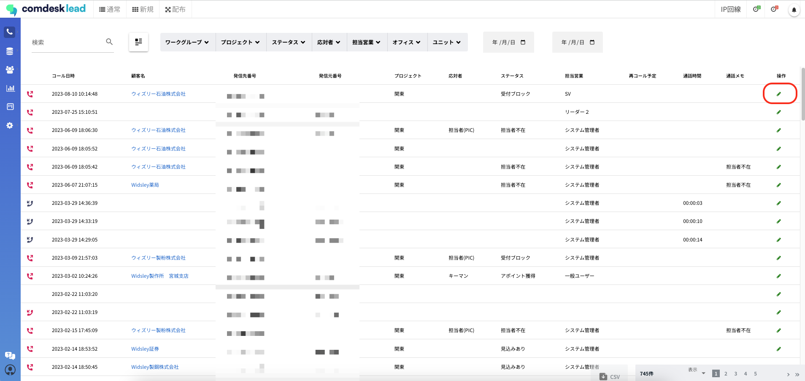
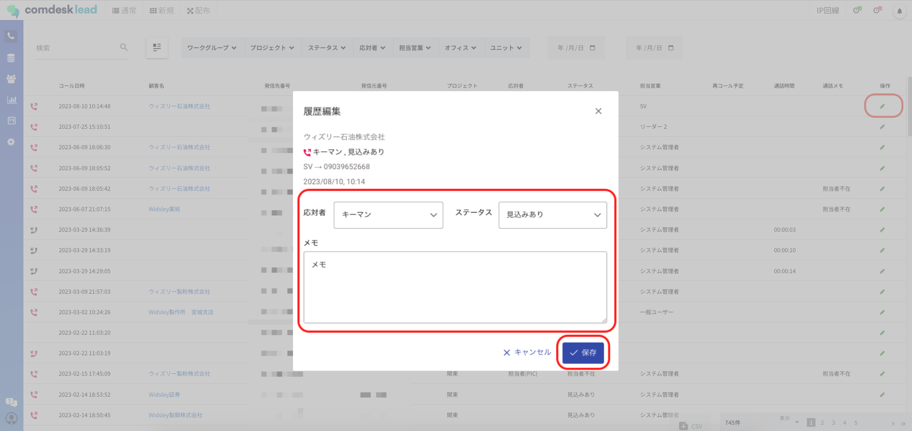
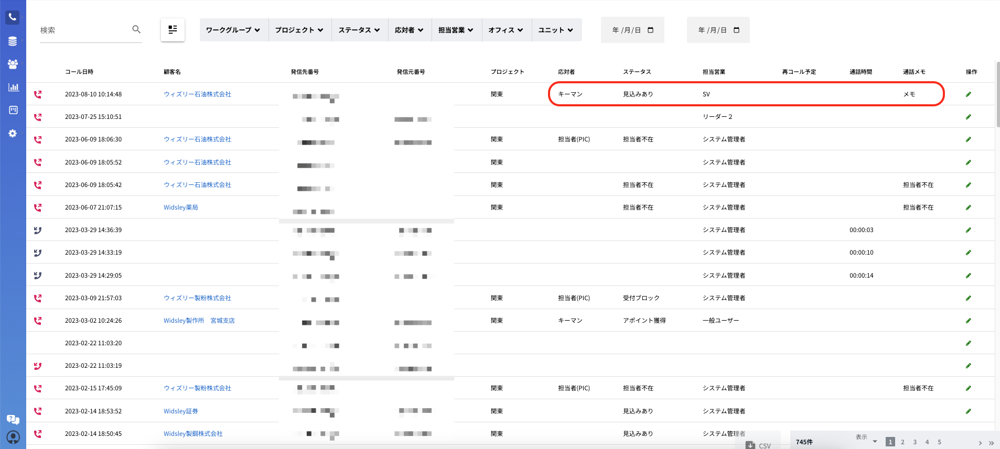
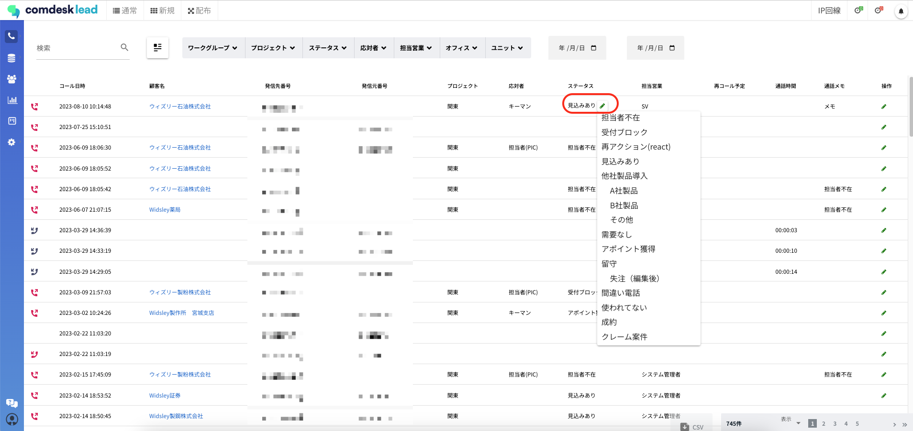

# 活動履歴の編集

活動履歴画面での編集についてご説明します。

## **編集権限**

「システム管理者」「マネージャー」「SV」のユーザー種別に設定されているユーザーが編集可能です。

## **編集可能項目**

「応対者」「ステータス」「通話メモ」の編集が可能です。

## &#x20;**編集方法**

### 1. 各項目をまとめて編集する

1-1　編集する活動履歴の右端のペンマークを押下し履歴編集のポップアップを表示させます。

1-2　「応対者」「ステータス」「メモ」のカラムをそれぞれを編集し保存ボタンを押下します。

1-3　編集内容が反映しました。コール画面のヒストリーにも即時反映します。\

### 2. 各項目ごとに編集する

編集したい項目（「応対者」「ステータス」「メモ」）にカーソルを合わせるとペンマークが表示されるので、それを押下し選択肢から選択をしなおします。通話メモはテキストボックスが表示されるので変更したい内容を入力します。\
※保存ボタンはありません。選択肢を選択すると即時保存され、コール画面のヒストリーにも即時反映します。

その他ご不明点などございましたら、[**サポートチームまでお問い合わせ**](https://comdesklead.zendesk.com/hc/ja/requests/new)をお願い致します。

お問い合わせ方法は\*\*[こちら](../../トラブルシューティング/サポートチームへのお問い合わせ方法/12828937533081_サポートチームへのお問い合わせ方法.md)\*\*
