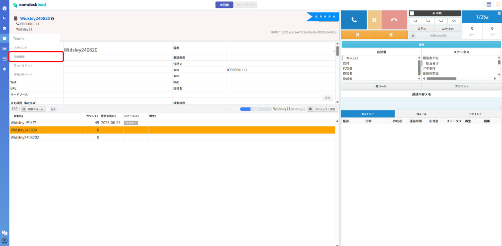
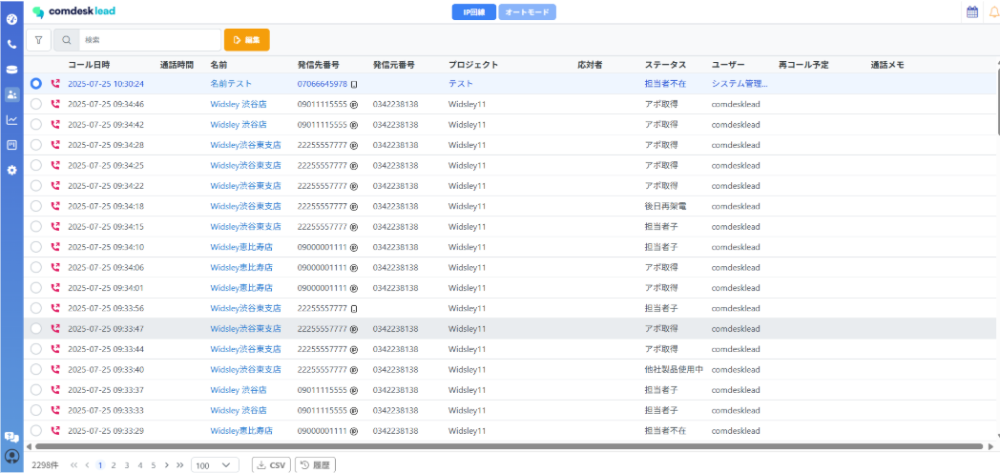
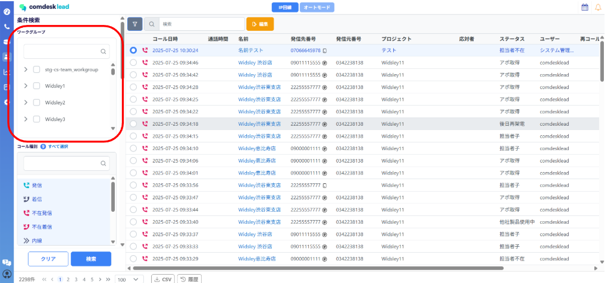
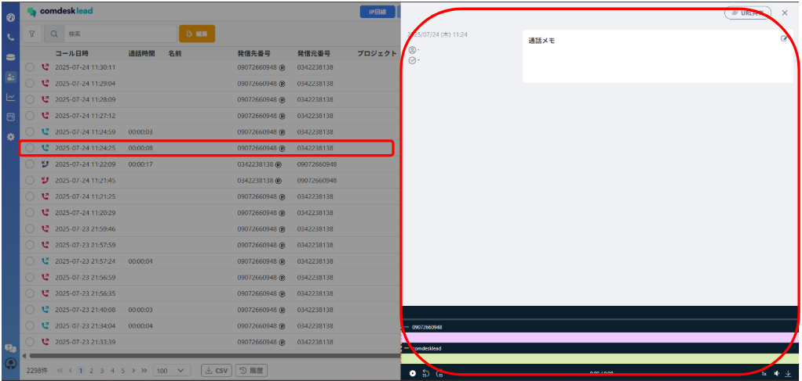

# 活動履歴で通話履歴を確認する

## **活動履歴の閲覧**

1. 画面左側のTeamsアイコンを選択し、活動履歴を選択してください。\
   &#x20;
2. 活動履歴一覧画面が表示されます。\
   &#x20;
3. ワークグループ、プロジェクト、ステータスなど特定の活動履歴を検索できます。下図は、ワークグループの検索例です。①ワークグループを選択します。②チェックボックスをONにしてワークグループを選択し、「適用」ボタンを選択します。\
   （文言修正が必要）
4.

    

    活動履歴の検索方法は[こちら](../../機能一覧/活用ガイド/12876176090905_活動履歴を検索する.md)

## **通話録音データの再生/ダウンロード**

ユーザーが架電した通話の録音を再生/ダウンロードできます。

※IP回線ご利用の場合：通話終了後まもなく反映されます。

※携帯回線ご利用の場合：通話終了から録音があがるまでに10分〜1時間程度のタイムラグがございます。\
（携帯回線のみ文言確認したい。通話時間やサーバーの負荷状況によって左右する等の文言を入れたい形）

1.  ①活動履歴一覧のうち1件を選択します。②画面右側に詳細画面が表示されます。

    下図は音声コントローラーを拡大したものです。\
    録音の再生・再生スピード・音量調節等ができます。\
    また、一番右のアイコン（下矢印のアイコン）から音声のダウンロードが可能です。\
    

## **活動履歴のCSVダウンロード**

1. 画面下部のCSVダウンロードアイコンを選択すると、活動履歴をCSV形式でダウンロードできます。より詳細な分析等にお使いください。

その他ご不明点などございましたら、[**サポートチームまでお問い合わせ**](https://comdesklead.zendesk.com/hc/ja/requests/new)をお願い致します。

お問い合わせ方法は[**こちら**](../../トラブルシューティング/サポートチームへのお問い合わせ方法/12828937533081_サポートチームへのお問い合わせ方法.md)
