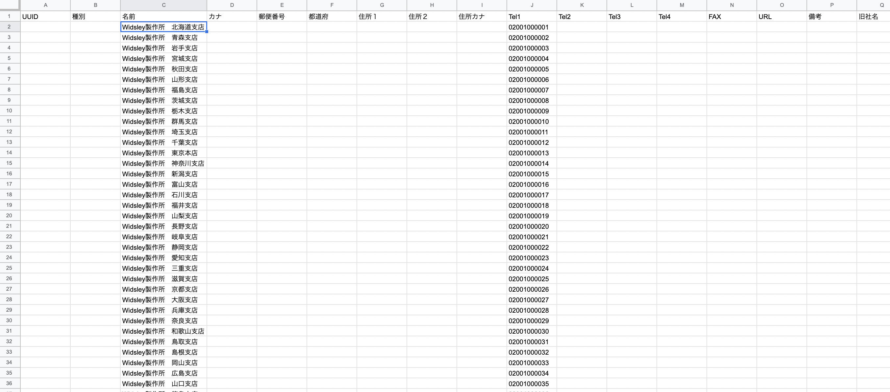
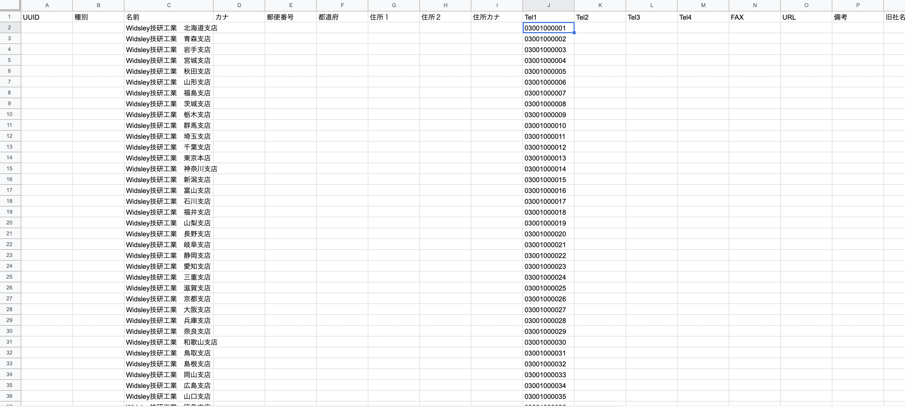
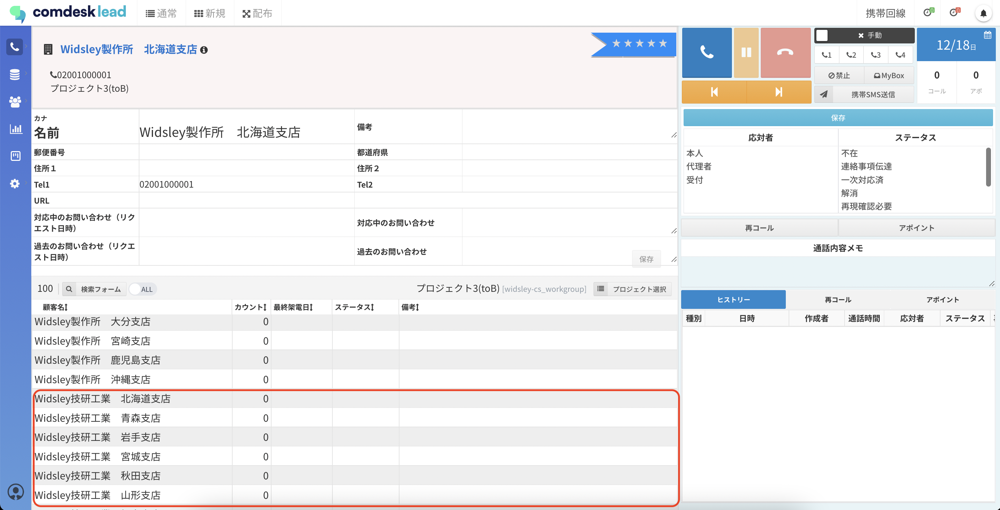

# 通常コール画面で表示される顧客リストの表示順

この記事では、通常コール画面上の顧客リストが、どのような表示順になっているかをご説明します。

目次\
[プロジェクトにリストが入っていない状態でインポートした際のリスト表示順](../../機能一覧/活用ガイド/13592765186841_通常コール画面で表示される顧客リストの表示順.md)\
[リストが入っているプロジェクトに追加でリストをインポートした際の表示順](../../機能一覧/活用ガイド/13592765186841_通常コール画面で表示される顧客リストの表示順.md)

CSVファイルを6000件ごとで分割しようとなっております。\
通常コールモードの画面上で表示されるリストの並び順は**インポート時に使用したCSVの1行目から順（6000件ごとに分割される仕です。）**

に表示されます。\
※昇順降順で切り替わることがあるので初期表示の場合のみです。

## **プロジェクトにリストが入っていない状態でインポートした際のリスト表示順**

このデータでインポートを行います。

インポート後、通常コールモードに移動するとインポート時に使用したCSVの1行目から順にリストが表示されます。

## **リストが入っているプロジェクトに追加でリストをインポートを行った際の表示順**

既にリストがあるプロジェクトに追加でインポートを行った場合、\
先にインポートを行ったCSVリストの最下部から新たにインポートを行った際のCSVの1行目から順番に表示されます。

追加でこのリストをインポートを行います。

先にインポートを行ったリストの一番下から順番に表示されます。

その他ご不明点などございましたら、[**サポートチーム**](https://comdesklead.zendesk.com/hc/ja/requests/new)までお問い合わせをお願いいたします。

お問い合わせ方法は[**こちら**](../../トラブルシューティング/サポートチームへのお問い合わせ方法/12828937533081_サポートチームへのお問い合わせ方法.md)
