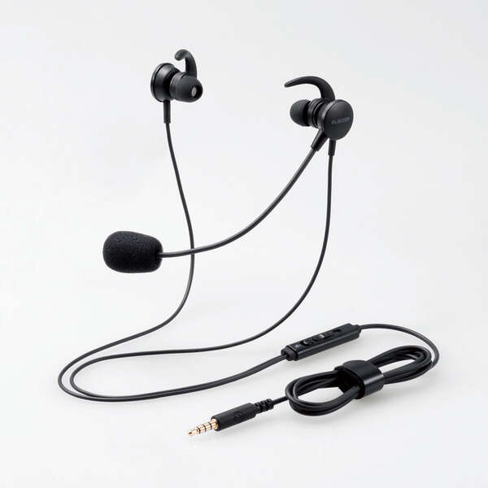
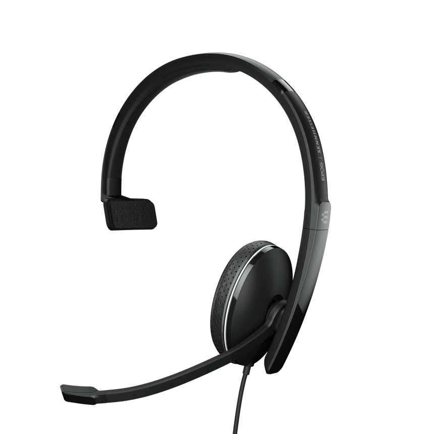
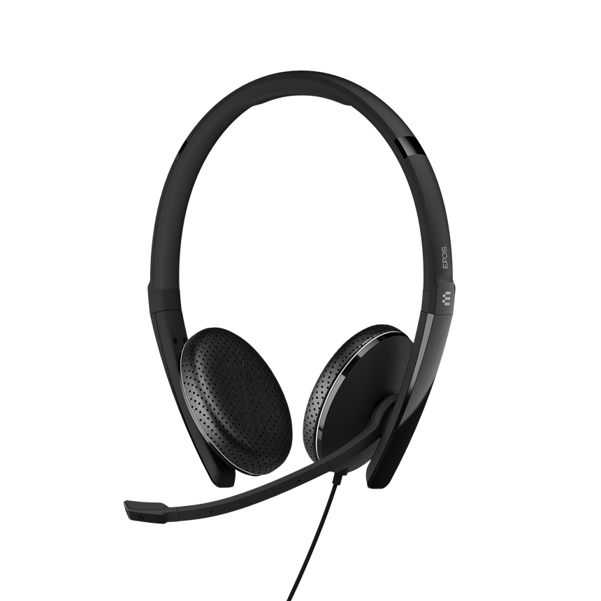

# 動作確認済みのヘッドセットのご紹介

## **携帯回線**

弊社からご提供しております携帯電話端末に関しては、下記ヘッドセットで問題なくご利用いただけることを動作確認済みでございます。

* ELECOM HS-EP15TBK（イヤホンジャックタイプ）\
  
* SENNHEISER ADAPT 135 II（イヤホンジャックタイプ）\
  
* SENNHEISER ADAPT 165 II（イヤホンジャックタイプ）\
  

なお、IP回線でご利用の場合につきましては、お使いのパソコンとヘッドセットとの相性がございますので、動作確認の対象外でございますことをご了承ください。

その他ご不明点などございましたら、[**サポートチームまでお問い合わせ**](https://comdesklead.zendesk.com/hc/ja/requests/new)をお願い致します。

お問い合わせ方法は\*\*[こちら](../../トラブルシューティング/サポートチームへのお問い合わせ方法/12828937533081_サポートチームへのお問い合わせ方法.md)\*\*
