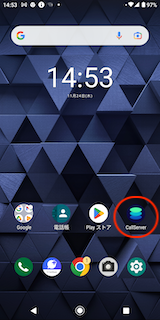
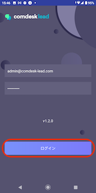
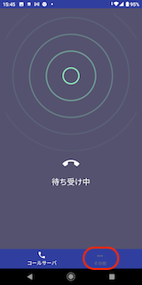
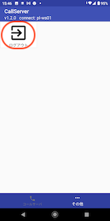
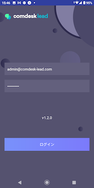

# 携帯回線発信制御アプリ（CallServer）のログイン・ログアウト

## **CallServerとは**

**携帯電話発信を制御するモバイルアプリ**

\*\*「CallServer」\*\*はComdesk Lead上の架電操作を本アプリで受けて、携帯端末から発信させます。

携帯を使用する際、必須となりますので、必ずインストールし、業務開始前にログインするようにしてください。

※本記事は、端末機種：DIGNO BX 　／　Androidバージョン： 9　の環境条件の画面でご案内しております。\
機種やバージョンによって表記等、異なる場合がございます。ご了承ください。

目次\
1\. CallServerへログインする\
2\. CallServerからログアウトする

## **1. CallServerへログインする**

1.  CallServerアイコンをタップします。

    
2.  ログイン画面が表示されますので、メールアドレスとパスワードを入力し、ログインボタンをタップします。

    
3.  「待ち受け中」画面に遷移します。

    

## **2. CallServerからログアウトする**

1.  「その他」をタップします。

    
2.  「ログアウト」をタップします。

    
3.  ログイン画面に遷移します。ログアウト完了です。

    

その他ご不明点などございましたら、[**サポートチームまでお問い合わせ**](https://comdesklead.zendesk.com/hc/ja/requests/new)をお願い致します。

お問い合わせ方法は\*\*[こちら](../../トラブルシューティング/サポートチームへのお問い合わせ方法/12828937533081_サポートチームへのお問い合わせ方法.md)\*\*
