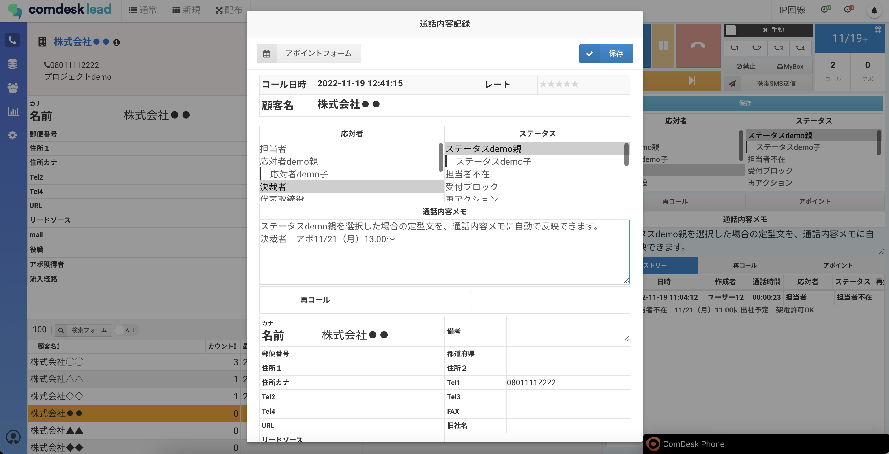
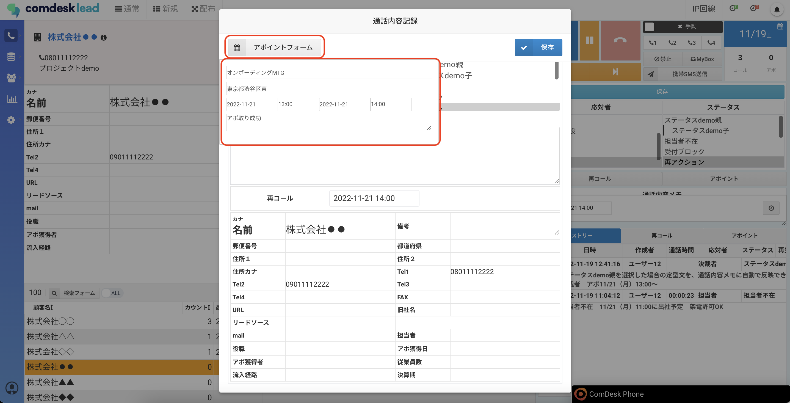
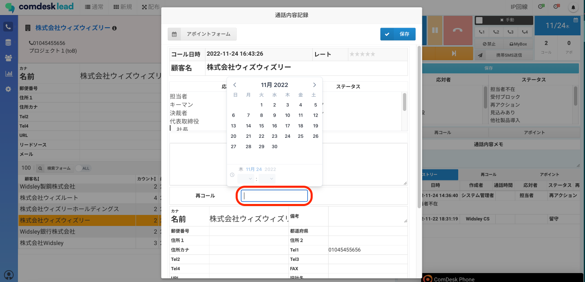
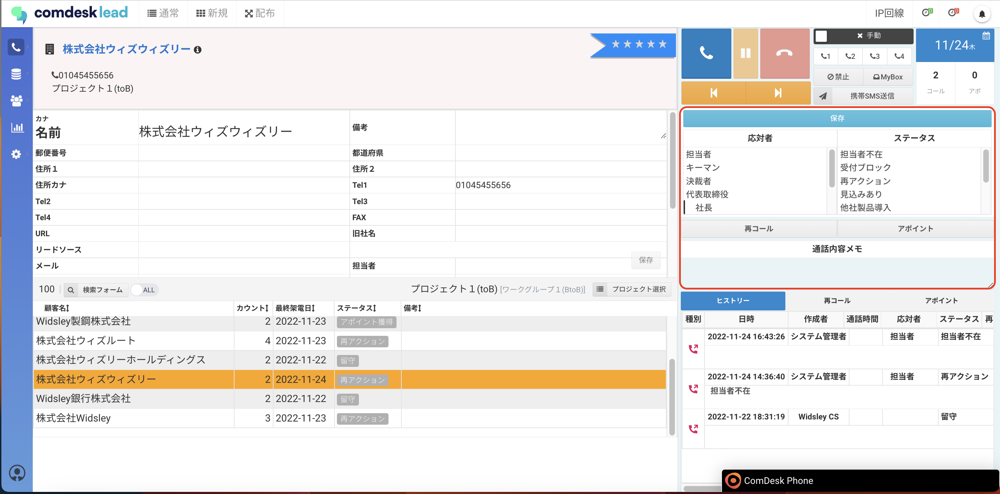
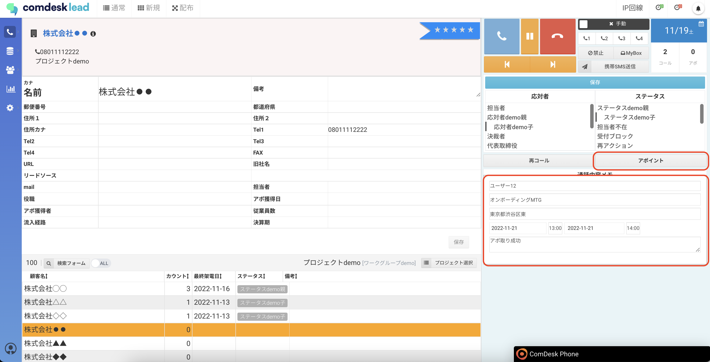
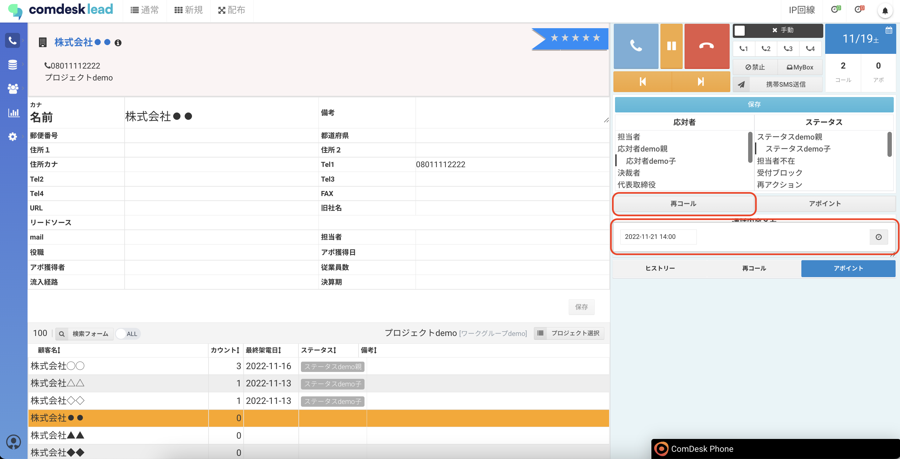

## **切断時に保存できる項目**

* 応対者
* ステータス（必須）
* 通話メモ
* アポイント日時
* 再コール日時
* リスト情報（切断時ポップアップを表示させている場合）

## **切断時ポップアップを表示させている場合**

1. 切断時に通話内容記録画面が表示されますので、必要に応じて下記を入力してください。
   * 応対者
   * ステータス（必須）
   * 通話メモ
   * リスト情報\
     
2. &#x20;通話内容記録画面の「アポイントフォーム」ボタンを選択すると、アポイントの詳細が登録できるフォームが表示されます。
3. 通話内容記録画面の「再コール」右側のボックスにカーソルを合わせるとカレンダーが表示されます。再コールしたい日時を選択してください。\
   

## **切断時ポップアップを表示させていない場合**

1. 画面右側の入力欄から、必要に応じて下記を入力してください。
   * 応対者
   * ステータス（必須）
   * 通話メモ\
     
2. &#x20;通話内容記録画面の「アポイントフォーム」ボタンをクリックすると、アポイントの詳細が登録できるフォームが表示されます。
3. 通話内容記録画面の「再コール」右側のボックスにカーソルをクリックするとカレンダーが表示されます。再コールしたい日時を選択してください。

[**切断時ポップアップ表示の設定方法はこちら**](../../機能一覧/活用ガイド/12780022937753_架電終了時の結果保存画面をポップアップで出す.md)

その他ご不明点などございましたら、[**サポートチームまでお問い合わせ**](https://comdesklead.zendesk.com/hc/ja/requests/new)をお願い致します。

お問い合わせ方法は\*\*[こちら](../../トラブルシューティング/サポートチームへのお問い合わせ方法/12828937533081_サポートチームへのお問い合わせ方法.md)\*\*
