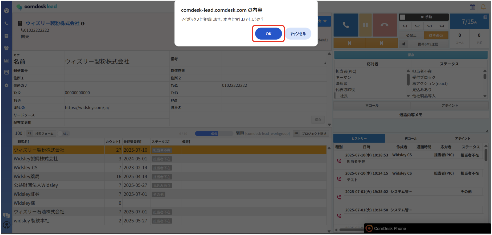
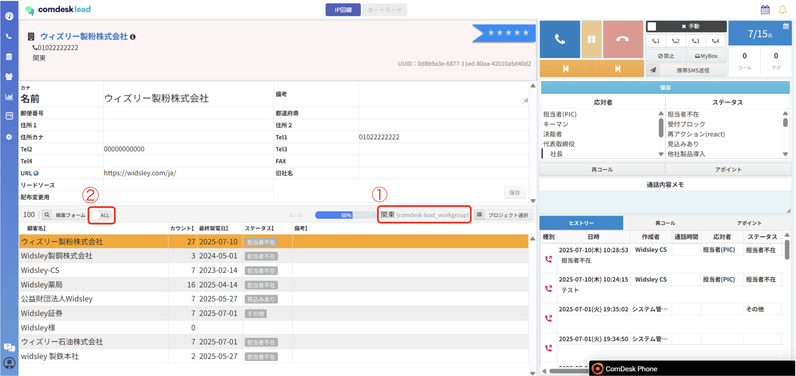
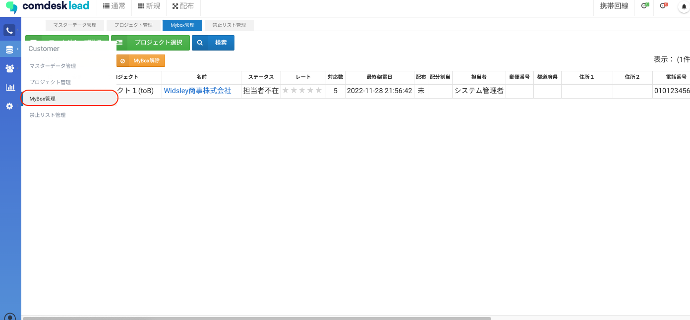
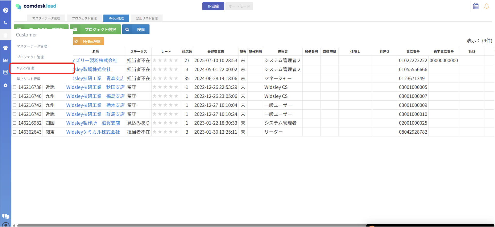

## **Myboxの概要**

見込み顧客を「Mybox」に登録することで、ご自身しかそのリストに架電できなくなる機能です。他のユーザーには、そのリストが表示されなくなると同時に、架電を行おうとしても架電できなくなります。

## **Myboxに登録する**

1. 画面右上「Mybox」をクリックします。\
   
2. アラートの「OK」をクリックしてください。\
   
3. コールモード画面にて、ご自身で登録したMybox登録済みリスト（選択しているプロジェクト内リスト）を確認できます。\
   選択しているプロジェクト（①）を確認し、スイッチボタンの「ALL」（②）をクリックして「Mybox」（③）に切り替えると、Mybox登録済みリストのみが表示されます。\
   
4. 上記3以外に、Myboxに登録したものは「Mybox管理」からも確認ができます。\
   

その他ご不明点などございましたら、[**サポートチームまでお問い合わせ**](https://comdesklead.zendesk.com/hc/ja/requests/new)をお願い致します。\
お問い合わせ方法は\*\*[こちら](../../トラブルシューティング/サポートチームへのお問い合わせ方法/12828937533081_サポートチームへのお問い合わせ方法.md)\*\*
