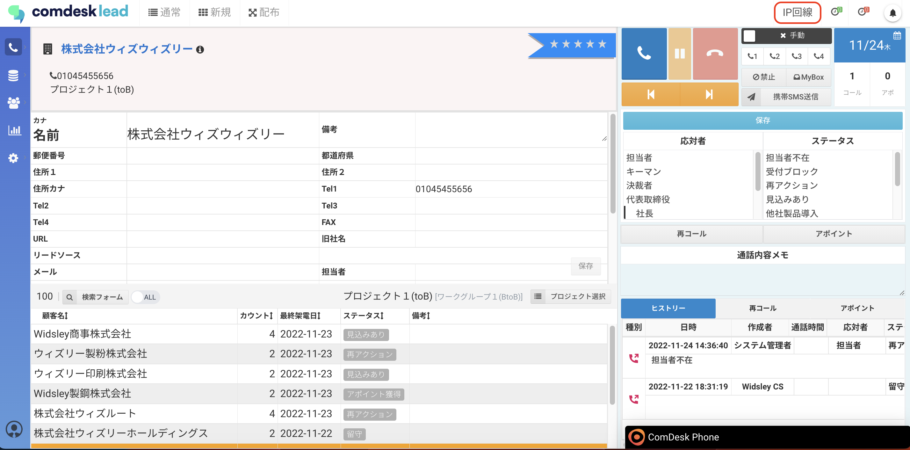
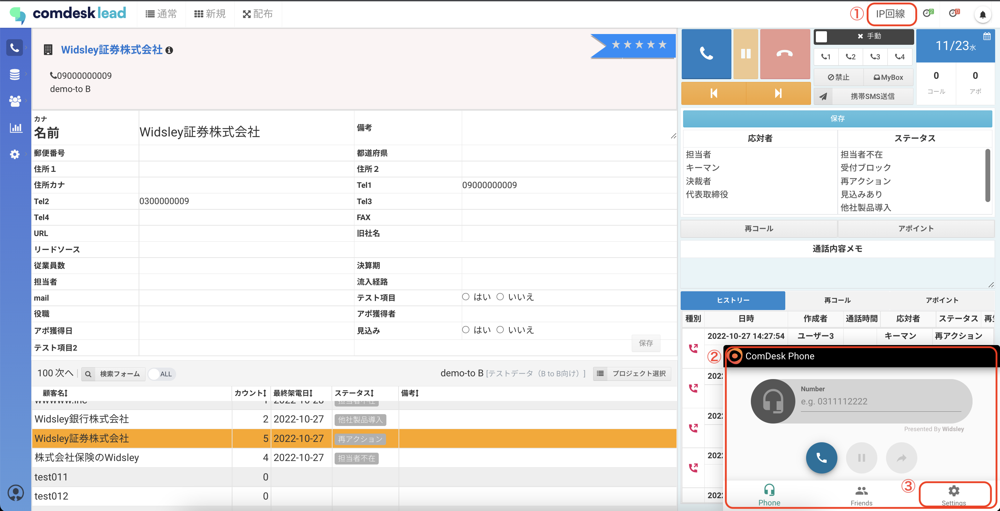
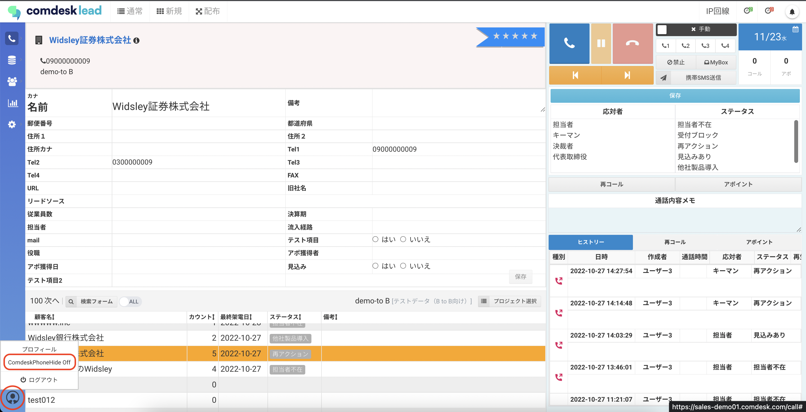
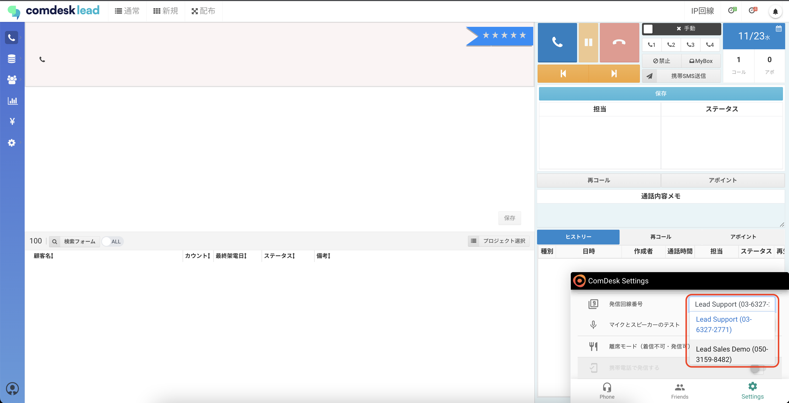
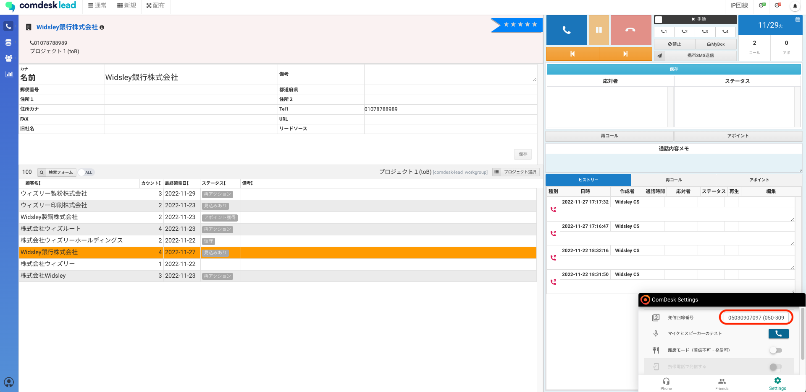
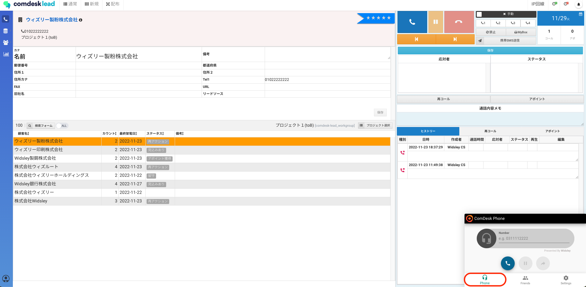
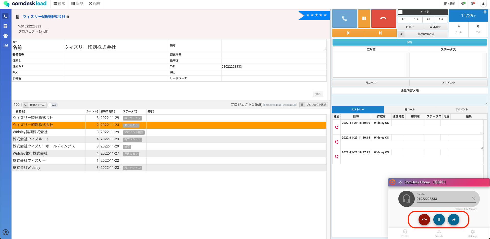
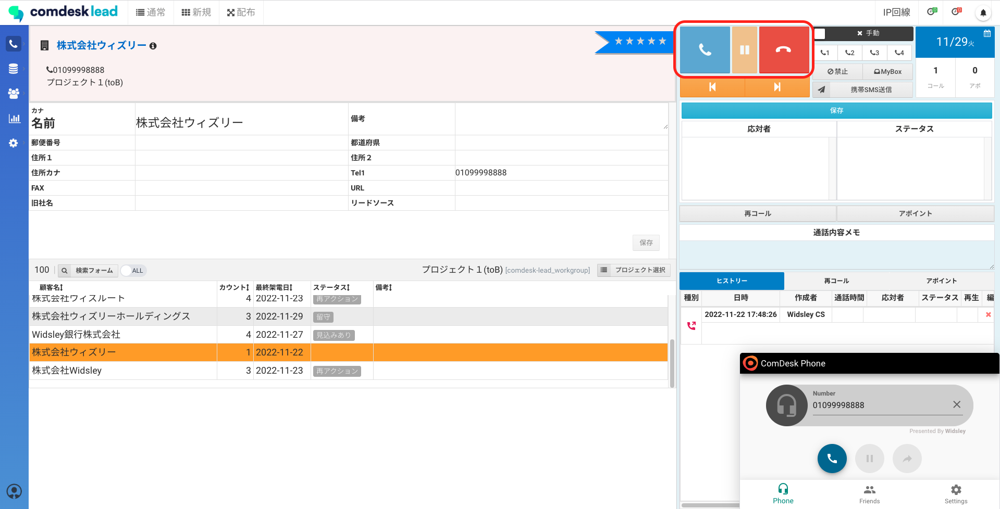

# IP回線での架電方法

目次\
1\. 回線選択\
2\. 発信するIP回線番号を選択

## **IP回線を選択する**

1. 画面右上の「回線選択」ボタンで「IP回線」を選択して回線を切り替えます。\
   

## **発信する回線を選択する**

（※メイン番号以外の回線で発信する場合）

1.  ①回線種別が：「IP回線」であることを確認\
    ②画面右下に表示されるComDesk Phoneを表示させます。\
    ③「Settings」を押します。\
    

    💡ComDesk Phoneポップアップ画面が見当たらない時は、以下2点を確認してください。

    最小化されている場合は、画面右下のComDesk Phoneの黒いバーをクリックしてください。\
    

    上図のComDesk Phoneポップアップの最小化も表示されていない場合は、下記を確認してください。\
    画面左下のアカウントアイコンを選択し、ComdeskPhoneHide offを選択\
    
2. 発信回線番号の枠を選択し、発信可能なIP回線が表示されるので発信を行いたい番号を選択してください。\
   
3. 赤枠に表示されている番号で発信される状態になります。\
   
4. 「Phone」に戻り、架電したいリストを選択します。\
   
5. 右上の「発信」ボタンを押すと、ComDesk Phoneに自動で番号がコピーされ発信ができます。\
   
6. 赤枠内のボタンから\
   ・保留\
   ・転送　ができます。\
   
7. 切電は赤枠内のボタンから行い、切電後「応対者/ステータス」を入力し保存をしてください。\
   

その他ご不明点などございましたら、[**サポートチームまでお問い合わせ**](https://comdesklead.zendesk.com/hc/ja/requests/new)をお願い致します。

お問い合わせ方法は\*\*[こちら](../../トラブルシューティング/サポートチームへのお問い合わせ方法/12828937533081_サポートチームへのお問い合わせ方法.md)\*\*
