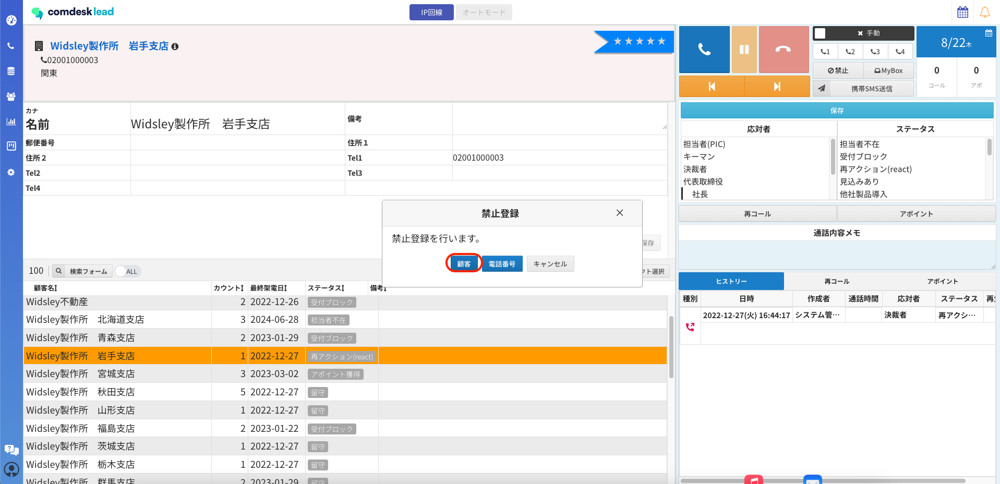
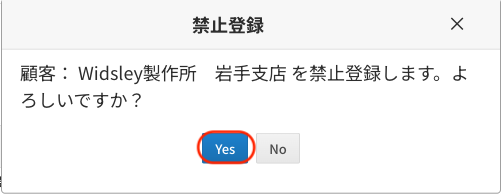
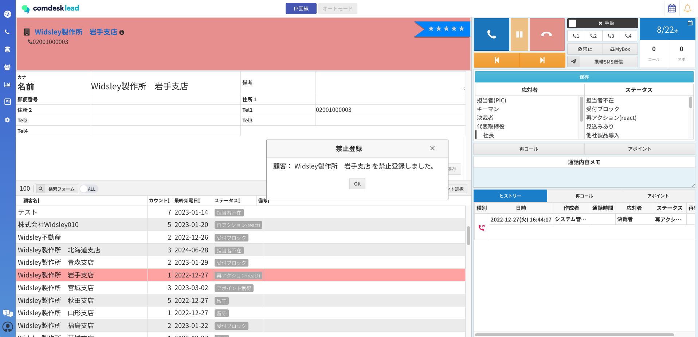
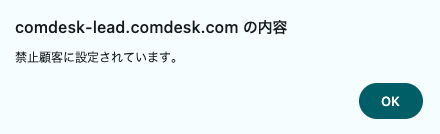
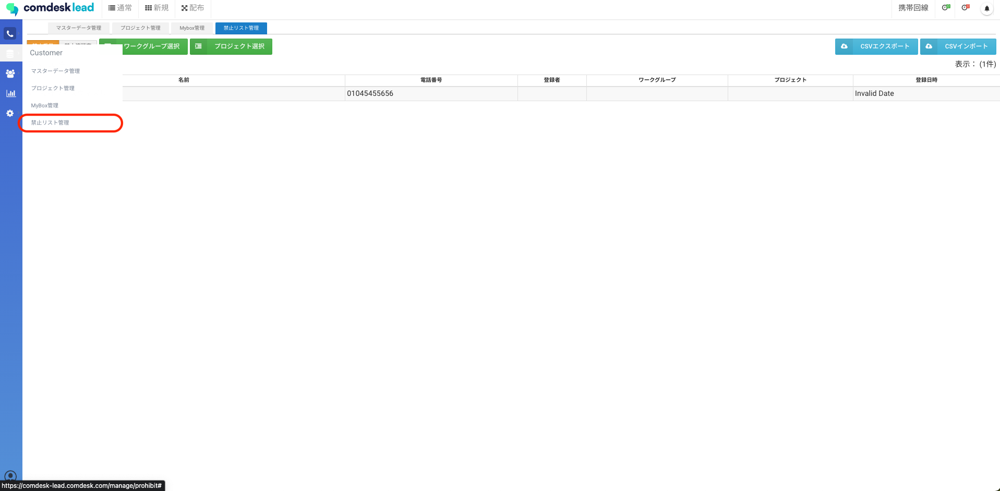
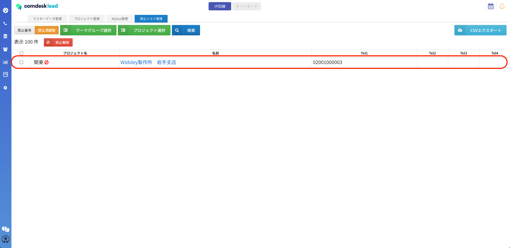
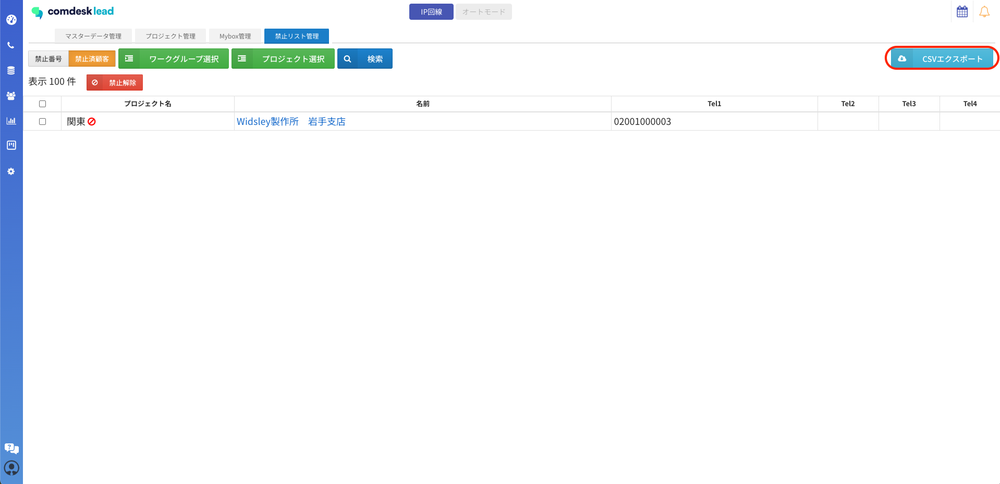
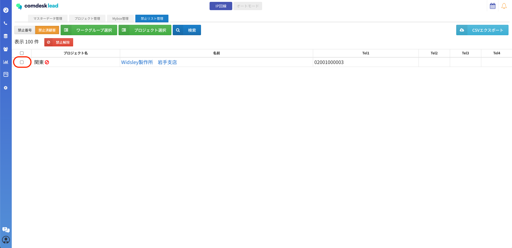
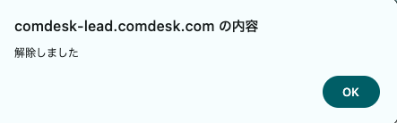

# 架電禁止顧客を禁止顧客リストに登録・解除する

## **禁止リストの概要**

成約済み企業やクレーム案件のリストを「禁止顧客」登録することで、誤って架電してしまうことを防ぐことができます。

※従来はテナント設定にて、「テナント全体」「同一のワークグループのみ」の選択が可能となっておりましたが

2024/04/30アップデート後は、**”禁止顧客”の適用される範囲は「同一のワークグループのみ」に仕様変更しております。**

**※顧客名が完全一致している場合、電話番号が異なっても禁止済顧客になります。**

**ハイフン・空白等があれば部分一致と見なされ、禁止登録されない仕様です。**

**※禁止顧客に登録したリストはコール画面には表示されません。**

[禁止顧客：登録方法](12815344287769_架電禁止顧客を禁止顧客リストに登録・解除する.md#h_01J5WT4K2FCGY5AKEH8AM98ZFD)\
[禁止顧客：解除方法](12815344287769_架電禁止顧客を禁止顧客リストに登録・解除する.md#01J5WYDC3T12Z2T28W843N4SRP)

## **禁止顧客：登録方法**

1. 禁止登録したい顧客を選択した状態で、「禁止」ボタンをクリックします。\
   禁止登録ポップアップが表示され、「顧客」をクリックします。\
   
2. 「顧客：”名前”を禁止登録します。よろしいですか？」と表示され\
   登録する場合は「Yes」をクリックすると禁止顧客への登録が完了します。\
   
3. 禁止顧客登録を完了すると、該当リストが赤く表示されます。\
   
4. 禁止顧客に登録したリストへ架電しようとすると、アラートが表示され架電はできません。「OK」ボタンをクリックすると、アラートは閉じます。\
   画面を更新した場合はコール画面では禁止顧客に登録済みのリストは表示されません。\
   
5. 禁止顧客に登録したリストは「Customer」メニュー＞「禁止リスト管理」＞「禁止済顧客」から確認ができます。\
   
6. 赤枠「禁止済顧客」から禁止顧客に登録したリストの確認ができます。
7. 禁止済顧客をエクスポートする場合は、右上に「CSVエクスポート」ボタンよりエクスポートが可能となります。\
   &#xNAN;**※禁止顧客のインポートはできません。**\
   禁止済顧客で表示・エクスポートできる項目は\
   ・プロジェクト名\
   ・名前\
   ・Tel1\~Tel4　となります。

## **禁止顧客：解除方法**

2024/04/30以降、禁止済顧客の解除方法は「**禁止リスト管理」からのみ**となります。

1. 解除を行いたい対象の禁止顧客にチェックを入れます。\
   全件解除を行いたい場合は「プロジェクト名」左側のチェックボックスに✔を入れることでまとめて解除が可能です。\
   ※元には戻せないため、ご注意ください。\
   
2. チェックが入っている状態で、「禁止解除」をクリックすると\
   「解除しました」とポップアップ表示され、禁止顧客から解除が完了となります。

その他ご不明点などございましたら、[**サポートチームまでお問い合わせ**](https://comdesklead.zendesk.com/hc/ja/requests/new)をお願い致します。

お問い合わせ方法は\*\*[こちら](../../トラブルシューティング/サポートチームへのお問い合わせ方法/12828937533081_サポートチームへのお問い合わせ方法.md)\*\*
