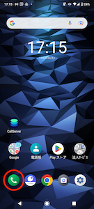
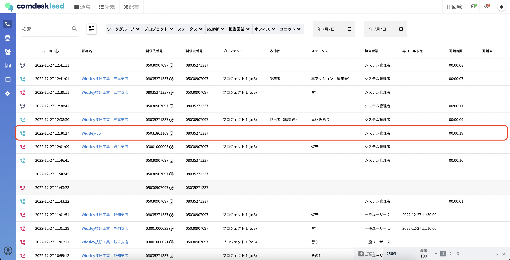
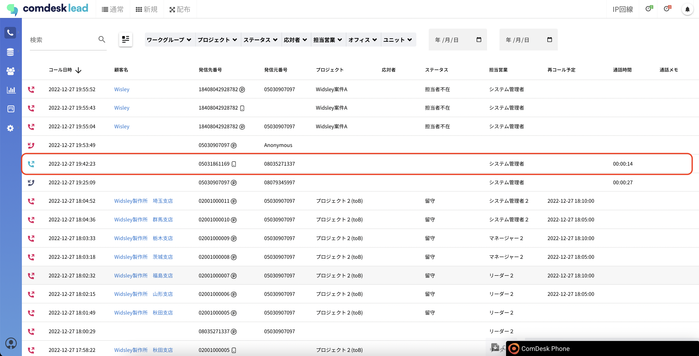
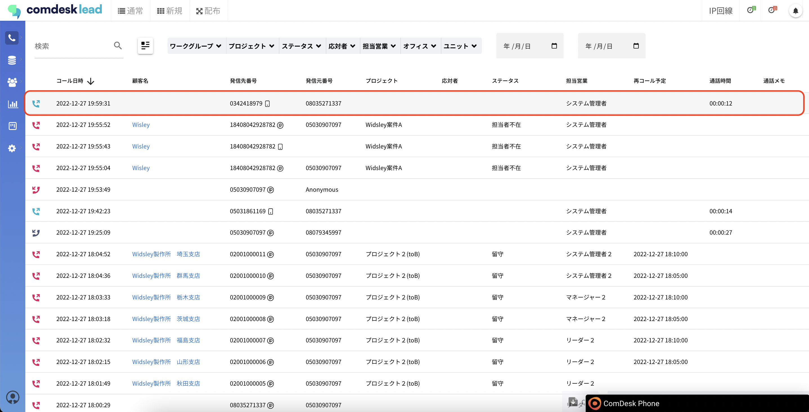

弊社より貸与しているAndroid携帯端末に入っている電話アプリを使用して架電すると、\
該当端末がキャリア録音SIMの場合に限り、Comdesk Leadのシステム上には、通話が発生した場合のみ録音がアップロードされます。

アップロードされた履歴・録音は、「活動履歴」よりご確認いただけます。

なお、Comdesk Leadを経由しない発信の場合、アクティビティ結果が保存されませんので、

架電の際は出来る限りComdesk Leadにログインしご利用されることを推奨いたします。

上図の電話アプリで架電すると、Comdesk Leadを経由していないため、アクティビティ結果が保存できませんので、応対者やステータスなどは未記載になります。プロジェクトも未記載となります。

## **各項目の詳細**

**コールタイプ**

**コールタイプアイコン**

**説明**

発信

水色の受話器（上向き矢印）

発信し、通話が発生した

不在発信

赤の受話器（上向き矢印）

発信したが留守orつながらなかった

**項目名**

**表示されている場合**

**未記載の場合**

コールタイプ

上記表の通り

上記表の通り

コール日時

コールした日時

未記載にはならない

顧客名

架電先の電話番号が1件のリストにのみ登録されている

架電先の電話番号がリストに登録されていない\
架電先の電話番号が複数のリストに登録されている

発信先番号

電話アプリを使用した携帯電話番号

未記載にはならない

発信元番号

架電先の電話番号

通話が発生していない

プロジェクト

\-

システムで登録していないため、必ず未記載

応対者

\-

システムで登録していないため、必ず未記載

ステータス

\-

システムで登録していないため、必ず未記載

担当営業

電話アプリを使用した携帯電話番号に紐付けされたユーザー名

未記載にはならない

再コール予定

\-

システムで登録していないため、必ず未記載

通話時間

通話した時間

通話が発生していない

通話メモ

\-

システムで登録していないため、必ず未記載

下図の赤枠は、電話アプリで架電した場合の活動履歴です。\
1件のリストにのみ登録されている電話番号に架電した場合は、顧客名が表示されます。

架電先の電話番号が複数のプロジェクトに登録されている場合、顧客名は未記載です。

架電先の電話番号がリスト未登録の場合、顧客名は未記載です。

その他ご不明点などございましたら、[**サポートチームまでお問い合わせ**](https://comdesklead.zendesk.com/hc/ja/requests/new)をお願い致します。

お問い合わせ方法は\*\*[こちら](../../トラブルシューティング/サポートチームへのお問い合わせ方法/12828937533081_サポートチームへのお問い合わせ方法.md)\*\*
