ー関連記事ー

MyboxのリストをMyboxから登録する方法は[こちら](12751011749529_見込み顧客をMyboxに登録する.md)

Mybox担当（担当営業者）を変更する方法は[こちら](13557435667993_Mybox担当（担当営業者）を変更したい.md)

## **Myboxの解除について**

Myboxの解除は、Mybox担当者またはシステム管理者の権限を持つ全てのアカウントでこの作業が可能です。

解除方法は以下のとおりですので、それぞれご説明いたします。

・コール画面からの解除

　　∟Mybox担当者が自身のMyboxを解除する

　　∟管理者が他のユーザーのMyboxを解除する

・Mybox管理画面からMybox登録状態を解除する

## **コール画面からのMybox解除方法（自身のMyboxを解除する場合）**

1. コール画面でMyboxを表示し、解除したいリストを選択します。\
   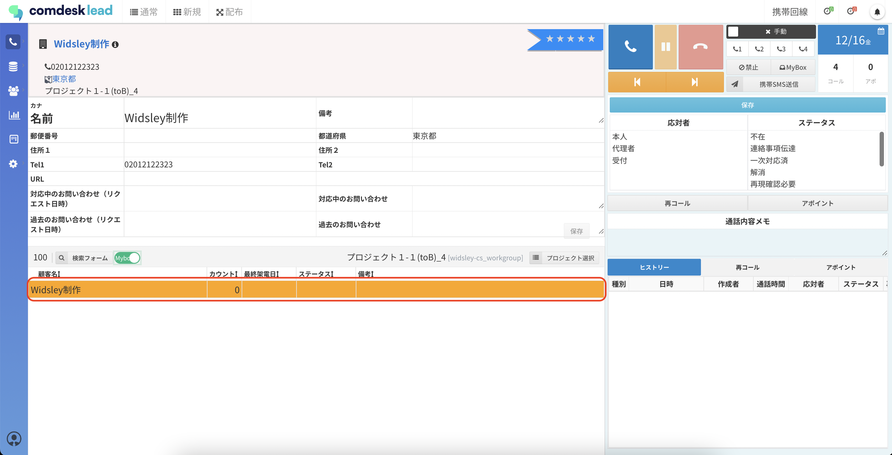
2. 赤枠内の「Mybox」ボタンをクリックします。\
   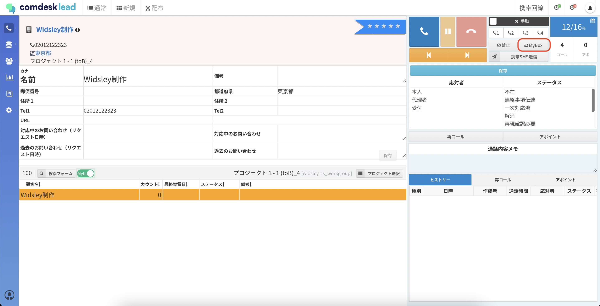
3. 「マイボックスから外してもいいですか？」とポップアップが表示されます。\
   解除で間違いなければ「OK」をクリックします。\
   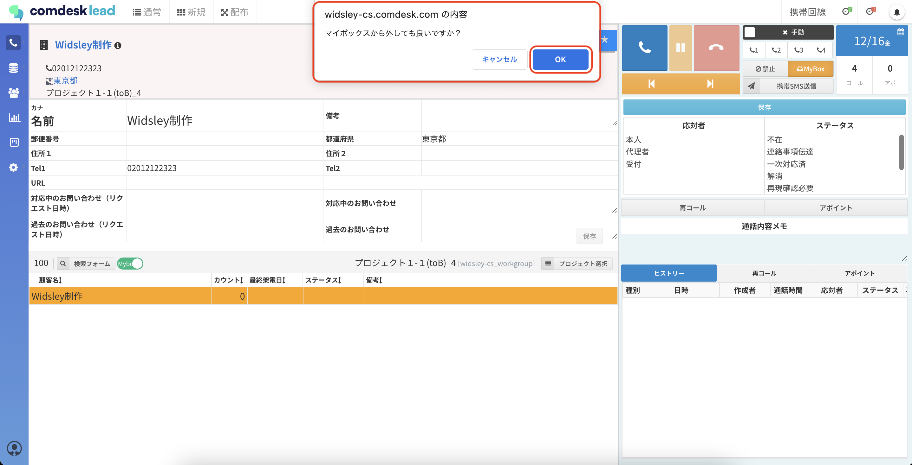
4. Myboxから解除されました。\
   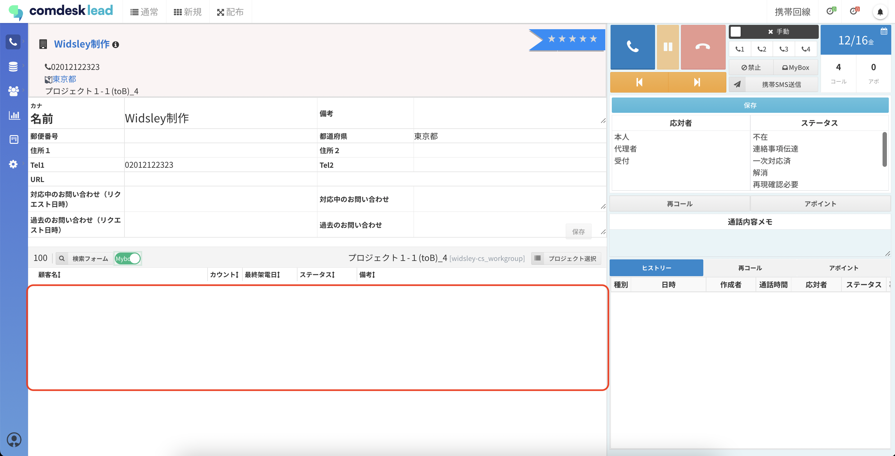

## **コール画面からのMybox解除方法（管理者が他のユーザーのMyboxを解除する場合）**

1. 「マスターデータ管理」を開きます。\
   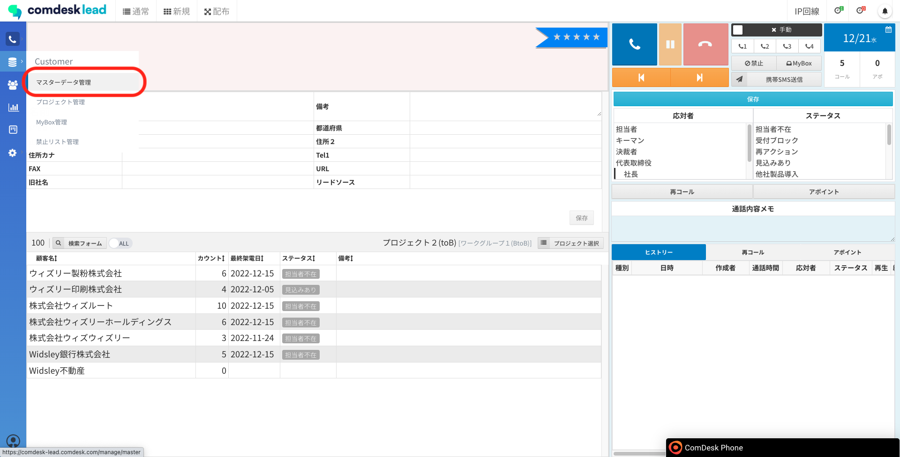
2. 他のユーザーのMyboxに入っている、解除したいリストを選択します。\
   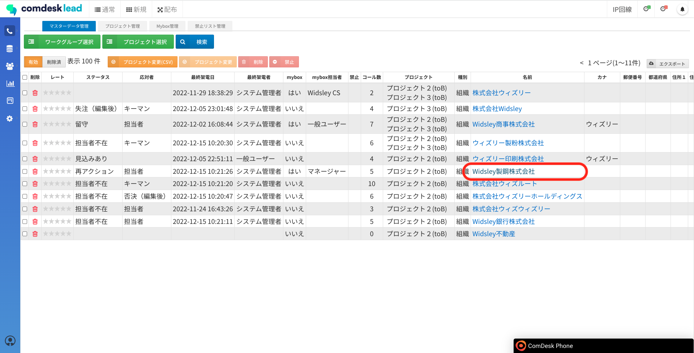
3. 赤枠内の「Mybox」ボタンをクリックします。\
   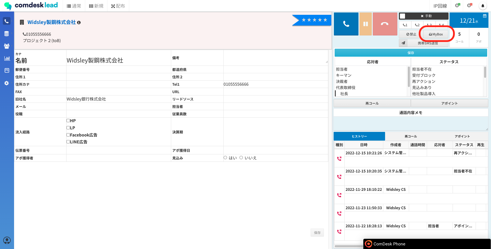
4. 「マイボックスから外してもいいですか？」とポップアップが表示されます。\
   解除で間違いなければ「OK」をクリックします。\
   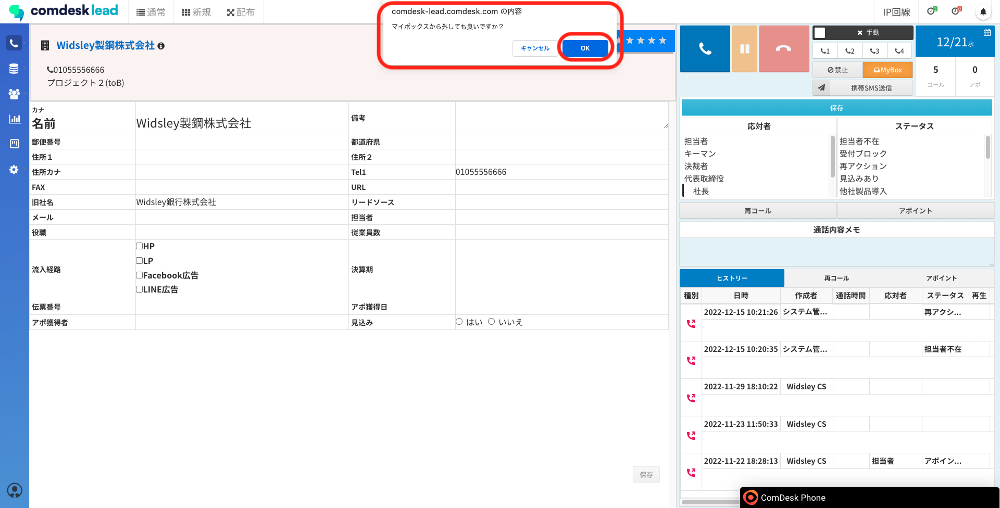
5. Myboxから解除されました。

## **Mybox管理画面からの解除方法**

1. Mybox管理画面に移動します。\
   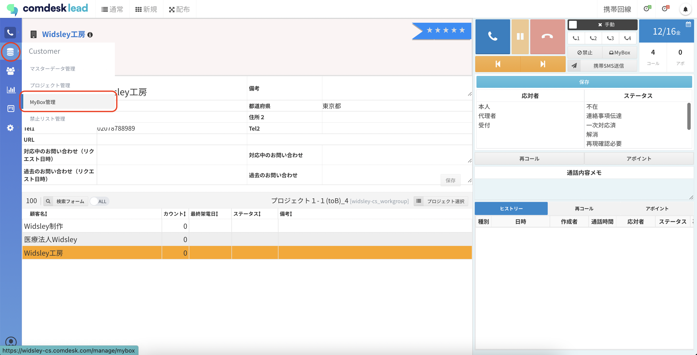
2. Myboxから解除をしたいリストの左側のチェックボックスに✔を入れます。\
   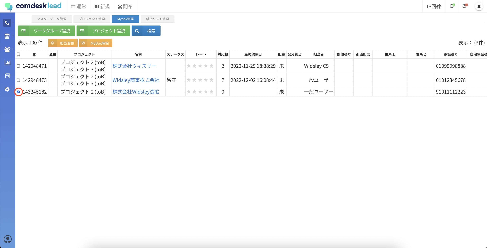
3. 赤枠内「Mybox解除」ボタンをクリックします。\
   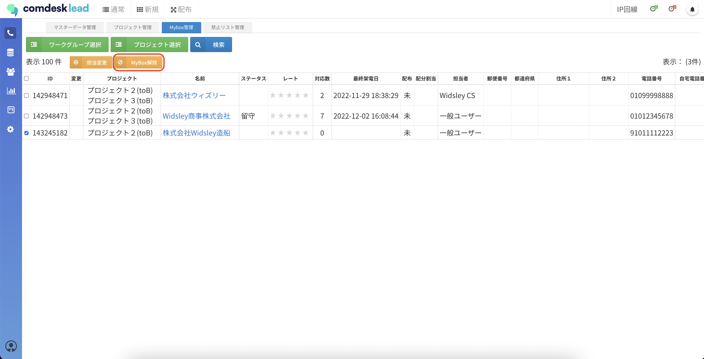
4. 「解除しました」とポップアップが表示されたら解除完了です。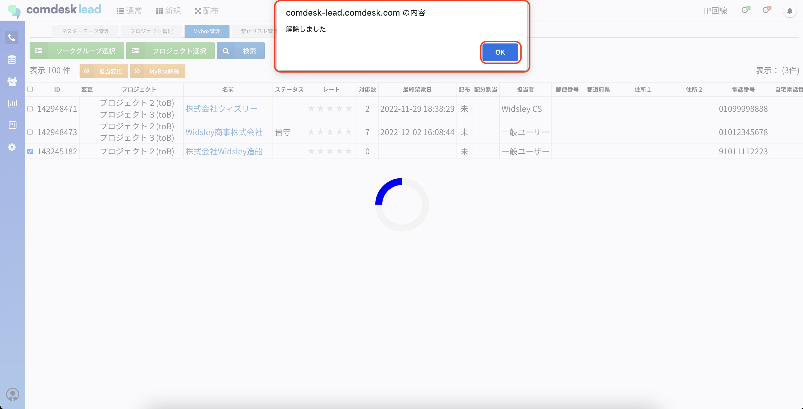

その他ご不明点などございましたら、\*\*[サポートチーム](https://comdesklead.zendesk.com/hc/ja/requests/new)\*\*までお問い合わせをお願いいたします。

お問い合わせ方法は\*\*[こちら](../../トラブルシューティング/サポートチームへのお問い合わせ方法/12828937533081_サポートチームへのお問い合わせ方法.md)\*\*
