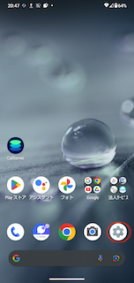
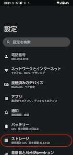
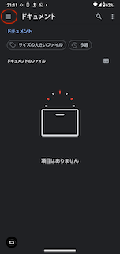
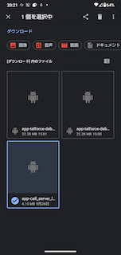
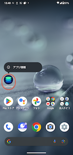
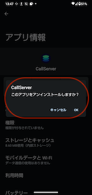

# CallServerのアンインストール（AQUOS Wish）

CallServerのアンインストール方法についてご説明いたします。\
この記事は最新のAQUOS Wishでの操作手順です。

目次\
[1. ダウンロードファイルの削除](24414426270745_CallServerのアンインストール（AQUOS_Wish）.md)\
[2. アプリのアンインストール](24414426270745_CallServerのアンインストール（AQUOS_Wish）.md)

## **1. ダウンロードファイルの削除**

1.  ホーム画面から設定アプリを開きます。

    
2.  設定内の「ストレージ」をタップします。

    
3.  ストレージを開いたら、「ドキュメント、その他」をタップします。\
    ※「ドキュメント、その他」をタップ後、どのアプリケーションで開くか問われた場合は\
    　デフォルトの「ファイル」アプリを選択してください。

    
4.  「ドキュメント」が表示されたら左上の三本線をクリックし、「ダウンロード」をタップします。\
    「ダウンロード」画面に遷移後、他のファイルをダウンロードしていない場合は\*\*全て削除\
    \*\*複数ファイルが表示される場合は\
    ファイル名：**app-call\_server\_lead-1.2.0.apk**　を選択し削除してください。

     

## **2. アプリのアンインストール**

1.  ホーム画面に戻り、アンインストール対象のアプリを長押しし、「アプリ情報」をタップします。

    \*\*

    \*\*
2.  アプリ情報内の「アンインストール」をタップし、「OK」をタップします。

    　　
3. アプリ一覧から、アンインストール対象のアプリが消えていれば\
   アプリのアンインストールが完了です。

その他ご不明点などございましたら、[**サポートチームまでお問い合わせ**](https://comdesklead.zendesk.com/hc/ja/requests/new)をお願い致します。

お問い合わせ方法は\*\*[こちら](../../トラブルシューティング/サポートチームへのお問い合わせ方法/12828937533081_サポートチームへのお問い合わせ方法.md)\*\*
