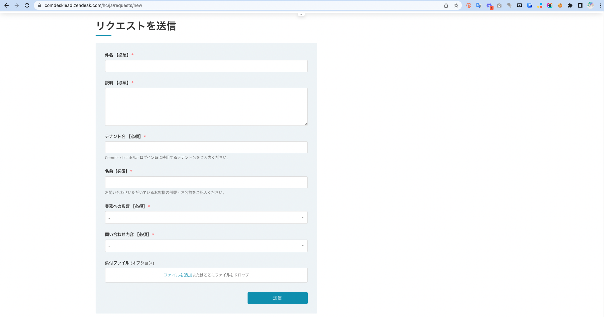

本記事では、弊社サポートチームへのお問い合わせ方法をご案内します。

サービスに関するご質問やご要望がございましたら、以下リンクより、\*\*「リクエストを送信」\*\*フォームより、お問い合わせをお願いいたします。

[https://comdesklead.zendesk.com/hc/ja/requests/new](https://comdesklead.zendesk.com/hc/ja/requests/new)

1. 「件名」欄に、タイトルをご入力ください。
2. 「説明」欄に、具体的なご質問やリクエスト内容をご入力ください。
3. 「担当者名のお名前」欄に、ご担当者様のお名前をご入力ください。
4. 「添付ファイル」（オプション）欄に、必要に応じて、ファイルや画像（スクリーンショット）などを添付してください。
5. 最後に「送信」ボタンをクリックしてください。

→下記項目をより具体的にご記入いただきますと、迅速な対応に繋がります。ご協力ください。

・該当テナント名（〇〇.comdesk.com） ・事象内容 ・発生日時 ・再現方法、動作手順 ・影響範囲、対象ユーザー\
・ご利用ネットワーク環境\
・解決のために試してみた内容

送信いただいた内容に応じて、弊社サポートチームがご担当者様にご返答致します。

その他ご不明点などございましたら、[**サポートチームまでお問い合わせ**](https://comdesklead.zendesk.com/hc/ja/requests/new)をお願い致します。

本記事のリクエスト方法についてご不明点がございましたら、以下までお気軽にご連絡くださいませ。

・Support E-mail：cs@widsley.com

・Support Tel：03-6327-2771
