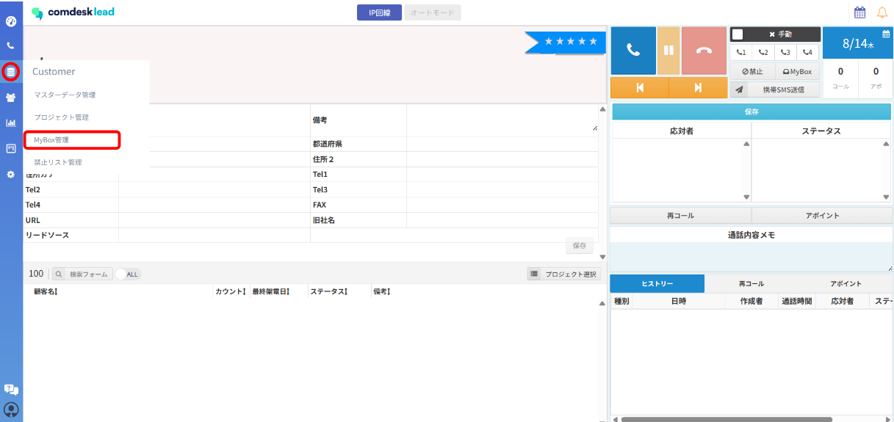
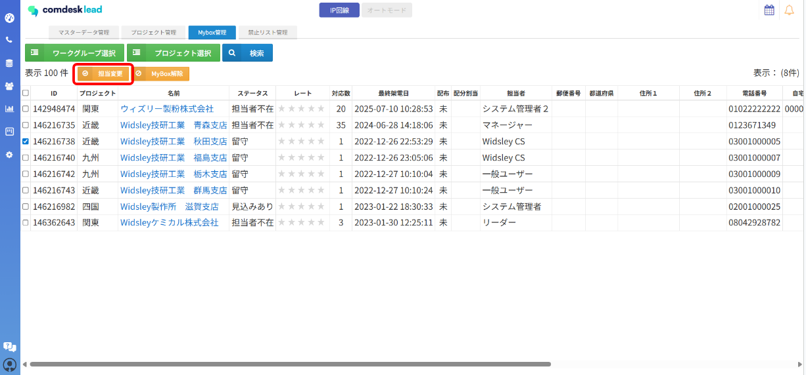
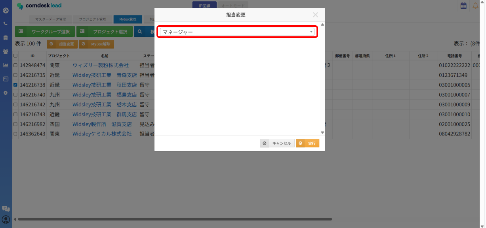
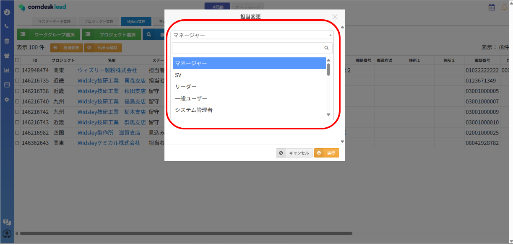
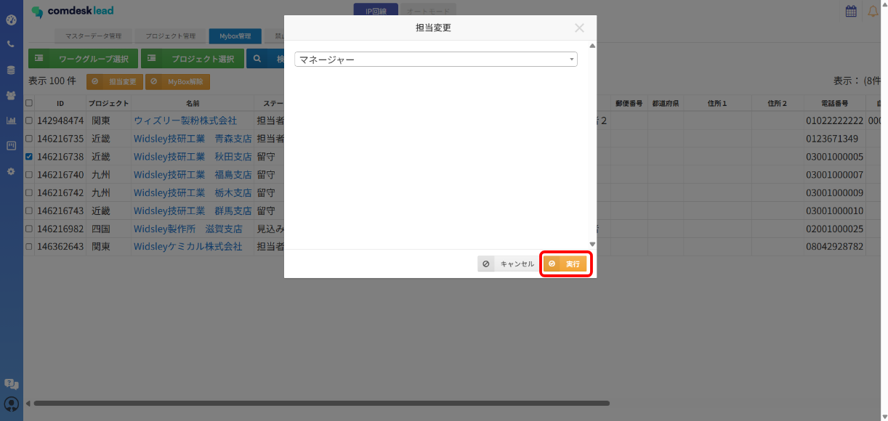

ー関連記事ー

MyboxのリストをMyboxから登録する方法は[こちら](12751011749529_見込み顧客をMyboxに登録する.md)

Myboxの解除方法は[こちら](13556859672217_MyboxのリストをMyboxから解除する.md)

## **Myboxの担当変更**

Myboxの担当変更は、Mybox担当者またはシステム管理者の権限を持つ全てのアカウントで操作可能です。

Mybox管理画面から担当変更ができます。

1. Mybox管理画面を開きます。\
   \
   &#x20;
2. 担当変更を行いたいリストの左側のチェックボックスに✔を入れます。\
   \
   &#x20;
3. 「担当変更」ボタンをクリックします。\
   \
   &#x20;
4. 担当変更先を選択する画面が表示されるので、赤枠内をクリックします。\
   \
   &#x20;
5. ユーザー名一覧が表示されます。\
   \
   &#x20;
6. 変更したい先のユーザーを選択若しくは検索後選択し、「実行」ボタンをクリックします。\
   \
   &#x20;
7. Myboxの担当者が変更されています。\
   \
   &#x20;

その他ご不明点などございましたら、[**サポートチームまでお問い合わせ**](https://comdesklead.zendesk.com/hc/ja/requests/new)をお願い致します。

お問い合わせ方法は[**こちら**](../../トラブルシューティング/サポートチームへのお問い合わせ方法/12828937533081_サポートチームへのお問い合わせ方法.md)
