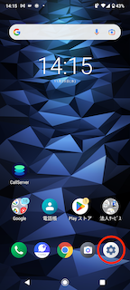
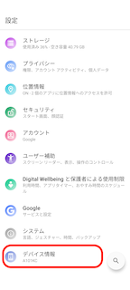
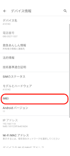
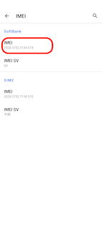
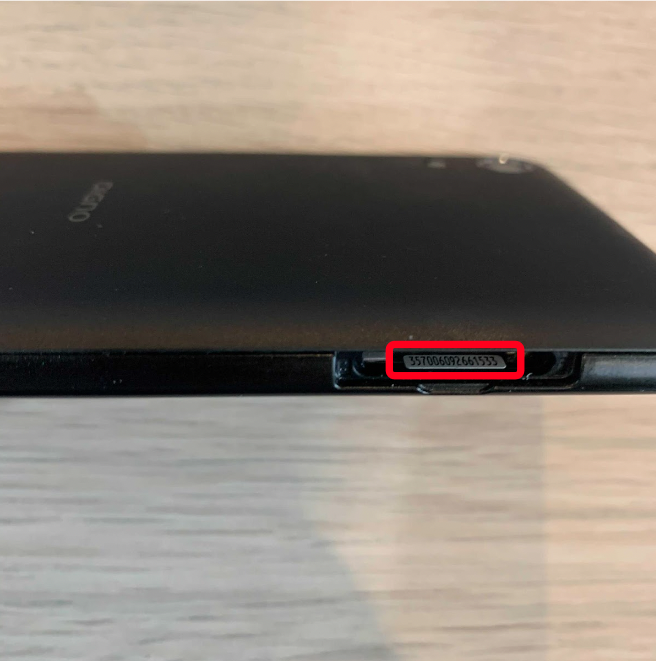

# IMEIの確認方法

## **IMEIとは**

「IMEI」とは端末識別番号で、「国際移動体装置識別番号（International Mobile Equipment Identifier）」の頭文字です。

## **IMEIの確認方法**

1. スマートフォンの設定アイコンを選択します。\
   
2. デバイス情報を選択します。\
   
3. IMEIを選択します。\
   
4. IMEIを確認します。\
   

## **参考**

電源が入らず、画面が表示できない場合にも、端末本体でも確認することができます。

下図は、DIGNO BX2の場合です。SIMスロットを抜いて確認できます。SIMスロットを抜く前は、必ず電源をお切りください。

その他ご不明点などございましたら、[**サポートチームまでお問い合わせ**](https://comdesklead.zendesk.com/hc/ja/requests/new)をお願い致します。

お問い合わせ方法は\*\*[こちら](../../トラブルシューティング/サポートチームへのお問い合わせ方法/12828937533081_サポートチームへのお問い合わせ方法.md)\*\*
