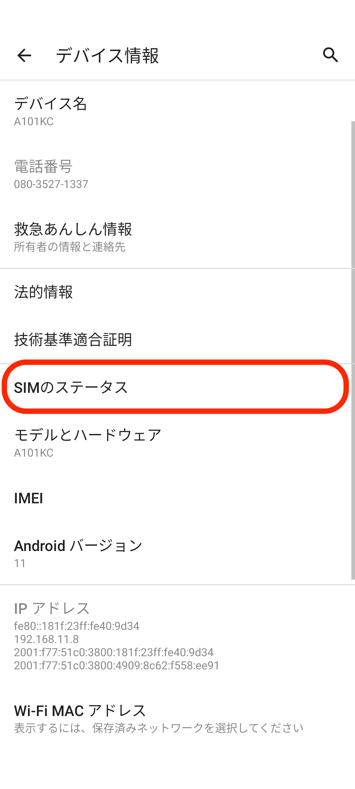
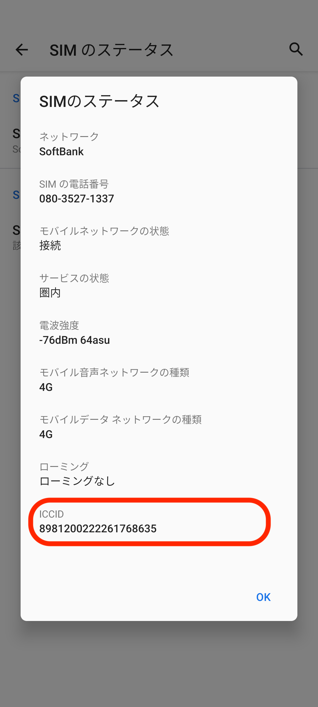

ICCIDとは、SIMカードの固有識別番号です。

キャリア録音の切り替えや、SIM故障の切り替えの際に確認をお願いすることがございます。

1. スマートフォンの「設定」をタップします。\
   
2. 「デバイス情報」をタップします。\
   
3. 「SIMのステータス」をタップします。\
   
4. 「SIMのステータス」をタップします。\
   
5. 「ICCID」を確認します。\
   

💡SIMカードでも確認できます。SIMスロットを抜く前は、必ず電源をお切りください。\

その他ご不明点などございましたら、[**サポートチームまでお問い合わせ**](https://comdesklead.zendesk.com/hc/ja/requests/new)をお願い致します。

お問い合わせ方法は\*\*[こちら](../../トラブルシューティング/サポートチームへのお問い合わせ方法/12828937533081_サポートチームへのお問い合わせ方法.md)\*\*
