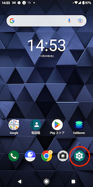
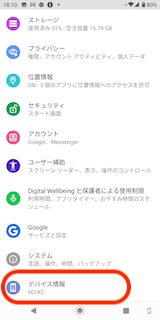
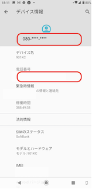

# 携帯番号（SIM番号）の確認方法

## **概要**

本記事では、お手持ちのスマートフォンのSIM番号を確認する方法をご案内いたします。

## **携帯番号（SIM番号）の確認方法**

1. スマートフォンの設定アイコンをタップします。\
   
2. デバイス情報をタップします。\
   
3. 電話番号を確認します。\
   

その他ご不明点などございましたら、[**サポートチームまでお問い合わせ**](https://comdesklead.zendesk.com/hc/ja/requests/new)をお願い致します。

お問い合わせ方法は\*\*[こちら](../../トラブルシューティング/サポートチームへのお問い合わせ方法/12828937533081_サポートチームへのお問い合わせ方法.md)\*\*
