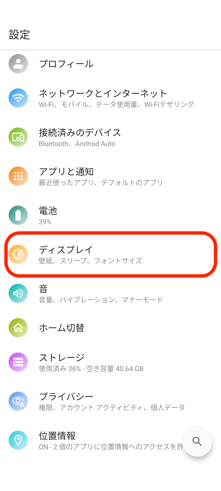
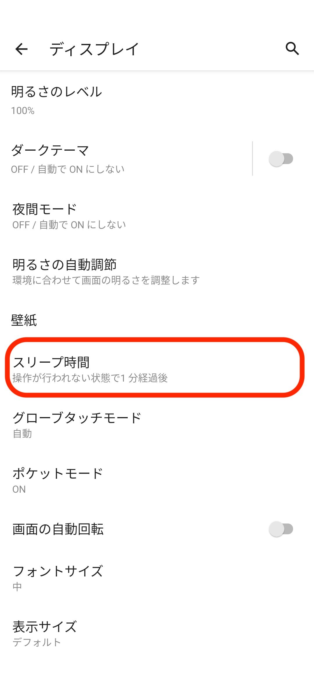
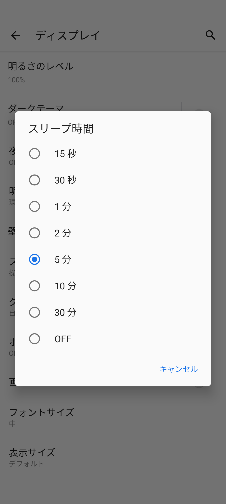

# 画面点灯時間を設定する

* [**DIGNO® BX2 オンラインマニュアル（取扱説明書）**](https://www.softbank.jp/mobile/support/manual/smartphone/digno-bx2/pdf/)
* [**DIGNO® BX オンラインマニュアル（取扱説明書）**](https://www.softbank.jp/mobile/support/manual/smartphone/digno-bx/)
* [**DIGNO® J オンラインマニュアル（取扱説明書）**](https://www.softbank.jp/mobile/support/manual/smartphone/digno-j/)

スリープするまでの時間を変更します。\
スリープ状態では、Comdesk Leadで架電ができませんので、多くのご利用者様では、充電器を常に差した状態でスリープ時間を「OFF」にされています。

1. スマートフォンの「設定アイコン」をタップします。\
   
2. 「ディスプレイ」をタップします。\
   
3. 「スリープ時間」をタップします。\
   
4. 「スリープ時間」を設定します。\
   
5. 希望の時間に設定したら変更完了です。

その他ご不明点などございましたら、[**サポートチームまでお問い合わせ**](https://comdesklead.zendesk.com/hc/ja/requests/new)をお願い致します。

お問い合わせ方法は\*\*[こちら](../../トラブルシューティング/サポートチームへのお問い合わせ方法/12828937533081_サポートチームへのお問い合わせ方法.md)\*\*
