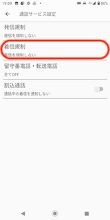
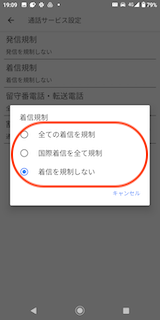
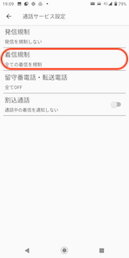
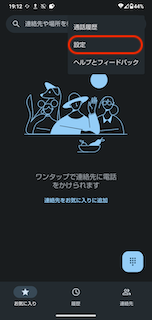
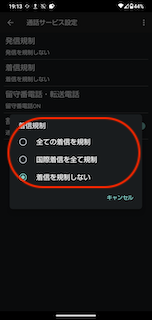

# 携帯電話での着信規制設定

## 携帯電話での着信規制設定

携帯端末を発信専用でご利用になる場合、着信規制の設定が可能です。

目次\
1\. [DIGNO BX2をご利用の場合](24496226652313_携帯電話での着信規制設定.md)\
2\. [AQUOS Wishをご利用の場合](24496226652313_携帯電話での着信規制設定.md)

## **DIGNO BX2をご利用の場合**

1. 電話アプリを開き、右上のメニューボタンをタップし「設定」をタップします。\
   
2. 「通話」をタップします。\
   
3. 「通話サービス設定」をタップします。\
   
4. 「着信規制」をタップします。\
   
5. 希望する規制設定をタップします。\
   
6. 設定できました。\
   

## **AQUOS Wishをご利用の場合**

1. 電話アプリを開き、右上のメニューボタンをタップし「設定」をタップします。\
   
2. 「通話アカウント」をタップします。\
   
3. 「SoftBank」をタップします。\
   
4. 「通話サービス設定」をタップします。\
   
5. 「着信規制」をタップします。\
   
6. 希望する規制設定をタップします。\
   
7. 設定できました。\
   

その他ご不明点などございましたら、[**サポートチームまでお問い合わせ**](https://comdesklead.zendesk.com/hc/ja/requests/new)をお願い致します。

お問い合わせ方法は\*\*[こちら](../../トラブルシューティング/サポートチームへのお問い合わせ方法/12828937533081_サポートチームへのお問い合わせ方法.md)\*\*
