## 携帯電話からの転送設定

携帯電話への着信を他の番号に転送する場合の設定方法をご案内します。

目次

1. [DIGNO BX2をご利用の場合](24532190641305_携帯電話からの転送設定.md#h_01HDJQPT386J1PA3R1D21WQT8M)\
   2\. [AQUOS Wishをご利用の場合](24532190641305_携帯電話からの転送設定.md#01HDJQSN1EZCEZDY7MHC8DZ4ED)

## **DIGNO BX2をご利用の場合**

1. 電話アプリを開き、右上のメニューボタンをタップし「設定」をタップします。\
   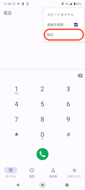
2. 「通話」をタップします。\
   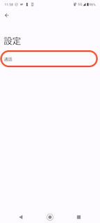
3. 「通話サービス設定」をタップします。\
   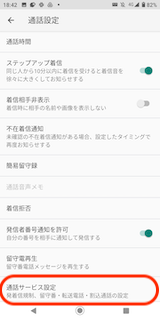
4. 「留守番電話・転送電話」をタップします。\
   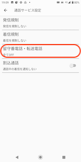
5. 「転送電話ON」を選択します。\
   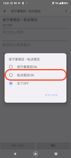
6. ご希望の呼び出し時間を選択します。\
   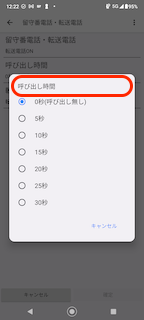
7. 転送先電話番号を入力し「登録」をタップします。\
   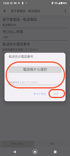
8. 「確定」をタップして完了です。\
   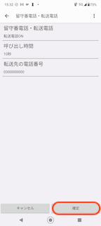

## **AQUOS Wishをご利用の場合**

1. 電話アプリを開き、右上のメニューボタンをタップし「設定」をタップします。\
   
2. 「通話アカウント」をタップします。\
   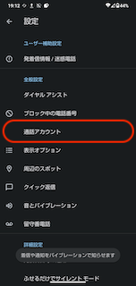
3. 「SoftBank」をタップします。\
   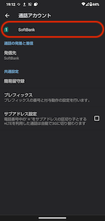
4. 「通話サービス設定」をタップします。\
   
5. 留守番電話・転送電話」をタップします。\
   
6. 「転送電話ON」を選択します。\
   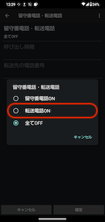
7. ご希望の呼び出し時間を選択します。\
   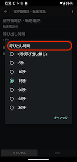
8. 転送先電話番号を入力し「登録」をタップします。\
   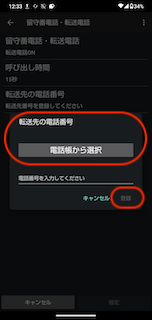
9. 「確定」をタップして完了です。\
   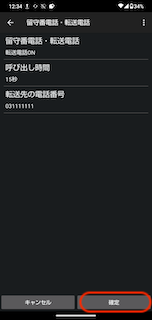

その他ご不明点などございましたら、[**サポートチームまでお問い合わせ**](https://comdesklead.zendesk.com/hc/ja/requests/new)をお願い致します。

お問い合わせ方法は\*\*[こちら](../../トラブルシューティング/サポートチームへのお問い合わせ方法/12828937533081_サポートチームへのお問い合わせ方法.md)\*\*
