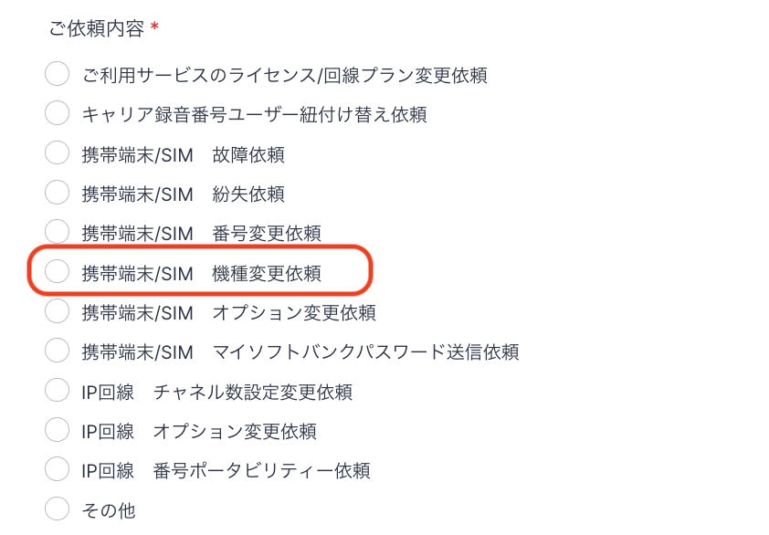
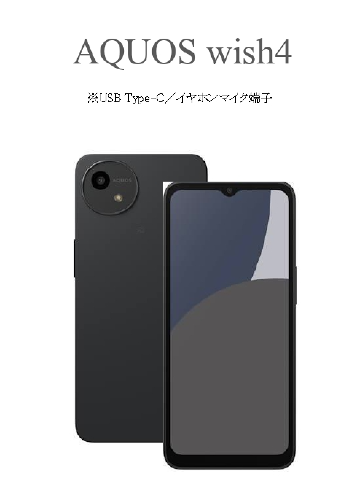

# 機種変更に関して

機種変更をご希望の場合は、**フォーム**にてご依頼をお願いいたします。

## **注意事項**

2025年5月より機種変更依頼はすべて有料依頼に変更となりました。

機種変更代として1万円/台で機種変更をすることができます。\
ご依頼を承ってから機種変更手続きをさせていただきますので、その旨ご了承ください。

尚、機種の指定はできません。原則、最新機種への機種変更となります。

## **依頼フォーム入力方法**

1. 機種変更依頼フォーム：[https://comdesk.com/apply-lead.html](https://comdesk.com/apply-lead.html)
2. 必須項目を入力し、ご依頼内容は上から6番目の\*\*「携帯/SIM　機種変更依頼」\*\*を選択してください。\
   
3. 当ページ上部に記載されている\*\*【注意事項】\*\*を確認いただき、機種変更したい機種のSIM（電話番号）・IMEIの記載をお願いいたします。\
   [IMEIの確認方法はこちら](../弊社貸出端末について/12781943797273_IMEIの確認方法.md)
4. 代替機到着希望日・回線切替希望日時をご選択\
   ご利用中のSIMによっては、回線切替（平日10:00〜17:00）が必要な場合がございますので予めお伺いしております。\
   回線切替の作業のため、1時間ほど端末の利用が不可となりますので、お昼休憩や非稼働日をご選択されることを推奨します。\
   回線切替が必要な場合には、担当からご連絡致します。
5. 送付先住所等ご入力いただき送信ください。

## **フォーム送信後の流れ**

1.  フォーム受領後、弊社よりキャリアに機種変更を申請します。

    変更機種は最新機種（現状AQUOS wish4）への変更となります。

    ※機種変更料金は1万円/台にて承り可能です。

    
2. 弊社より御社ご指定の交換端末送付宛先へ発送します。
3. 端末到着後、回線切替が必要な場合は回線切り替えを弊社で行います。\
   旧端末・新端末共に電源を切った状態でお待ちいただきます。\
   約1時間は使用不可となります。
4. 回線切替完了後、弊社からご連絡致します。\*\*\
   正しい組み合わせで\*\*既存のSIM（電話番号）を新しく送付したIMEI（携帯端末）に入れ、\
   電源を入れたら電波が入っているか確認をお願いいたします。
5.  旧端末を返却端末送付書**に沿って弊社へ返送**をお願いいたします。\
    期日を過ぎた場合はキャリアより、**未返却損害金が50,000円/1台**あたり発生致しますので\
    弊社よりご請求させていただきますご認識をお願いいたします。

    ※基本的には、手元に届いた時点で関連のアプリはすでにインストールされた状態です。

    ※返送時に、同梱されております返却シートのチェック項目を全て埋めた状態にて

    &#x20; ご返送を頂ますようお願い致します。

その他ご不明点などございましたら、[**サポートチームまでお問い合わせ**](https://comdesklead.zendesk.com/hc/ja/requests/new)をお願い致します。

お問い合わせ方法は\*\*[こちら](../../トラブルシューティング/サポートチームへのお問い合わせ方法/12828937533081_サポートチームへのお問い合わせ方法.md)\*\*
