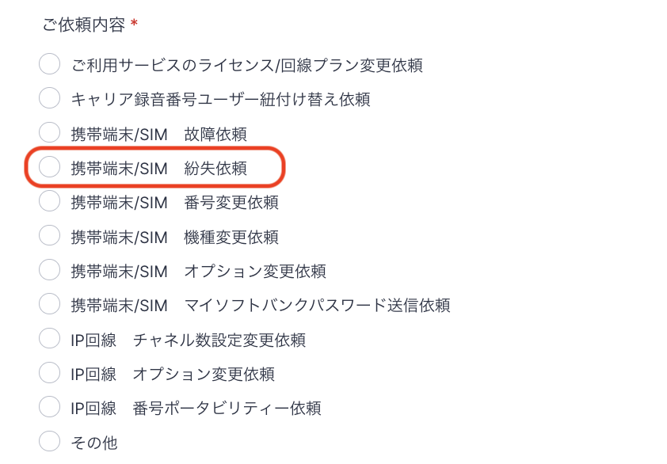
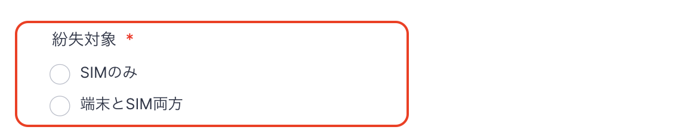

# 携帯端末紛失について

弊社貸し出しの携帯端末を紛失してしまった場合、フォームにてご依頼をお願いいたします。

## **依頼方法**

1. 紛失依頼フォーム：[https://comdesk.com/apply-lead.html](https://comdesk.com/apply-lead.html)
2.  ご依頼内容は上から4番目の\*\*「携帯/SIM　紛失依頼」\*\*を選択してください。\
    \*\*

    \*\*
3. 紛失対象：SIMのみ/端末とSIMの両方　から当てはまるものをご選択ください。\
   紛失1台あたり5,000円（税別）のSIM再発行手数料が発生致します。\
   
4. 紛失端末の台数と電話番号（SIM）、端末番号（IMEI）を入力ください。\
   ※IMEIは分かる場合のみで結構です。\
   [IMEIの確認方法はこちら](../弊社貸出端末について/12781943797273_IMEIの確認方法.md)
5. 回線停止の希望有無をご記載ください。\
   回線停止とは、Softbankへの回線停止です。\
   1台につき停止500円、再開500円の計1,000円が発生致します。
6. 代替機到着希望日/送付先住所などご記載ください。

## **フォーム送信後の流れ**

1. フォーム受領後、社内で確認を行います。
2. 弊社からキャリアに代替端末または代替SIMの依頼を行います。
3. キャリアから弊社に代替端末または代替SIMが届き次第、交換端末をお客様へ送付させていただきます。
4. 届いた端末またはSIMをお手持ちの端末またはSIMをセットにし、問題なく動作するか確認をお願いいたします。\
   ※セットは決まったものがございますので、入れ子でお使いいただかないようご注意ください。\
   　解約などの際に正しい状態でご返却いただけなければ、キャリアから50,000円の手数料が発生いたします。

その他ご不明点などございましたら、[**サポートチームまでお問い合わせ**](https://comdesklead.zendesk.com/hc/ja/requests/new)をお願い致します。

お問い合わせ方法は\*\*[こちら](../../トラブルシューティング/サポートチームへのお問い合わせ方法/12828937533081_サポートチームへのお問い合わせ方法.md)\*\*
