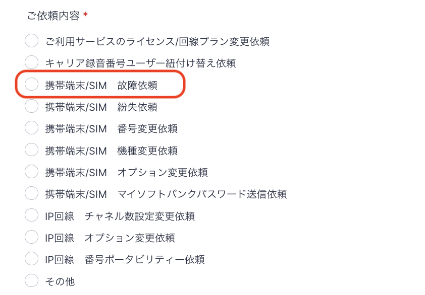
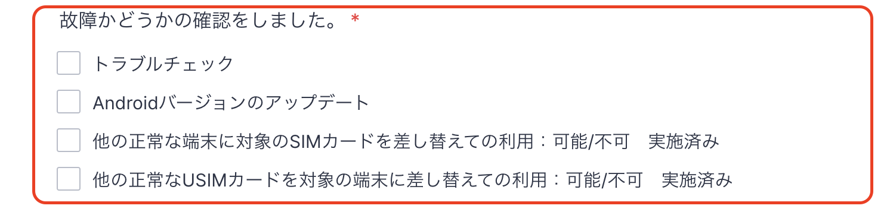
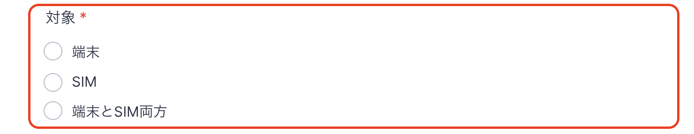

「電源が落ちる」「電源が入らない」「充電ができない」「セーフモードになる」「声が聞こえない」などの、携帯端末の不具合が発生した場合の対応方法についてご説明致します。

**目次**\
**弊社より貸与しているAndroid携帯端末をご利用の場合**\
　　　■故障依頼前にお試しください。\
　　　■故障依頼方法\
　　　■フォーム送信後の流れ\
　　　■携帯端末がお手元に届いた後\
**ユーザー様がお持ちの携帯端末をご利用の場合**

## **弊社より貸与しているAndroid携帯端末をご利用の場合**

### ■故障依頼前にお試しください。

「**再起動**」や「**SIMの抜き差し**」で解決する場合がありますのでおためしください。\
ソフトバンクのトラブルチェックもご参考ください。\
&#x20;[https://www.softbank.jp/mobile/support/repair/recovery/trouble-check/](https://www.softbank.jp/mobile/support/repair/recovery/trouble-check/)

### ■故障依頼方法

1.  上記で解決しない場合は、端末の故障かSIMの故障か切り分ける為、以下作業を行いご確認をお願いいたします。\
    \*\*①正しく使えてる端末に、不具合が起きている端末のSIMを挿入し正常に動作するかどうか。\
    \*\*\*\*②正しく使えている端末のSIMを不具合が起きている端末に挿入し正常に動作するかどうか。\
    \*\*

    ・①の作業で動作確認が取れ、②で動作確認が取れなかった場合は**端末の故障**

    ・①の作業で動作確認が取れず、②の作業で動作確認が取れた場合は**SIMの故障**\
    &#xNAN;**※SIMの故障の場合、SIM再発行手数料として5,000円（税抜）が発生致します。**

    ・①、②両方で動作確認が取れない場合は\*\*両方故障

    **IMEI（携帯端末の製造番号）と携帯電話番号が一致している場合に限り、携帯端末の交換が可能です。一致しているかどうかご不明の場合、**[こちら](https://comdesklead.zendesk.com/hc/ja/requests/new)\*\*までお問い合わせください。
2. 故障依頼フォームのご入力をお願いいたします。\
   故障依頼フォーム：[https://comdesk.com/apply-lead.html](https://comdesk.com/apply-lead.html)
3. ご依頼内容は上から3番目\*\*「\*\*\*\*携帯端末/SIM　故障依頼」\*\*にチェックを入れてください。\
   
4. 「故障かどうかの確認をしました」は確認した項目にチェックをお願いいたします。\
   状況を正しく把握させていただくため、全て確認のご協力をいただけますと幸いです。\
   
5. 4で行なった作業で故障対象が端末なのか、SIMなのか、その両方なのか、対象のものにチェックをお願いいたします。\
   
6. 故障対象のSIM（電話番号）・IMEIの記載欄は下記を参考にご入力ください。\
   IMEIの確認方法：[https://www.softbank.jp/support/faq/view/10892](https://www.softbank.jp/support/faq/view/10892)\
   ※正常画面が表示されない場合のIMEI確認方法につきまして\
   SIM挿入口内側に白地に黒い文字で15桁の数字が記載されており、その数字がIMEIです。
7. 故障内容・代替機到着希望・送付先情報をご入力いただき、フォームの送信をお願いいたします。

### ■フォーム送信後の流れ

1. フォーム受領後、弊社にてIMEIと携帯電話番号の一致を確認
2. 一致している場合は、弊社よりキャリアに交換端末を申請
3. 弊社よりユーザー様ご指定の交換端末送付宛先へ発送\
   ※ユーザー様より携帯端末交換依頼をいただいた後、ユーザー様のお手元に新しい携帯端末が届くまで、通常3～5営業日（年末年始を除く）かかります。

### ■携帯端末がお手元に届いた後

1. 故障の携帯端末よりSIMを抜き出し、新しい携帯端末に挿入&#x20;
2. 電源を入れて、問題無く起動するか確認
3. 故障の携帯端末を、**返却端末送付書に沿って弊社へ返送**をお願いいたします。\*\*\
   期日を過ぎた場合はキャリアより、\*\***未返却損害金が50,000円/1台あたり発生致しますので**\
   **弊社よりご請求させていただきます。**

※\*\*基本的には、\*\*手元に届いた時点で関連のアプリはすでにインストールされた状態です。

※返送時に、同梱されております返却シートのチェック項目を全て埋めた状態にて

&#x20; ご返送をいただきますようお願い致します。

## **ユーザー様がお持ちの携帯端末をご利用の場合**

ユーザー様お持ちの携帯端末について、上記の症状が発生した場合は再起動などで復旧する場合がございます。

※ユーザー様ご契約の端末での不具合等に関してはサポート対象外となります。

その他ご不明点などございましたら、[**サポートチームまでお問い合わせ**](https://comdesklead.zendesk.com/hc/ja/requests/new)をお願い致します。

お問い合わせ方法は\*\*[こちら](../../トラブルシューティング/サポートチームへのお問い合わせ方法/12828937533081_サポートチームへのお問い合わせ方法.md)\*\*
