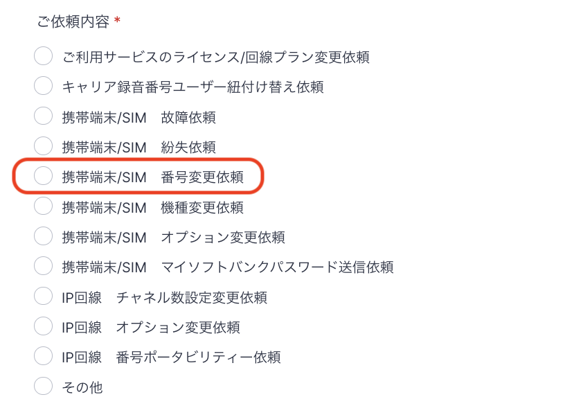
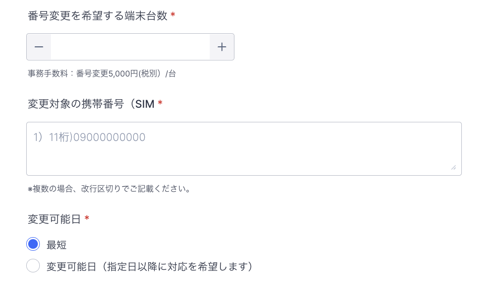

# 電話番号変更について

電話番号変更をご希望される場合は、フォームにてご依頼をお願いいたします。\
（有償：1番号あたり、6,000円+税別）

**【番号変更ご依頼時の注意事項】**\
番号変更の適用日以降、弊社より作業完了のご連絡を差し上げるまでの最大2営業日の間、

対象端末の通話録音が取得出来なくなる場合がございます。予めご了承ください。

1. 電話番号変更依頼フォーム：[https://comdesk.com/apply-lead.html](https://comdesk.com/apply-lead.html)
2. ご依頼内容の選択は、上から5番目の\*\*「携帯端末/SIM番号変更依頼」\*\*を選択して下さい。\
   
3.  番号変更対象の端末台数・電話番号・変更可能日をご記載ください。\
    変更可能日については、「最短」もしくは「変更可能日（指定日以降に対応を希望します）」を選択ください。\
    変更日の指定はできかねます。\
    ご指定いただいた変更可能日以降に対応し、キャリアの番号変更処理が完了次第ご連絡致します。\*\*（有償：1番号あたり、6,000円+税別）\
    

    \*\*
4. フォームの送信後、弊社からキャリアに番号変更依頼をし、変更が完了次第ご連絡いたします。\
   なお、それに準じてキャリア録音の紐付け直しも実施いたします。\
   ご利用ユーザーもご変更の場合には、フォームの備考にご記載ください。\
   ※キャリア対応のため日付指定ができず、所要日数の目安は申請から1～4営業日です。

その他ご不明点などございましたら、[**サポートチームまでお問い合わせ**](https://comdesklead.zendesk.com/hc/ja/requests/new) をお願い致します。

お問い合わせ方法は\*\*[こちら](../../トラブルシューティング/サポートチームへのお問い合わせ方法/12828937533081_サポートチームへのお問い合わせ方法.md)\*\*
