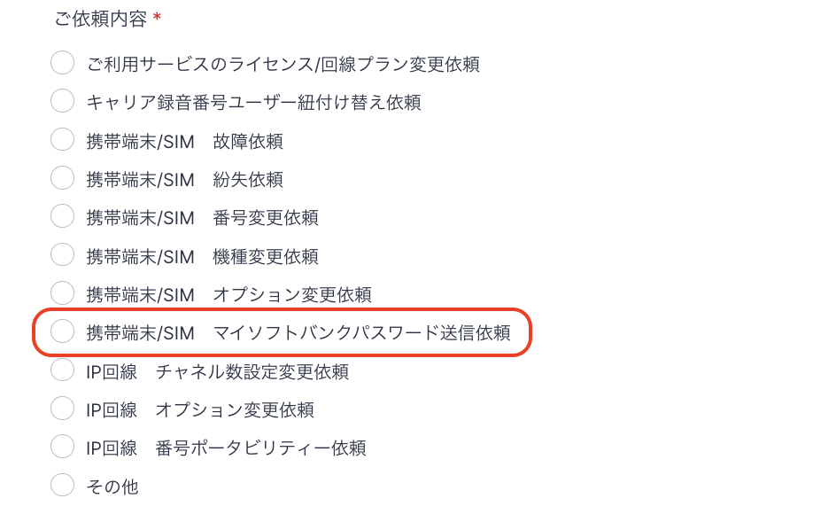

# My SoftBankのパスワード

My SoftBankのパスワードを忘れてしまった場合や、他アプリ使用時に年齢認証を求められた場合、フォームでのご依頼をお願いいたします。

1. My SoftBankのパスワード送信依頼フォーム：[https://comdesk.com/apply-lead.html](https://comdesk.com/apply-lead.html)
2. ご依頼内容は上から8番目\*\*「携帯端末/SIM　マイソフトバンクパスワード送信依頼」\*\*を選択してください。\
   
3. My SoftBankのパスワード再送信を行う携帯番号をご記入いいただき送信をお願いいたします。
4. ご依頼をいただき担当部署が確認次第、対象端末へSNSメッセージが送付されます。

その他ご不明点などございましたら、[**サポートチームまでお問い合わせ**](https://comdesklead.zendesk.com/hc/ja/requests/new)をお願い致します。

お問い合わせ方法は\*\*[こちら](../../トラブルシューティング/サポートチームへのお問い合わせ方法/12828937533081_サポートチームへのお問い合わせ方法.md)\*\*
