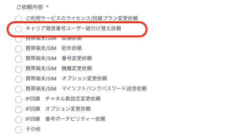
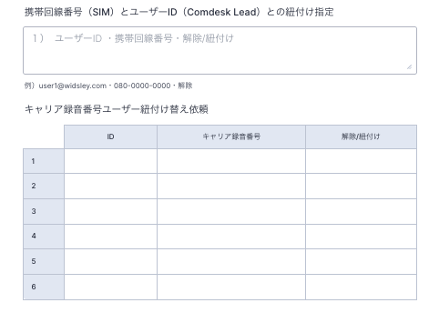
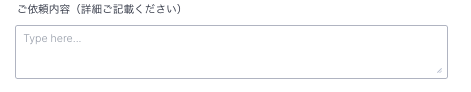

# キャリア録音番号とユーザーの紐付けを変更したい

キャリア録音番号とユーザーの紐付けを変更したい場合は、フォームまたは[サポートチームへお問い合わせ](../../トラブルシューティング/サポートチームへのお問い合わせ方法/12828937533081_サポートチームへのお問い合わせ方法.md)をお願いいたします。

ケース\
・弊社貸し出し端末の利用者が変更になったとき\
・退職者などが発生し、別ユーザーを新規発行した場合

## **フォームでの依頼方法**

1. 変更依頼フォーム：[https://portal.comdesk.com/](https://comdesk.com/apply-lead.html)
2. ご依頼内容は上から2番目の「キャリア録音番号ユーザー紐付け替え依頼」を選択してください。\
   
3. テキストボックスorテーブル入力のいずれかでご記載ください。\
   Comdesk Lead IDに対して\*\*どの番号を紐付けるか（解除するか）\*\*をご記入ください。\
   
4.  ご依頼内容の詳細をご記載ください。\
    **紐付け変更のご希望日時もご共有いただけますとスムーズに対応が可能です。**

    ### \*\*

    フォーム送信後の流れ\*\*

    1. フォーム受領後、実際の登録内容とご依頼内容に相違がないか確認をします。
    2. 確認事項がある場合、弊社サポートよりご連絡させていただきます。
    3. 相違がなければ、ご指定いただいた日時で対応させていただきます。
    4. 対応が完了次第、ご連絡させていただいますので今しばらくお待ち下さい。

その他ご不明点などございましたら、[**サポートチームまでお問い合わせ**](https://comdesklead.zendesk.com/hc/ja/requests/new)をお願い致します。

お問い合わせ方法は\*\*[こちら](../../トラブルシューティング/サポートチームへのお問い合わせ方法/12828937533081_サポートチームへのお問い合わせ方法.md)\*\*
