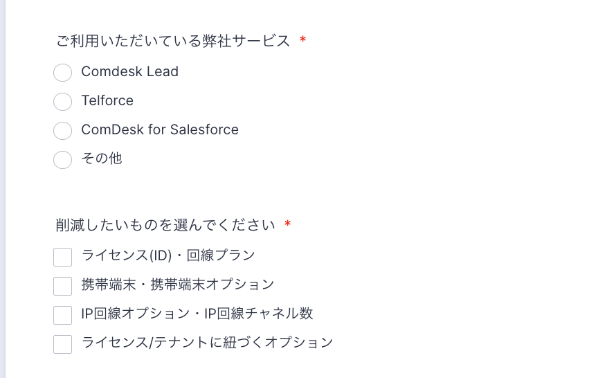
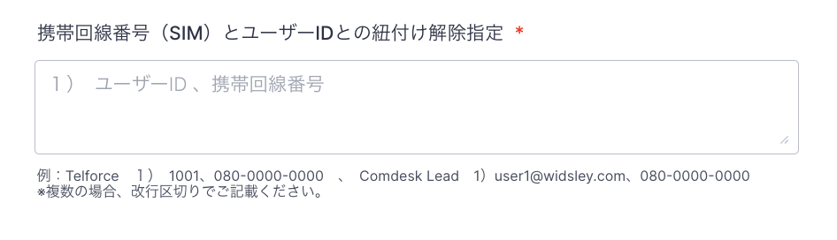
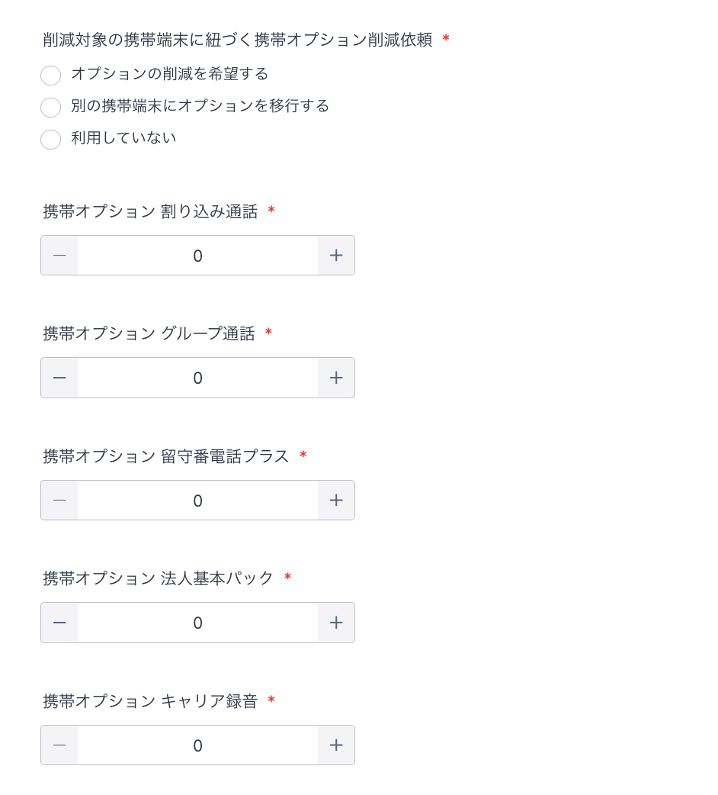
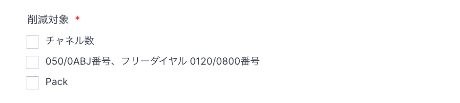
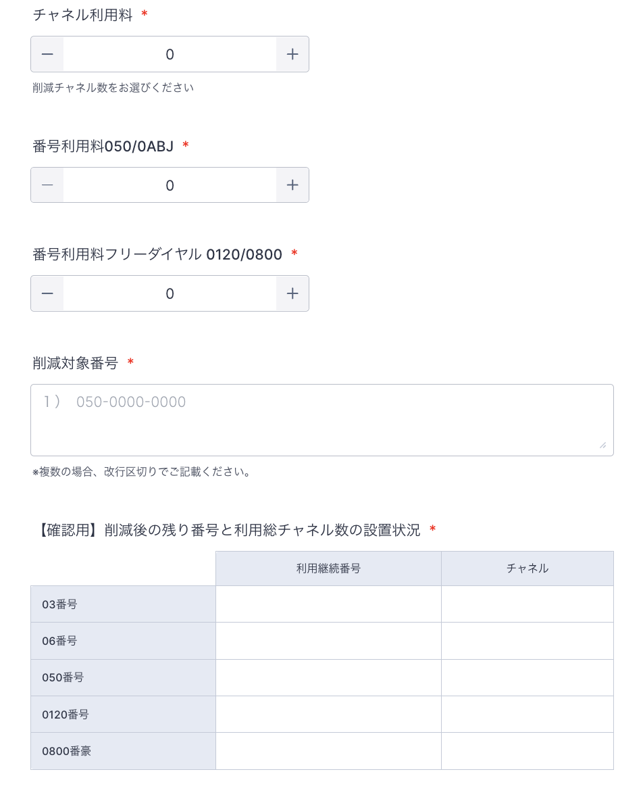

# ご契約サービスの削減について

■ご依頼フォーム

[Comdesk Lead 削減依頼フォーム](https://comdesk.com/reduction-lead.html)

**◾️削減オーダーを行う際の注意点**

Comdesk Lead ご契約サービスの削減適用は最短の翌々月から反映されます。

申請後も翌月末まで利用可能です。例：1月に削減オーダーをいただいた際は、2月末までご利用可能です。3月のご利用（請求）分から削減対象となります。

尚、携帯端末のレンタルにつきましては、削減月（例の場合3月）に入りまして５営業日以内に弊社着で返却いただく必要がございますのでご注意ください。

削減適応を翌々月以降（3ヶ月後以降）をご希望の際は、備考にてお知らせください。

**・削減オーダーの流れ**

フォームにて、ご利用いただいているサービス、並びに削減するご契約サービス対象を選択ください。

**・ライセンス（ID）、回線プランの削減**

　ライセンス、回線プランそれぞれマイナスでのオーダーをお願いいたします。\
　ライセンスのみオーダーをいただいた場合、回線プランの削減は行われませんのでご注意ください。

　削減するライセンスは数量と一緒に、対象ライセンスのアカウント指名、ユーザーIDをご指定ください。なお、複数同時に削減する際は、改行区切りで削減する内容分だけ記載をお願いいたします。

　尚、携帯端末の削減が必要な際は、”\*\*携帯端末・携帯端末オプションの削減”\*\*から削減オーダーをお願いいいたします。自動では削減されませんのでご注意ください。

**・携帯端末、携帯端末オプションの削減**

　削減する端末台数分だけマイナスで入力してください。　　　　　　　　　　　　　　　　　　　　　　　　　　　\
　例：　３ライセンス削減　　　" -3 "

　その後、対象の携帯回線番号（SIM）と、削減時に紐付けを解除するユーザーIDをお知らせください。\
　複数台同時にオーダーする際は、改行区切りにてご記載ください。

　端末台数を削減しても、ライセンス（ID）、並びに回線プラン数は自動では削減されません。別途、”\*\*ライセンス（ID）・回線プランの削減”\*\*からオーダーをお願いいたします。

　※ライセンス（ID）はそのままで、端末のみ削減してプラン変更をご希望の場合は、まず削減フォームで端末削減手続きを行い、その後、変更依頼フォームから回線プラン変更の手続きをお願いいたします。

　オプションにつきましては、ご利用中のサービスに応じて表示されます。

　ご利用中の削減ご希望サービスを削減数分だけ選択し、オーダーをお願いいたします。

**・IP回線、IP回線オプション\*\*\*\*の削減**

　削減対象をはじめに選択ください。

　**チャネル数の削減、番号の削減**

　削減対象の数量をマイナス数値で選択ください。

　番号を削減いただく場合は、対象番号も合わせてお知らせください。

　その後、削減後に御社で継続してお使いいただく残番号と、残チャネルの状態を記載ください。

　例：削減前：03番号と0120番号を２つずつ、各番号10chずつ使用

　　　0120番号を２つ削減。チャネルは5chずつ振り分けて、10ch削減

　　　→チャネル利用料”-10”、番号利用料フリーダイヤル”-2”

&#x20;         【確認用】設置状況

　　　　03番号　03\~\~\~\~\~.  15ch

&#x20;                              03\~\~\~\~\~.  15ch

　 また、番号を削減する際は、端末解約トーキアナウンスの必要有無をお知らせください。

　**パックの削減**

　パックは現在ご使用のパックを選択いただき、削減をお願いいたします。

　ご利用中のパックの選択肢がない場合は、備考に記載をお願いいたします。

その他ご不明点などございましたら、弊社担当者、もしくは[**サポートチームまでお問い合わせ**](https://comdesklead.zendesk.com/hc/ja/requests/new)をお願い致します。

お問い合わせ方法は\*\*[こちら](../../トラブルシューティング/サポートチームへのお問い合わせ方法/12828937533081_サポートチームへのお問い合わせ方法.md)\*\*
