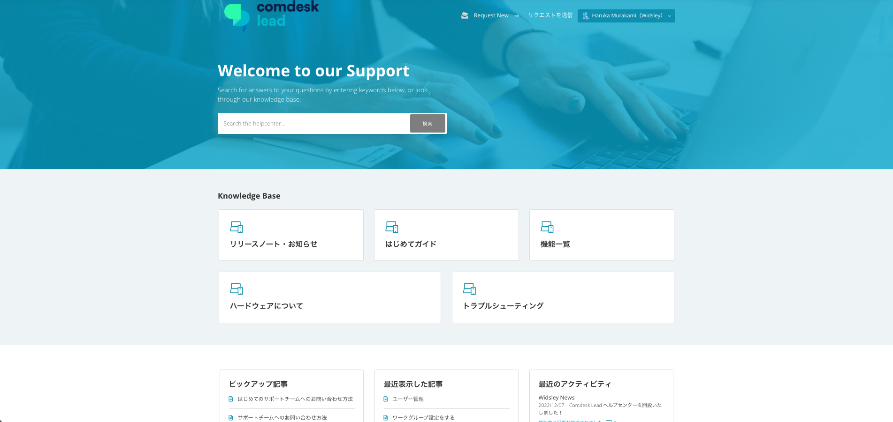

# 2022/12/07　Comdesk Lead ヘルプセンターを開設いたしました！

日頃、Comdesk Leadをご利用いただき誠にありがとうございます。\
この度、弊社Support Teamは、Comdesk Lead ヘルプセンターを開設いたしました。

## **新しいヘルプセンターのポイント**

1. **「はじめてガイド」**\
   Comdesk Leadを使いこなす為の「ユーザー/管理者」向けのコンテンツをそれぞれご用意しました。
2. **「機能一覧」**\
   「基本/活用」ガイドから便利機能をご紹介しています。
3. \*\*「ハードウェア」\*\*に関するご依頼・操作操作方法\
   DIGNOシリーズの操作方法や、端末に関する各種ご依頼はこちらのページから確認していただけます。
4. **「よくあるご質問」「トラブルシューティング」**\
   皆様からよくいただくご質問や解決方法を追加し、素早い課題解決にご活用いただけるようになりました。

ご利用いただきやすいヘルプセンターを目指し、随時コンテンツを追加し、\
使いやすさ・わかりやすさを追求して改善してまいりますので、ご不明点ございましたら一度こちらのヘルプセンターをご参照ください。

その他ご不明点・ご意見などございましたら、[**サポートチームまでお問い合わせ**](https://comdesklead.zendesk.com/hc/ja/requests/new)をお願い致します。

お問い合わせ方法は\*\*[こちら](../../トラブルシューティング/サポートチームへのお問い合わせ方法/12828937533081_サポートチームへのお問い合わせ方法.md)\*\*  （初めてのお問い合わせ方法は\*\*[こちら](../../トラブルシューティング/サポートチームへのお問い合わせ方法/12927370479257_はじめてのサポートチームへのお問い合わせ方法.md)\*\*）

​今後ともComdesk Leadのご愛顧のほどよろしくお願いいたします。
