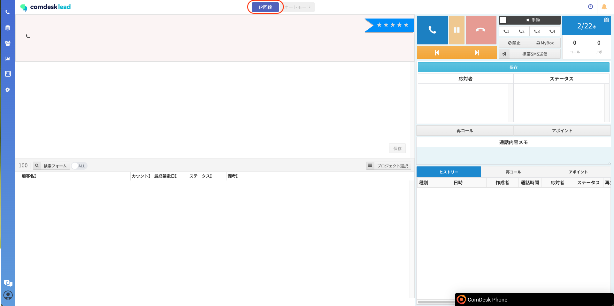

# 2024/02/21 夜間アップデートによる画面の表示崩れ/回線切替ボタンの配置変更について

平素より大変お世話になっております。

Widsley Customer Supportでございます。

昨夜の再コールのアップデートの影響で、

Comdesk Lead内で画面の表示崩れが発生している可能性がございます。

* インポート時の「送信」ボタンが表示されない
* 通知されるべき、内容が表示されない　等

ご迷惑をお掛けしてしまい、誠に申し訳ございません。

本事象に関しまして、スーパーリロードをお試しいただくことで解消される状態でございます。

* Windows：Ctrl + Shift + R
* Mac：Cmd + Shift + R

また、従来まで画面右上に表示されていた「携帯回線/IP回線」の回線切替ボタンに関しましても

画面上部に表示場所が変更となっております。

画像赤枠内をクリックすることで、「携帯回線/IP回線」の回線切替が可能でございます。

※オートコールに関しては画面上部の「オートコール」ボタンからでも、従来のボタンからでも変更は可能でございます。

ご不明点がございましたら、お気軽に[サポート窓口](https://comdesklead.zendesk.com/hc/ja/requests/new)・担当CSまでご連絡くださいませ。
