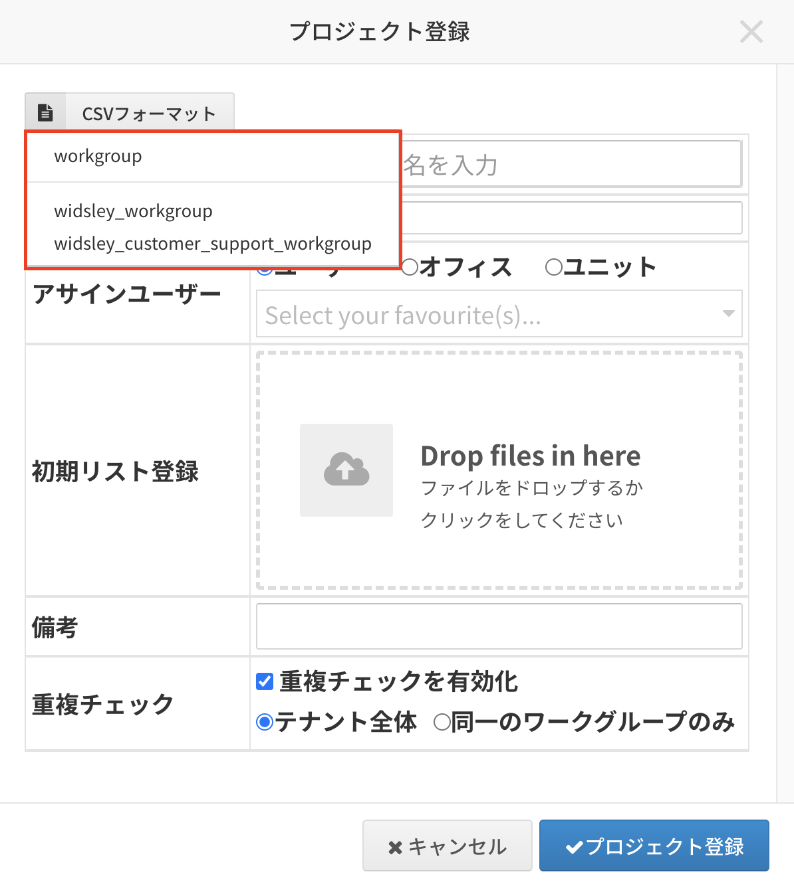

# Comdesk Lead　改修リリースのお知らせ（2022/12/21）

平素より大変お世話になっております。Widsley Supportでございます。\
いつもご利用ありがとうございます。

本日（2022/12/21）夜間リリースにて、Comdesk Leadに下記リリースを実施予定でございます。\
挙動や仕様において、一部変更となる部分がございますので、ご認識いただけますと幸いです。

——————————————————————————–————————————————–——

・【リスト項目】禁則文字の入力制御

・【プロジェクト管理画面】CSVフォーマットのワークグループ名の表示改善

——————————————————————————–————————————————–——

詳細は以下のとおりです。

◆【リスト項目】禁則文字の入力制御\
　　┗入力できない文字が「項目名」に入っていた場合、アラートが出るようにいたしました。\
◆【プロジェクト管理画面】CSVフォーマットのワークグループ名の表示改善\
　　　┗ワークグループ名の表示を改善し、視認性を向上いたしました。\

——————————————————————————–————————————————–——

リリース日時 ： 2022年12月21日(水)  21：00～26：00頃\
※サービスの停止はありません。

——————————————————————————–————————————————–——

以上、ご確認ください。\
ご不明点ございましたら、お気軽に[サポート窓口](https://comdesklead.zendesk.com/hc/ja/requests/new)・担当CSまでご連絡くださいませ。

今後も、より一層みなさまのお役に立てるよう取り組んでまいりますので、引き続き、Comdesk Leadのご愛顧を賜りますよう心よりお願い申し上げます。
